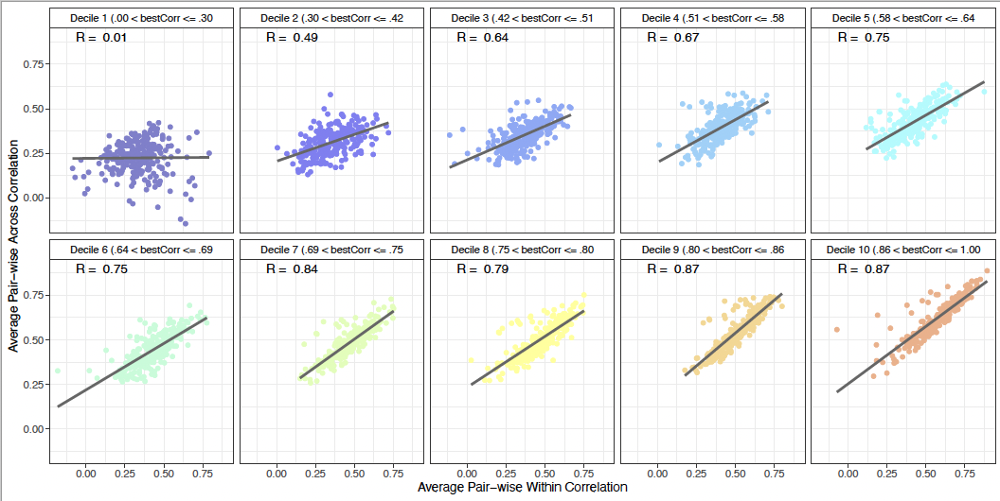
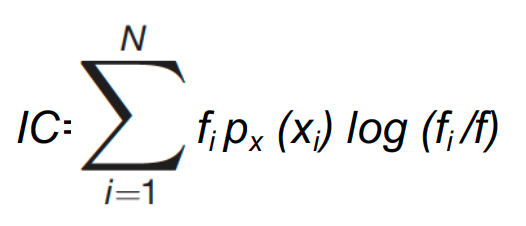

```{r setup, include=FALSE}
 library(knitr)
 knitr::knit_hooks$set(optipng = knitr::hook_optipng)
 knitr::opts_chunk$set(echo = TRUE,comment = NA,error=FALSE, warning = FALSE, message = FALSE, fig.show='hold',results='hold')
```

```{css, echo=FALSE}
.watch-out {
  background-color: #FFECEE;
  border: 1px solid gray;
}
```

```{css, echo=FALSE}
.main-container {
    max-height: 800px !important;
    overflow-y: scroll !important;
    overflow-x: auto !important;
}

pre {
  max-height: 800px !important;
  overflow-y: scroll !important;
  overflow-x: auto !important;
}
pre code {
  max-height: 800px !important;
  overflow-y: scroll !important;
  overflow-x: auto !important;
}
```

# Preliminars: Packages, functions, and data preload

```{r, warning=FALSE, message=FALSE}

source("https://github.com/ManuMi68/StatMmRa/raw/main/RMmRaGen24.txt")
source("https://github.com/ManuMi68/MuLaNa2/raw/main/Rallfun-v40vMM.txt")


# Function chkPkg() is located in RMmRaGen.R
chkPkg(c("data.table", "dplyr", "tidyr","tibble", "parallel", "foreach",
          "ggplot2","add2ggplot","introdataviz", "cowplot", "ggridges", "ggcorrplot",
          "ez","afex", "emmeans", "effectsize","scmamp",
          "rtf","mltools","apaTables",
          "nparLD", "nparcomp", "rankFD",
          "XNomial", "rstatix","EMT", "twosamples"))

FxDir=getwd()
DirPath<-"NeuroSpatial"
if (!dir.exists(paste0(FxDir,"/",DirPath))) {dir.create(paste0(FxDir,"/",DirPath))}

# Load all data
load(gzcon(url("https://github.com/ManuMi68/MuLaNa2/raw/main/NeuroSpatialData/NeuroSpatial.RData")))

# Color schemes for the 4 tasks
# Tarea 1 (código 2 "Elevated Cliff")
TskCol1<-c("green3","green4")
TskCol2<-c("red","orange")
TskCol3<-c("blue","dodgerblue")
TskCol4<-c("gray28","gray50")

TskCol1b<-c("red","orange","brown")


# More specific functions, perhaps I will include them in RMMRA
   #define function to catch integer(0)
integer0_test <- function(data) {
    if(identical(data, integer(0))) {
      return(0)
    }
    else {
      return(data)
    }}
  
PosHocAut <-function(a0P, MxP, emP, OrdV,customP) {
  ExtMod<-integer0_test(grep("|",emP,fixed = T))
  em.simple.Global <- eval(parse(text = paste0("emmeans(a0P, ~ ", emP,")")))
  dtresAllGlobal<- setkeyv(as.data.table(em.simple.Global),OrdV)
  dtresAllGlobal[,`:=`(emmean=frmMM(emmean),SE=frmMM(SE,4),lower.CL=frmMM(lower.CL),upper.CL=frmMM(upper.CL))]
  ResPostH.Global<-pairs(em.simple.Global,adjust = "holm")
  ResPostH.GlobalOrto<-contrast(em.simple.Global, customP,adjust = "holm")
  ResPostH.Global.MM <-PosHoc.MM(em.simple.Global)     # Estimate Rom from emmeans
  em.Is<-em.r<-NA
  em.Is<- eval(parse(text = paste0("emmeans(a0P, ~ ", emP,",pbkrtest.limit = 18240)")))
  em.r<-  eval(parse(text = paste0("emmeans(MxP, ~ ", emP,",pbkrtest.limit = 18240)")))
  if (ExtMod==0) ResPosHAPA.Global <- ResAPA1.23(em.Is, em.r, MxP)
  if (!ExtMod==0) ResPosHAPA.Global <- ResAPA2.23(em.Is, em.r, MxP)
  #ResPosHAPA.Global <- ResAPA2.23(em.Is, em.r, MxP)
  Result<-list(
    Global=      em.simple.Global,
    Means=       dtresAllGlobal,
    PosHoc=      ResPostH.Global,
    PosHocPlan = ResPostH.GlobalOrto,
    PosHocMM =   ResPostH.Global.MM,
    PosHocAPA =  ResPosHAPA.Global
  )
}

ResAPA1.23<-function(em.simpleIsP, em.simple.rP, Mod.1rp) {
  pp1 =    pairs(em.simpleIsP,adjust = "holm")
  pp1Sum = summary(pp1)
  pp1.MM = PosHoc.MM(em.simpleIsP)
  pp1.r =  pairs(em.simple.rP,adjust = "holm")
  pp1b=    eff_size(em.simple.rP, sigma = sigma(Mod.1rp), edf = df.residual(Mod.1rp))
  pp1bSum= summary(pp1b)
  initEs=grep("estimate",names(data.table(pp1Sum)))-1
  
  # He sustituido pHolm por pRom
  # pp1.MM[1,pRom]
  # pp1Sum[1,"p.value"]
  ResAPA2<-list();#CtrEl=1
  for (CtrEl in 1:nrow(pp1Sum)) {
    ResAPA2[CtrEl]<- paste0(pp1Sum[CtrEl,1],": ",
                            "t(",formatC(round(pp1Sum[CtrEl,"df"],2),2,format="f"),") = ",
                            formatC(round(pp1Sum[CtrEl,"t.ratio"],2),2,format="f"), ", p = ",
                            # formatC(round(pp1Sum[CtrEl,"p.value"],4),4,format="f"), ", dPAIR = ",
                            pp1.MM[CtrEl,pRom], ", dPAIR = ",  
                            formatC(round(pp1bSum[CtrEl,"effect.size"],2),2,format="f"),
                            " (", InterpdCohen(pp1bSum[CtrEl,"effect.size"])," effect)",
                            ", CI 95% = [",
                            formatC(round(pp1bSum[CtrEl,"lower.CL"],2),2,format="f"), ", ",
                            formatC(round(pp1bSum[CtrEl,"upper.CL"],2),2,format="f"), "]"
    )}
  ResAPA2
}

ResAPA2.23<-function(em.simpleIsP, em.simple.rP, Mod.1rp) {
      pp1 =    pairs(em.simpleIsP,adjust = "holm")
      pp1Sum = summary(pp1)
      pp1.MM = PosHoc.MM(em.simpleIsP)
      pp1.r =  pairs(em.simple.rP,adjust = "holm")
      pp1b=    eff_size(em.simple.rP, sigma = sigma(Mod.1rp), edf = df.residual(Mod.1rp))
      pp1bSum= summary(pp1b)
      initEs=grep("estimate",names(data.table(pp1Sum)))-1
      
      ResAPA2<-list();#CtrEl=1
      for (CtrEl in 1:nrow(pp1Sum)) {
        ResAPA2[CtrEl]<- paste0(paste(unname(unlist((pp1Sum)[CtrEl,2:initEs])),collapse = " "),": ",pp1Sum[CtrEl,1],": ",
                                "t(",formatC(round(pp1Sum[CtrEl,"df"],2),2,format="f"),") = ",
                                formatC(round(pp1Sum[CtrEl,"t.ratio"],2),2,format="f"), ", p = ",
                                # formatC(round(pp1Sum[CtrEl,"p.value"],4),4,format="f"), ", dPAIR = ",
                                pp1.MM[CtrEl,pRom], ", dPAIR = ",  
                                formatC(round(pp1bSum[CtrEl,"effect.size"],2),2,format="f"),
                                " (", InterpdCohen(pp1bSum[CtrEl,"effect.size"])," effect)",
                                ", CI 95% = [",
                                formatC(round(pp1bSum[CtrEl,"lower.CL"],2),2,format="f"), ", ",
                                formatC(round(pp1bSum[CtrEl,"upper.CL"],2),2,format="f"), "]"
        )}
      ResAPA2
    }

# Functions that computes Bayes Normandin-Ramos, adapted to the contrast of 0.25
BayNormRam<-function(z,N,li=.25,ls=.9,Nulo=.25) {
  ct=1/(ls-li)
  Nu=ct*integrate(MiBer, z = z, N = N, lower = li,upper = ls)[[1]]
  De=MiBer(Nulo,z = z, N = N)
  Res=Nu/De
  Res}
MiBer<-function(Theta,z,N) {(Theta^z) * ((1-Theta)^(N-z))}
Productorio<-function(x) {Prodd=1;for (i in 1:length(x)) Prodd=Prodd*x[i];Prodd}

BF1Grp <- function(DTp, colp=c("green3","green4"),logEs10=F) {
  ColPer<-c("cyan3","blue","red", "magenta2");
  if (logEs10) {LgEscala=log10(3);xlbl="Log10 (BF)"}
  if (!logEs10) {LgEscala=log(3); xlbl="Log (BF)"}
  P <- ecdf(DTp$logBF)
  Py = P(LgEscala)
  
  cdfbas<-ggplot (data=DTp, aes(x=logBF))
  cdfGrp<- cdfbas + stat_ecdf(linewidth=1,pad = T) +
    scale_colour_manual(values=colp) +
    theme_classic2() +
    theme(legend.title=element_blank(),
          legend.text=element_text(size=10),
          legend.position=c(0.2,0.8), 
          text = element_text(size=20),
          axis.text.x = element_text(colour = "black"),
          axis.text.y = element_text(colour = "black"),
          plot.caption = element_text(hjust = 0.5,size = 12)) +
    labs(y="Cumulative Proportion", x=xlbl,
         caption ="<----Favours chance/learning-----|-----Favours learning/chance---->") +
    xlim(-4,4)  +
    geom_vline(xintercept = LgEscala, linetype="dashed", linewidth=.25) +
    geom_vline(xintercept = -LgEscala, linetype="dashed", linewidth=.25) +
    geom_vline(xintercept = 0, linetype="dashed", linewidth=.25) +
    geom_hline(yintercept = .5, linetype="dashed", linewidth=.25) +
    annotate(geom="text", x=LgEscala, y=Py, label=percent(Py), color="red", hjust=0, vjust=0) +
    geom_point(aes(x=LgEscala,y=Py),color="red")
  cdfGrp
}

BFAllGrp1 <- function(DTpp, colp=c("green3","green4"),logEs10=F) {
  ColPer<-c("cyan3","blue","red", "magenta2");
  
  if (logEs10) {LgEscala=log10(3);xlbl="Log10 (BF)"}
  if (!logEs10) {LgEscala=log(3); xlbl="Log (BF)"}
  library(grid)
  
  JnGrp<-lapply(levels(DTpp$Day), function(xy) {
    DTppS<-DTpp[Day==xy]
    Py<-DTppS[, lapply(.SD, function(z) stats::ecdf(z)(LgEscala)), .SDcols = "logBF", by = .(Group) ]
    cdfbas<-ggplot (data=DTppS, aes(x=logBF, group =Group, color = Group, linetype = Group))
    cdfGrp<- cdfbas + stat_ecdf(linewidth=1,pad = T) +
      scale_colour_manual(values=colp) +
      theme_classic2() +
      theme(legend.title=element_blank(),
            legend.text=element_text(size=10),
            legend.position=c(0.2,0.8), 
            text = element_text(size=20),
            axis.text.x = element_text(colour = "black"),
            axis.text.y = element_text(colour = "black"),
            plot.caption = element_text(hjust = 0.5,size = 12)) +
      labs(y="Cumulative Proportion", x=xlbl) +
      # labs(y="Cumulative Proportion", x=xlbl,
      #      caption ="<----Favours chance/learning-----|-----Favours learning/chance---->",cex.caption = 0.5) +
      xlim(-4,4)  +
      geom_vline(xintercept = LgEscala, linetype="dashed", linewidth=.25) +
      geom_vline(xintercept = -LgEscala, linetype="dashed", linewidth=.25) +
      geom_vline(xintercept = 0, linetype="dashed", linewidth=.25) +
      geom_hline(yintercept = .5, linetype="dashed", linewidth=.25) +
      annotate(geom="text", x=LgEscala, y=Py$logBF, label=percent(Py$logBF), color="gray50", hjust=0, vjust=0) +
      geom_point(data = data.frame(x=rep(LgEscala,length(levels(DTpp$Group))), Py),aes(x=x,y=logBF),color="gray50",size=2) +
      annotate("rect", xmin=-Inf, xmax=0, ymin=-Inf, ymax=1, alpha=0.2, fill="red") +
      annotate("rect", xmin=0, xmax=+Inf, ymin=-Inf, ymax=1, alpha=0.2, fill="green") +
      annotate(geom="text",x=4,y=.5,label="Favors Learning", cex=5, hjust=1, vjust=0) +
      annotate(geom="text",x=-4,y=.5,label="Favors Chance", cex=5, hjust=0, vjust=0) +
      coord_cartesian(ylim=c(0,1), clip = "off")
      cdfGrp
    
  })
  pltAll<-plot_grid(plotlist=JnGrp,nrow = 1, labels=levels(DTpp$Day), hjust=-2.5)
  names(JnGrp) <-levels(DTpp$Day)
  Res<-list(Session=JnGrp,All=pltAll )
  Res
}

BFAllGrp2 <- function(DTpp, colp=c("green3","green4"),logEs10=F) {
  ColPer<-c("cyan3","blue","red", "magenta2");
  if (logEs10) {LgEscala=log10(3);xlbl="Log10 (BF)"}
  if (!logEs10) {LgEscala=log(3); xlbl="Log (BF)"}
  
  JnGrp<-lapply(levels(DTpp$Group), function(xy) {
    DTppS<-DTpp[Group==xy]
    Py<-DTppS[, lapply(.SD, function(z) stats::ecdf(z)(LgEscala)), .SDcols = "logBF", by = .(Day) ]
    cdfbas<-ggplot (data=DTppS, aes(x=logBF, group =Day, color = Day, linetype = Day))
    cdfGrp<- cdfbas + stat_ecdf(linewidth=1,pad = T) +
      scale_colour_manual(values=colp) +
      theme_classic2() +
      theme(legend.title=element_blank(),
            legend.text=element_text(size=10),
            legend.position=c(0.2,0.8), 
            text = element_text(size=20),
            axis.text.x = element_text(colour = "black"),
            axis.text.y = element_text(colour = "black"),
            plot.caption = element_text(hjust = 0.5,size = 12)) +
      labs(y="Cumulative Proportion", x=xlbl) +
      # labs(y="Cumulative Proportion", x=xlbl,
      #      caption ="<----Favours chance/learning-----|-----Favours learning/chance---->",cex.caption = 0.5) +
      xlim(-4,4)  +
      geom_vline(xintercept = LgEscala, linetype="dashed", linewidth=.25) +
      geom_vline(xintercept = -LgEscala, linetype="dashed", linewidth=.25) +
      geom_vline(xintercept = 0, linetype="dashed", linewidth=.25) +
      geom_hline(yintercept = .5, linetype="dashed", linewidth=.25) +
      annotate(geom="text", x=LgEscala, y=Py$logBF, label=percent(Py$logBF), color="gray50", hjust=0, vjust=0) +
      geom_point(data = data.frame(x=rep(LgEscala,length(levels(DTpp$Day))), Py),aes(x=x,y=logBF),color="gray50",size=2) +
      annotate("rect", xmin=-Inf, xmax=0, ymin=-Inf, ymax=1, alpha=0.2, fill="red") +
      annotate("rect", xmin=0, xmax=+Inf, ymin=-Inf, ymax=1, alpha=0.2, fill="green") +
      annotate(geom="text",x=4,y=.5,label="Favors Learning", cex=5, hjust=1, vjust=0) +
      annotate(geom="text",x=-4,y=.5,label="Favors Chance", cex=5, hjust=0, vjust=0) +
      coord_cartesian(ylim=c(0,1), clip = "off")
    cdfGrp 
    
  })
  pltAll<-plot_grid(plotlist=JnGrp,nrow = 1, labels=levels(DTpp$Group), hjust=-2.5)
  names(JnGrp) <-levels(DTpp$Group)
  Res<-list(Group=JnGrp,All=pltAll )
  Res
}

BFAllGrp3 <- function(DTpp, colp=c("green3","green4"),logEs10=F) {
  ColPer<-c("cyan3","blue","red", "magenta2");
  if (logEs10) {LgEscala=log10(3);xlbl="Log10 (BF)"}
  if (!logEs10) {LgEscala=log(3); xlbl="Log (BF)"}
  
  
    DTppS<-DTpp
    Py<-DTppS[, lapply(.SD, function(z) stats::ecdf(z)(LgEscala)), .SDcols = "logBF", by = .(Day) ]
    cdfbas<-ggplot (data=DTppS, aes(x=logBF, group =Day, color = Day, linetype = Day))
    cdfGrp<- cdfbas + stat_ecdf(linewidth=1,pad = T) +
      scale_colour_manual(values=colp) +
      theme_classic2() +
      theme(legend.title=element_blank(),
            legend.text=element_text(size=10),
            legend.position=c(0.2,0.8), 
            text = element_text(size=20),
            axis.text.x = element_text(colour = "black"),
            axis.text.y = element_text(colour = "black"),
            plot.caption = element_text(hjust = 0.5,size = 12)) +
      labs(y="Cumulative Proportion", x=xlbl) +
      # labs(y="Cumulative Proportion", x=xlbl,
      #      caption ="<----Favours chance/learning-----|-----Favours learning/chance---->",cex.caption = 0.5) +
      xlim(-4,4)  +
      geom_vline(xintercept = LgEscala, linetype="dashed", linewidth=.25) +
      geom_vline(xintercept = -LgEscala, linetype="dashed", linewidth=.25) +
      geom_vline(xintercept = 0, linetype="dashed", linewidth=.25) +
      geom_hline(yintercept = .5, linetype="dashed", linewidth=.25) +
      annotate(geom="text", x=LgEscala, y=Py$logBF, label=percent(Py$logBF), color="gray50", hjust=0, vjust=0) +
      geom_point(data = data.frame(x=rep(LgEscala,length(levels(DTpp$Day))), Py),aes(x=x,y=logBF),color="gray50",size=2) +
      annotate("rect", xmin=-Inf, xmax=0, ymin=-Inf, ymax=1, alpha=0.2, fill="red") +
      annotate("rect", xmin=0, xmax=+Inf, ymin=-Inf, ymax=1, alpha=0.2, fill="green") +
      annotate(geom="text",x=4,y=.5,label="Favors Learning", cex=5, hjust=1, vjust=0) +
      annotate(geom="text",x=-4,y=.5,label="Favors Chance", cex=5, hjust=0, vjust=0) +
      coord_cartesian(ylim=c(0,1), clip = "off")
    cdfGrp 
    
  
  
}

AcumBFLog.23<-function(DTp,Gs,Ds,logEs10=T,wG=T,wS=T) {
  ValsBF2=seq(-2, 2, by=1.0)
  
  DTp<-DTp[Group==Gs&Day==Ds]
  Global  <- Productorio(DTp$BF)
  ResBFg1 <- DTp$logBF
  P <- ecdf(DTp$logBF)
  
  if (logEs10) {          
    ValsBF=sort(c(seq(-2,2,by=.5),-log10(3),log10(3),-.01));
    GlobalLog<-log10(Global)
  }
  if (!logEs10) {
    ValsBF=sort(c(seq(-2,2,by=.5),-log(3),log(3),-.01));
    GlobalLog<-log(Global)
  }        
  
  if (wG&wS) laEtiq=paste0(Gs," ",Ds)
  if (wG&!wS) laEtiq=Gs
  if (!wG&wS) laEtiq=Ds
  
  BFAc <-list(
    BF =       DTp$BF,
    InterBF =  InterpBF(DTp$BF),
    LogBF =    DTp$logBF,	
    DT =       data.table(Group=rep(laEtiq,length(ResBFg1)),BF=ResBFg1),
    Pecdf =    P,
    empcdf =   empirical_cdf(ResBFg1, ubounds=ValsBF),
    empcdf2 =  empirical_cdf(ResBFg1, ubounds=ValsBF2),
    NegPerc =  percent(P(0)),
    BFGlobal = paste0("BF All= ",round(Global,3), "; Log BF All= ",round(GlobalLog,3), "; ",InterpBF(Global), " Evidence"),
    BFAll =    round(Global,3),
    LogBFAll = round(GlobalLog,3),
    InterBFAll = InterpBF(Global),
    Grp <- BF1Grp(DTp = DTp,logEs10 = logEs10)
  )
  BFAc
}

AcumBFLog.23.NoCx<-function(DTp,Ds,logEs10=T,wG=T,wS=T) {
  ValsBF2=seq(-2, 2, by=1.0)
  
  DTp<-DTp[Day==Ds]
  Global  <- Productorio(DTp$BF)
  ResBFg1 <- DTp$logBF
  P <- ecdf(DTp$logBF)
  
  if (logEs10) {          
    ValsBF=sort(c(seq(-2,2,by=.5),-log10(3),log10(3),-.01));
    GlobalLog<-log10(Global)
  }
  if (!logEs10) {
    ValsBF=sort(c(seq(-2,2,by=.5),-log(3),log(3),-.01));
    GlobalLog<-log(Global)
  }        
  
  laEtiq=Ds
  
  BFAc <-list(
    BF =       DTp$BF,
    InterBF =  InterpBF(DTp$BF),
    LogBF =    DTp$logBF,	
    DT =       data.table(BF=ResBFg1),
    Pecdf =    P,
    empcdf =   empirical_cdf(ResBFg1, ubounds=ValsBF),
    empcdf2 =  empirical_cdf(ResBFg1, ubounds=ValsBF2),
    NegPerc =  percent(P(0)),
    BFGlobal = paste0("BF All= ",round(Global,3), "; Log BF All= ",round(GlobalLog,3), "; ",InterpBF(Global), " Evidence"),
    BFAll =    round(Global,3),
    LogBFAll = round(GlobalLog,3),
    InterBFAll = InterpBF(Global),
    Grp <- BF1Grp(DTp = DTp,logEs10 = logEs10)
  )
  BFAc
}

com.Glob <- function(DTp) {
  res<- foreach(i=levels(DTp$Group),.combine='c') %:%
    foreach(j=levels(DTp$Day)) %dopar% { 
      AcumBFLog.23(DTp, i, j, F, T, T) }
  names(res) <-(foreach(i=levels(DTp$Group),.combine='c') %:%
                           foreach(j=levels(DTp$Day), .combine='c') %dopar% {
                             paste0(i, ".", j)
                           })
  res
}

com.Glob.NoCx <- function(DTp) {
    foreach(j=levels(DTp$Day)) %dopar% { 
      AcumBFLog.23.NoCx(DTp, j, F, T, T) }
}

com.Glob.APA <- function(DTp) {
  foreach(i=levels(DTp$Group),.combine='c') %:%
    foreach(j=levels(DTp$Day), .combine='c') %dopar% {
      paste0(i," ",j,": ",AcumBFLog.23(DTp, i, j, F, T, T)$BFGlobal)}
}

com.Glob.APA.NoCx <- function(DTp) {
    foreach(j=levels(DTp$Day), .combine='c') %dopar% {
      paste0(j,": ",AcumBFLog.23.NoCx(DTp, j, F, T, T)$BFGlobal)}
}

com.ecdf<-function(DTp) {
  Resecdf<-list()
  setkey(DTp,Group,Day)
  lv1=length(levels(DTp$Group));lv2=length(levels(DTp$Day))
  Resecdf[[1]]<-  unlist(lapply(1:lv1, function (x) lapply(1:lv2, function (y) 
    DTp[.(levels(DTp$Group)[x],levels(DTp$Day)[y],with=F),stats::ecdf(logBF)])),recursive = F)
  
  names(Resecdf[[1]]) <-(foreach(i=levels(DTp$Group),.combine='c') %:%
                           foreach(j=levels(DTp$Day), .combine='c') %dopar% {
                             paste0(i, ".", j)
                           })
  
  # Resecdf[[2]]<-  unlist(lapply(1:lv1, function (x) lapply(1:lv2, function (y) 
  #  DTp[.(levels(DTp$Group)[x],levels(DTp$Day)[y],with=F),empirical_cdf(logBF, ubounds=ValsBF)])),
  #  recursive = F)
  # Resecdf[[3]]<-  unlist(lapply(1:lv1, function (x) lapply(1:lv2, function (y) 
  #  DTp[.(levels(DTp$Group)[x],levels(DTp$Day)[y],with=F),empirical_cdf(logBF, ubounds=ValsBF2)])),
  #  recursive = F)
  Resecdf[[2]] <-foreach(i=1:lv1,.combine='cbind') %:%
    foreach(j=1:lv2, .combine='cbind') %dopar% {
      sapply (DTp[.(levels(DTp$Group)[i],levels(DTp$Day)[j],with=F),
                  empirical_cdf(logBF, ubounds=ValsBF)]$CDF, percent)
    } %>% as.data.frame %>%
    `colnames<-`(foreach(i=levels(DTp$Group),.combine='c') %:%
                   foreach(j=levels(DTp$Day), .combine='c') %dopar% {
                     paste0(i, ".", j)
                   }) %>%
    mutate(UpperBound= round(ValsBF,2), .before=colnames(.)[1])
  Resecdf[[3]] <-foreach(i=1:lv1,.combine='cbind') %:%
    foreach(j=1:lv2, .combine='cbind') %dopar% {
      sapply (DTp[.(levels(DTp$Group)[i],levels(DTp$Day)[j],with=F),
                  empirical_cdf(logBF, ubounds=ValsBF2)]$CDF, percent)
    } %>% as.data.frame %>%
    `colnames<-`(foreach(i=levels(DTp$Group),.combine='c') %:%
                   foreach(j=levels(DTp$Day), .combine='c') %dopar% {
                     paste0(i, ".", j)
                   }) %>%
    mutate(UpperBound= round(ValsBF2,2), .before=colnames(.)[1])
  Resecdf
}

com.ecdf.NoCx<-function(DTp) {
  Resecdf<-list()
  setkey(DTp,Day)
  lv1=1;lv2=length(levels(DTp$Day))
  Resecdf[[1]]<-  unlist(lapply(1:lv1, function (x) lapply(1:lv2, function (y) 
    DTp[.(levels(DTp$Day)[y],with=F),stats::ecdf(logBF)])),recursive = F)
  names(Resecdf[[1]]) <-levels(DTp$Day)
  Resecdf[[2]] <-foreach(i=1:lv1,.combine='cbind') %:%
    foreach(j=1:lv2, .combine='cbind') %dopar% {
      sapply (DTp[.(levels(DTp$Day)[j],with=F),
                  empirical_cdf(logBF, ubounds=ValsBF)]$CDF, percent)
    } %>% as.data.frame %>%
    `colnames<-`(
                   foreach(j=levels(DTp$Day), .combine='c') %dopar% {
                     paste0(j)
                   }) %>%
    mutate(UpperBound= round(ValsBF,2), .before=colnames(.)[1])
  Resecdf[[3]] <-foreach(i=1:lv1,.combine='cbind') %:%
    foreach(j=1:lv2, .combine='cbind') %dopar% {
      sapply (DTp[.(levels(DTp$Day)[j],with=F),
                  empirical_cdf(logBF, ubounds=ValsBF2)]$CDF, percent)
    } %>% as.data.frame %>%
    `colnames<-`(
                   foreach(j=levels(DTp$Day), .combine='c') %dopar% {
                     paste0(j)
                   }) %>%
    mutate(UpperBound= round(ValsBF2,2), .before=colnames(.)[1])
  Resecdf
}

MakeBF<-function(DTppp, Nmpp) {
  Global.i<- DTppp %>% 
    .[,.(BF=Productorio(BF)),by=list(Group,Day)] %>%
    .[,InterBF:=InterpBF(BF)] %>%
    .[,logBF:=log(BF)]  %>%
    .[,BF:=frmMM(BF,4)] %>%
    .[,logBF:=frmMM(logBF,4)] %>%
    #dplyr::rename(., BF=V1) %>%
    data.table()
  ecdf.i<-com.ecdf(DTppp)
  Detall.i <- com.Glob(DTppp)
  GlobalAPA.i <- com.Glob.APA(DTppp)
  GrpGroup.i<-BFAllGrp1(DTppp,TskCol2)
  GrpDay.i<-  BFAllGrp2(DTppp, TskCol1b)
  GrpJn.i<-plot_grid(plotlist=lapply (Detall.i, "[[", 13), 
                     labels = c(t(outer(levels(DTppp$Group), levels(DTppp$Day), FUN=paste,sep=" "))))
  
  write.csv2(Global.i,paste0(Nmpp," Global.csv"))
  zz<-file(paste0(Nmpp," Global.txt"),"w")
  sink(zz);
  print(GlobalAPA.i);
  cat("\n");
  print(ecdf.i[[2]]);
  cat("\n"); cat("\n");
  print(ecdf.i[[3]]);
  cat("\n");cat("\n");cat("\n");
  print(Detall.i)
  sink(); close(zz)
  for (i in 1:length(levels(DTppp$Group))) {ggsave(paste0(Nmpp," CumDis_",levels(DTppp$Group)[i], ".pdf"),GrpDay.i[[1]][[i]])}
  for (i in 1:length(levels(DTppp$Day)))   {ggsave(paste0(Nmpp," CumDis_",levels(DTppp$Day)[i], ".pdf"),GrpGroup.i[[1]][[i]])}
  ggsave(paste0(Nmpp," CumDis_CxtBySess.pdf"),GrpGroup.i[[2]],width = 12,height = 6)
  ggsave(paste0(Nmpp," CumDis_SessByCxt.pdf"),GrpDay.i[[2]],width = 8,height = 6)
  ggsave(paste0(Nmpp," CumDis_All.pdf"),GrpJn.i,width = 20,height = 14)
  
  Res <-list(
    Global= Global.i,
    ecdfMM = ecdf.i,
    Detall = Detall.i,
    GlobalAPA = GlobalAPA.i,
    GrpGroup = GrpGroup.i,
    GrpDay = GrpDay.i,
    GrpJn = GrpJn.i
  )
  Res
}

MakeBFNoCx<-function(DTppp, Nmpp) {
  Global.i<- DTppp %>% 
    .[,.(BF=Productorio(BF)),by=list(Day)] %>%
    .[,InterBF:=InterpBF(BF)] %>%
    .[,logBF:=log(BF)]  %>%
    .[,BF:=frmMM(BF,4)] %>%
    .[,logBF:=frmMM(logBF,4)] %>%
    #dplyr::rename(., BF=V1) %>%
    data.table()
  ecdf.i<-com.ecdf.NoCx(DTppp)
  Detall.i <- com.Glob.NoCx(DTppp)
    names(Detall.i)<-levels(DTppp$Day)
  GlobalAPA.i <- com.Glob.APA.NoCx(DTppp)
  # GrpGroup.i<-BFAllGrp1(DTppp,TskCol2)
  GrpDay.i<-  BFAllGrp3(DTppp, TskCol1b)
  GrpJn.i<-plot_grid(plotlist=lapply (Detall.i, "[[", 13), 
                     labels = levels(DTppp$Day))
  
  write.csv2(Global.i,paste0(Nmpp," Global.csv"))
  zz<-file(paste0(Nmpp," Global.txt"),"w")
    sink(zz);
    print(GlobalAPA.i);
    cat("\n");
    print(ecdf.i[[2]]);
    cat("\n"); cat("\n");
    print(ecdf.i[[3]]);
    cat("\n");cat("\n");cat("\n");
    print(Detall.i)
  sink(); close(zz)
  ggsave(paste0(Nmpp," CumDis_SessByCxt.pdf"),GrpDay.i)
  ggsave(paste0(Nmpp," CumDis_All.pdf"),GrpJn.i,width = 20,height = 14)
  
  Res <-list(
    Global= Global.i,
    ecdfMM = ecdf.i,
    Detall = Detall.i,
    GlobalAPA = GlobalAPA.i,
    # GrpGroup = GrpGroup.i,
    GrpDay = GrpDay.i,
    GrpJn = GrpJn.i
  )
  Res
}

stats_MM <- function(x) {
    nadt <-0
    summ<-summary(x)
    if (length(summ)>6) nadt= summ[[7]]
    n = length(x)-nadt
    min <- frmMM(min(x, na.rm = TRUE),2)
    max <- frmMM(max(x, na.rm = TRUE),2)
    mean <- frmMM(mean(x, na.rm = TRUE),2)
    med <- frmMM(median(x, na.rm = TRUE))
    trimm = frmMM(mean(x, na.rm = TRUE,trim=.2),2)
    Q1 <- frmMM(summ[[2]],2)
    Q3 <- frmMM(summ[[5]],2)
    Iqr <- frmMM(summ[[5]]-summ[[2]],2)
    sd <- frmMM(sd(x, na.rm =TRUE),2)
    se <- frmMM(sd(x, na.rm =TRUE)/sqrt(n),2)
    mad <- frmMM(mad(x, na.rm = TRUE),2)
    summary <- data.table(n=n, 'NAs' = nadt, Min = min, '1st Qu'=Q1, 
                          Median=med, Mean = mean, 'Trimmed(20%)' = trimm,
                          '3rd Qu'=Q3, Max = max, 
                          SD = sd, SEM = se, IQR = Iqr, MAD = mad)
    summary
  }
```

```{r ResCtrl1, eval=F, echo=FALSE, comment=""}
    # Results
    cat("Data Structure:\n");
      str(DTp) # Data File
    cat("---------------------\n");
      kableTabl(DTp,"Data", "")
    cat("---------------------\n");
      kableTabl(ezPrecis(DTp),"Design Structure", "")
    cat("---------------------\n");
      kableTabl(DTRes,"Descriptive", "")
    cat("Omnibus AOV:\n")
      a0
    cat("---------------------\n");
    cat("Pos Hoc Simple Effects:\n")
      PosH.4w$PosHocMM
    #kableTabl(PosH.4w$PosHocMM,"Pos Hoc Simple Effects", "")
    cat("---------------------\n");
    kableTabl(PosH.4w$Means,"Descrptive & CI-95%", "")
    cat("---------------------\n");
    cat("Graphics have been preloaded to avoid page overload\n (see the corresponding section for details).:\n");
    # plot(Grp) # Exploratory Analysis
```

# **Results Section 1** Reorienting behavior in a two-context paradigm

## **Figure 1. Reorientation behavior in a two-context paradigm**

------------------------------------------------------------------------

> **Figure 1.** Reorientation behavior in a two-context paradigm. A) Schematic of experimental chambers showing reward location (yellow star) in Context A (left) and Context B (right). B) Schematic of session structure of two-context paradigm. Animals (N = 14) are disoriented before being placed in each context, in alternating order on 12 consecutive trials. C) Percentage of digs in each cup location on test trials on day 1 (left), day 2 (center), and day 3 (right). D) Boxplots showing distribution of digs in geometrically correct vs. incorrect axes in each context. E) Boxplots showing distribution of digs in each cup location combining both contexts. In all boxplots graphs, the boxes indicate the upper and lower quartiles of the data and the whiskers (extending lines) the minimum and maximum outside the quartiles. The horizontal line indicates the median. Dots represent individual data points and asterisks (\*) indicate p \< 0.05. F) Cumulative proportion of Bayes Factor (BF) on days 1 to 3 per context evaluating the alternative model (MAlt) that animals preferentially dug on a distinct rewarded axis in each context vs. the null model (Mnull) that animals dug by chance. G) Cumulative proportion of individual Bayes Factors (BF) across days 1 to 3 combining contexts evaluating the alternative model (MAlt) that animals increased digging in C locations with experience vs. the null model (Mnull) that animals dug by chance Conventional values showing the border marking credibility for Malt (log(BF) \> log(1/3)= 1.1) and Mnull (log(BF) \< log(1/3)= -1.1) are indicated by vertical dashed lines. The value of half (0.5) of the sample is marked by a horizontal dashed line.

------------------------------------------------------------------------

### Fig 1D) Boxplots of digs in geometrically correct vs. incorrect axes in each context

{Design (2 Axis x S) x (3 Day x S) x (2 Context x S)}

{width="400"}

```{r F1D, warning=FALSE, message=FALSE}
  NmRoo = paste0(DirPath,"/", "Fig1D")
  Mk.dir(NmRoo)
  
  #DT1 <- readRDS(gzcon(url("https://github.com/ManuMi68/MuLaNa2/raw/main/NeuroSpatialData/BehavTwoContext.RDS")))
  DTp<-copy(BehavTwoContext)
  
  
  # "Fig.1D) has been preloaded to avoid overloading problems
  # Box Plot
    # ColPer=c("#D599D7", "#AA33B0","#700075")
    # Grp.1D<- Grph.2023(
    #     DatP = DTp,
    #       Dvp="Proportion", VarX="Context",VarFill="Day",
    #       LblsP =c("Cluster Quality", "","Dig Percent Per Animal",""),
    #       ylmP =c(0,100),hLin = F,lvIp = 4,GrpSel = c(1:3),wMain=F,
    #     TyGrp="Box", # Bar, Box, Violin, SplitViolin
    #     Wthdot=T, Relleno=T, ResumAd=T,ColPer=ColPer
    #   ) 
    #  Grp.1D <- Grp.1D + facet_grid( ~ Axis)
    #  ggsave(paste0(NmRoo,"/Fig1D.pdf"), Grp.1D, width=10, height=10)
   
# Descriptive
  DTRes<-DTp[, rbindlist(lapply(.SD, stats_MM)), .SDcols = 'Proportion', by=.(Axis,Day,Context)]
  #DTRes<-DTp[,c(N = .N,as.list(summary(Proportion))), by=.(Axis,Day,Context)]
  write.csv2(DTRes,paste0(NmRoo, "/BehavTwoContext_Descriptive.csv"))
 
 
# AOV
  a0 <- aov_ez("Subject", "Proportion", DTp,
        within = c("Axis","Context","Day"))
  
  # Effect size & Mixed
  eef<-effectsize::eta_squared(a0, generalized=TRUE)
  Mod.1r<-lmer(Proportion~Day * Axis * Context + (1|Subject),data=DTp)
  
  # Pos Hoc of the more complex significant effect: Axis:Context
  # Defines orthogonal contrasts from a prioristic perspective
  custom <- list(`Unique` = c(1, -1))
  PosH.4w = PosHocAut(a0, Mod.1r, "Axis|Context", c("Context","emmean"), custom=custom)
  # Since the focal variable has only two levels, the Rom correction is not necessary  
  
  <<ResCtrl1>>
```

***Execute the following code if you want to generate the Figure 1D***

```{r, eval=FALSE}
  DTp<-copy(BehavTwoContext)
  # Box Plot
  ColPer=c("#D599D7", "#AA33B0","#700075")
  Grp.1D<- Grph.2023(
      DatP = DTp,
        Dvp="Proportion", VarX="Context",VarFill="Day",
        LblsP =c("Cluster Quality", "","Dig Percent Per Animal",""),
        ylmP =c(0,100),hLin = F,lvIp = 4,GrpSel = c(1:3),wMain=F,
      TyGrp="Box", # Bar, Box, Violin, SplitViolin
      Wthdot=T, Relleno=T, ResumAd=T,ColPer=ColPer
    ) 
   Grp.1D <- Grp.1D + facet_grid( ~ Axis)
   ggsave(paste0(NmRoo,"/Fig1D.pdf"), Grp.1D, width=10, height=10)
   Grp.1D
```

### Fig 1E) Boxplots of digs in each cup location combining both contexts

{Design (4 Dig x S) x (3 Day x S)}

{width="400"}

```{r F1E, warning=FALSE, message=FALSE}
  NmRoo = paste0(DirPath,"/", "Fig1E")
  Mk.dir(NmRoo)
  #DT2 <- readRDS(gzcon(url("https://github.com/ManuMi68/MuLaNa2/raw/main/NeuroSpatialData/DigBehavioralData.RDS")))
  DTp<-copy(DigBehavioralData)
  
# Fig.1E) has been preloaded to avoid overloading problems
  # Box Plot
    # ColPer=c("#D599D7", "#AA33B0","#700075")
    # Grp.1E<- Grph.2023(
    #   DatP = DTp,
    #   Dvp="Perc", VarX="Dig", VarFill="Day",
    #   LblsP =c("Cluster Quality", "","Dig Percent Per Animal","Location of first dig"),
    #   ylmP =c(0,100),hLin = F,lvIp = 4,GrpSel = c(1:3),wMain=F,
    #   TyGrp="Box", # Bar, Box, Violin, SplitViolin
    #   Wthdot=T, Relleno=T, ResumAd=T,ColPer=ColPer
    # )
    # ggsave(paste0(NmRoo,"/Fig1E.pdf"), Grp.1E, width=10, height=10)
  
# Descriptive
  DTRes<-DTp[, rbindlist(lapply(.SD, stats_MM)), .SDcols = 'Perc', by=.(Dig,Day)]
  #DTRes<-DTp[,c(N = .N,as.list(summary(Perc))), by=.(Dig,Day)]
  write.csv2(DTRes,paste0(NmRoo, "/DigBehavioralData_Descriptive.csv"))
  
# AOV
  a0 <- aov_ez("Subject", "Perc", DTp,
        within = c("Dig","Day"))
  
  # Effect size & Mixed
  eef<-effectsize::eta_squared(a0, generalized=TRUE)
  Mod.1r<-lmer(Perc~Day * Dig + (1|Subject),data=DTp)
    
  
# Pos Hoc
  # Defines orthogonal contrasts from a prioristic perspective
  custom <- list(`CG vs NF` = c(1, 1,-1,-1),
                     `C vs G` = c(1,-1, 0, 0),
                    `N vs F` = c(0, 0, 1,-1)
                 )
  PosH.4w = PosHocAut(a0, Mod.1r, "Dig|Day", c("Day","emmean"), custom=custom)
  <<ResCtrl1>> 
```

***Execute the following code if you want to generate the Figure 1E***

```{r, eval=FALSE}
  DTp<-copy(BehavTwoContext)
  ColPer=c("#D599D7", "#AA33B0","#700075")
  Grp.1E<- Grph.2023(
    DatP = DTp,
    Dvp="Perc", VarX="Dig", VarFill="Day",
    LblsP =c("Cluster Quality", "","Dig Percent Per Animal","Location of first dig"),
    ylmP =c(0,100),hLin = F,lvIp = 4,GrpSel = c(1:3),wMain=F,
    TyGrp="Box", # Bar, Box, Violin, SplitViolin
    Wthdot=T, Relleno=T, ResumAd=T,ColPer=ColPer
  )
  ggsave(paste0(NmRoo,"/Fig1E.pdf"), Grp.1E, width=10, height=10)
  Grp.1E
```

### Fig 1F) Cumulative proportion of Bayes Factor (BF) on days 1 to 3 per context

{width="400"}

```{r F1F, warning=FALSE, message=FALSE}
  NmRoo = paste0(DirPath,"/", "Fig1F")
  Mk.dir(NmRoo)
  ValsBF2=seq(-2, 2, by=1.0)
  logEs10=F
  if (logEs10)  ValsBF=sort(c(seq(-2,2,by=.5),-log10(3),log10(3),-.01))
  if (!logEs10) ValsBF=sort(c(seq(-2,2,by=.5),-log(3),log(3),-.01))
  # unique(DT.BF$Subj) AK42   AK74   JJ9    HG1    K1     MG1    CMG159 CMG089 CMG129 CMG154 CMG162 CMG161 CMG169 CMG087
  Nsj=14; LgSess=12
  nFi=Nsj*LgSess*2+Nsj*4 # Check Files: 392
  #DT.BF <- readRDS(gzcon(url("https://github.com/ManuMi68/MuLaNa2/raw/main/NeuroSpatialData/DigBehavioralDataForBF.RDS")))
  DT.BF <-copy(DigBehavioralDataForBF)
    
  # Process the data to test:
   # the alternative model (MAlt) that animals preferentially dug on the rewarded axis
   # in each context (long wall right in Context A and long wall left in Context B) vs.
   # the null model (Mnull) that animals dug by chance (50%).
   # Note especially line:  .[,BF:=BayNormRam(z,N,li=.5,ls=.9,Nulo=.5),by=list(Group,Day,Subj)] 
  DT.50<-data.table(copy(DT.BF)) %>%
        .[,AxisMM :=Dig] %>% .[,HitsMM :=Dig] %>%
        mutate(AxisMM = dplyr::recode(AxisMM, C = "C/G",F = "N/W", G = "C/G", W="N/W")) %>%
        mutate(HitsMM = dplyr::recode(HitsMM, C = "1",  F = "0",   G = "1",   W="0")) %>%
        mutate(HitsMM = as.numeric(as.character(HitsMM))) %>%
        data.table() %>%
        .[, data.table(table(Subj,Day,AxisMM)),by=Group] %>%
        .[,Perc:=N/sum(N),by=list(Group,Subj,Day)] %>%
        .[,zz:=sum(N),by=list(Group,Subj,Day)] %>%
        .[AxisMM=="C/G"] %>%
        .[,Inter:=interaction(Group,Day)] %>%
        dplyr::rename(., z=N) %>%
        dplyr::rename(., N=zz) %>%
        .[,BF:=BayNormRam(z,N,li=.5,ls=.9,Nulo=.5),by=list(Group,Day,Subj)] %>%
        .[,InterBF:=InterpBF(BF),by=list(Group,Day,Subj)] %>%
        IfFilterLog(.,Fs = logEs10) %>%
        .[, ecdfr := lapply(.SD, function(z) stats::ecdf(z)(z)), .SDcols = "logBF", by = .(Group,Day) ] %>%
        mutate(Day=factor(Day)) %>%
        dplyr::rename(., Subject=Subj)  %>%
        as.data.table()
  
  # Overall results and Fig. 1F
  Res.50 = MakeBF(DT.50, paste0(NmRoo, "/50Chan"))
  Res.50$Global
  # To re-generate the Fig.1F:
   # Res.50$GrpDay$All
```

### Table S1) Complement of Figure 1. Individual data points corresponding to Figure 1C showing percent of digs in each cup per context

```{r}
    # To obtain the percentages data  
    DTPerc<- data.table(copy(DT.BF)) %>%
          .[, data.table(table(Subj,Day,Dig)),by=Group] %>%
          .[,Perc:=percent(N/sum(N)),by=list(Group,Subj,Day)] %>%
          mutate(N=NULL)  %>%
          data.table()
   # To obtain the percentages data in wide format   
    DTFPivot<-DTPerc %>%
          pivot_wider(names_from = c(Dig, Group), values_from = Perc, names_vary = "slowest")
    kableTabl(DTFPivot,"percent of digs in each cup per context", "Table S1. Complement of Figure 1")
    write.csv2(DTFPivot,paste0(NmRoo,"/DigPercents.csv"))
```

### Table S2) Individual Data of Fig.1F)

```{r TS2, warning=FALSE, message=FALSE}

  DT.50[, .(Group,Day,Subject, logBF) ]
```

### Fig 1G) Cumulative proportion of individual Bayes Factors (BF) across days 1 to 3 combining contexts

{width="400"}

```{r F1G, warning=FALSE, message=FALSE}
  NmRoo = paste0(DirPath,"/", "Fig1G")
  Mk.dir(NmRoo)
  ValsBF2=seq(-2, 2, by=1.0)
  logEs10=F
  if (logEs10)  ValsBF=sort(c(seq(-2,2,by=.5),-log10(3),log10(3),-.01))
  if (!logEs10) ValsBF=sort(c(seq(-2,2,by=.5),-log(3),log(3),-.01))
  # unique(DT.BF$Subj) AK42   AK74   JJ9    HG1    K1     MG1    CMG159 CMG089 CMG129 CMG154 CMG162 CMG161 CMG169 CMG087
  Nsj=14; LgSess=12
  nFi=Nsj*LgSess*2+Nsj*4 # Check Files: 392
  #DT.BF <- readRDS(gzcon(url("https://github.com/ManuMi68/MuLaNa2/raw/main/NeuroSpatialData/DigBehavioralDataForBF.RDS")))
  DT.BF <-copy(DigBehavioralDataForBF)
 
  # Process the data to test:
     # the alternative model (MAlt) that animals dug in the rewarded cup location vs.
     # the null model (Mnull) that animals dug by chance (25%).
     # Note especially line:  .[,BF:=BayNormRam(z,N,li=.25,ls=.9,Nulo=.25),by=list(Day,Subj)]
  DT.25.NoCx<-data.table(copy(DT.BF)) %>%
        .[,AxisMM :=Dig] %>% .[,HitsMM :=Dig] %>%
        mutate(AxisMM = dplyr::recode(AxisMM, C = "C/G",F = "N/W", G = "N/W", W="N/W")) %>%
        mutate(HitsMM = dplyr::recode(HitsMM, C = "1",  F = "0",   G = "0",   W="0")) %>%
        mutate(HitsMM = as.numeric(as.character(HitsMM))) %>%
        data.table() %>%
        .[, data.table(table(Subj,AxisMM)),by=Day] %>%
        .[,Perc:=N/sum(N),by=list(Day,Subj)] %>%
        .[,zz:=sum(N),by=list(Day, Subj)] %>%
        .[AxisMM=="C/G"] %>%
        .[,Inter:=Day] %>%
        dplyr::rename(., z=N) %>%
        dplyr::rename(., N=zz) %>%
        .[,BF:=BayNormRam(z,N,li=.25,ls=.9,Nulo=.25),by=list(Day,Subj)] %>%
        .[,InterBF:=InterpBF(BF),by=list(Day,Subj)] %>%
         IfFilterLog2(.,Fs = logEs10) %>%
        .[, ecdfr := lapply(.SD, function(z) stats::ecdf(z)(z)), .SDcols = "logBF", by = .(Day) ] %>%
        mutate(Day=factor(Day)) %>%
        dplyr::rename(., Subject=Subj)  %>%
        as.data.table()
  
  # Overall results and Fig. 1G
  Res.25.NoCx = MakeBFNoCx(DT.25.NoCx, paste0(NmRoo, "/25Chan_FolCx"))
  Res.25.NoCx$Global
  # To view Figure 1G:
   # Res.25.NoCx$GrpDay
```

### Table S3) Individual Data of Fig.1G).

```{r TS3, warning=FALSE, message=FALSE}

DT.25.NoCx[, .(Day,Subject,logBF) ]

```

------------------------------------------------------------------------

# **Results Section 2** Place field alignment to spatial geometry persists over days and predicts digging behavior

## **Figure 2. Place field alignment to spatial geometry persists over days.**

------------------------------------------------------------------------

> **Figure 2.** Place field alignment to spatial geometry persists over days. A) Example place cell maps from two simultaneously recorded cells on day 3 from electrophysiology (left) and calciumimaging (right) recordings. B) Quantification of best match rotation (BMR) between trials for a cell. Place cells' maps are compressed to squares (indicated by the dashed lines and arrow on top of each map) and compared across all trials to determine which rotation yields the highest correlation between each pair of maps. For each trial comparison, one of the maps is rotated 0°, 90°, 180°, and 270°. The highest pixel to pixel cross-correlation between the non-rotated trial A map and rotated trial B map determines the BMR for that trial comparison. C) Distribution of bestmatch rotations across days using electrophysiological (N = 7 on day 1 and 6 on days 2 and 3, left) and calcium-imaging (N = 5, right) recordings, computed as the proportion of pairwise trial comparisons for which each rotation yielded the best match, averaged per animal. D) Schematic of heading prediction method using the center-out measure (see methods). For each place field, the angles from the center of the arena to the center of mass of the field was measured. The center-out measure from Corr (C, teal) and Geo (G, red) trials were used to train a Support Vector Machine (SVM), leaving the trial to be predicted out (gray). E) Heading prediction accuracy using center-out measure. Histograms represent mean ± standard error of the mean (SEM), circles represent individual animal points. Red dashed line represents chance level (50%). Asterisks (\*) indicate p \< 0.05.

------------------------------------------------------------------------

### Fig.2C-left) Distribution of bestmatch rotations across days using electrophysiological recordings

{Design (3 Day x S) x (4 Rotaton x S)}

{width="400"}

```{r F2C-L, warning=FALSE, message=FALSE}

  NmRoo = paste0(DirPath,"/", "Fig2CLeft ")
  Mk.dir(NmRoo)
   
  #DT3 <- readRDS(gzcon(url("https://github.com/ManuMi68/MuLaNa2/raw/main/NeuroSpatialData/Tetrodes.RDS")))
  DTp<-copy(Tetrodes)
  
  # "Fig.2CLeft) has been preloaded to avoid overloading problems
  # Box Plot
    # ColPer=c("#D599D7", "#AA33B0","#700075")
    # Grp.2CL<- Grph.2023(
    #   DatP = DTp,
    #     Dvp="Proportion", VarX="Rotation",VarFill="Day",
    #     LblsP =c("Cluster Quality", "","Percent Trial Pairs","Best Match Rotation"),
    #     ylmP =c(0,.6),hLin = F,lvIp = 4,GrpSel = c(1:3),wMain=F,
    #   TyGrp="Box", # Bar, Box, Violin, SplitViolin
    #   Wthdot=T, Relleno=T, ResumAd=T,ColPer=ColPer
    # )
    # ggsave(paste0(NmRoo,"/Fig2C_Left.pdf"), Grp.2CL, width=10, height=10)
  
# Descriptive
  DTRes<-DTp[, rbindlist(lapply(.SD, stats_MM)), .SDcols = 'Proportion', by=.(Rotation,Day)]
  #DTRes<-DTp[,c(N = .N,as.list(summary(Proportion))), by=.(Rotation,Day)]
  write.csv2(DTRes,paste0(NmRoo, "/Tetrodes_Descriptive.csv"))
 
# AOV
  a0 <- aov_ez("Subject", "Proportion", DTp,
        within = c("Rotation","Day"))
  
  # Effect size & Mixed
  eef<-effectsize::eta_squared(a0, generalized=TRUE)
  Mod.1r<-lmer(Proportion~Day * Rotation + (1|Subject),data=DTp)
      
# Pos Hoc
  # Defines orthogonal contrasts from a prioristic perspective
  custom <- list(`0.180vs90.270` = c(1,-1, 1,-1),
                       `0vs180` =  c(1, 0,-1, 0),
                      `90vs270` =  c(0, 1, 0,-1)
                   )
                 
  PosH.4w = PosHocAut(Mod.1r, Mod.1r, "Rotation", c("Rotation","emmean"), custom=custom)
  <<ResCtrl1>> 
```

***Execute the following code if you want to generate the Figure 2C-Left***

```{r, eval=FALSE}
  DTp<-copy(Tetrodes)
  ColPer=c("#D599D7", "#AA33B0","#700075")
  Grp.2CL<- Grph.2023(
    DatP = DTp,
      Dvp="Proportion", VarX="Rotation",VarFill="Day",
      LblsP =c("Cluster Quality", "","Percent Trial Pairs","Best Match Rotation"),
      ylmP =c(0,.6),hLin = F,lvIp = 4,GrpSel = c(1:3),wMain=F,
    TyGrp="Box", # Bar, Box, Violin, SplitViolin
    Wthdot=T, Relleno=T, ResumAd=T,ColPer=ColPer
  )
  ggsave(paste0(NmRoo,"/Fig2C_Left.pdf"), Grp.2CL, width=10, height=10)
  Grp.2CL
```

### Fig.2C-right) Distribution of bestmatch rotations across days using calcium-imaging recordings

{Design (3 Day x S) x (4 Rotaton x S)}

{width="400"}

```{r Fig2C-R, warning=FALSE, message=FALSE}
  
  NmRoo = paste0(DirPath,"/", "Fig2CRight ")
  Mk.dir(NmRoo)
  
  #DT4 <- readRDS(gzcon(url("https://github.com/ManuMi68/MuLaNa2/raw/main/NeuroSpatialData/CalciumNormal.RDS")))
  DTp<-copy(CalciumNormal)
  
  # Fig.2CRight) has been preloaded to avoid overloading problems
  # Box Plot
    # ColPer=c("#D599D7", "#AA33B0","#700075")
    # Grp.2CR<- Grph.2023(
    #   DatP = DTp,
    #     Dvp="Proportion", VarX="Rotation",VarFill="Day",
    #     LblsP =c("Cluster Quality", "","Percent Trial Pairs","Best Match Rotation"),
    #     ylmP =c(0,.6),hLin = F,lvIp = 4,GrpSel = c(1:3),wMain=F,
    #   TyGrp="Box", # Bar, Box, Violin, SplitViolin
    #   Wthdot=T, Relleno=T, ResumAd=T,ColPer=ColPer
    # )
    # ggsave(paste0(NmRoo,"/Fig2C_Right.pdf"), Grp.2CR, width=10, height=10)
  
# Descriptive
  DTRes<-DTp[, rbindlist(lapply(.SD, stats_MM)), .SDcols = 'Proportion', by=.(Rotation,Day)]
  #DTRes<-DTp[,c(N = .N,as.list(summary(Proportion))), by=.(Rotation,Day)]
  write.csv2(DTRes,paste0(NmRoo, "/CalciumNormal_Descriptive.csv"))
 
# AOV
  a0 <- aov_ez("Subject", "Proportion", DTp,
        within = c("Rotation","Day"))
  
  # Effect size & Mixed
  eef<-effectsize::eta_squared(a0, generalized=TRUE)
  Mod.1r<-lmer(Proportion~Day * Rotation + (1|Subject),data=DTp)
  
# Pos Hoc
  # Defines orthogonal contrasts from a prioristic perspective
  custom <- list(`0.180vs90.270` = c(1,-1, 1,-1),
                       `0vs180` =  c(1, 0,-1, 0),
                      `90vs270` =  c(0, 1, 0,-1)
                   )
                 
  PosH.4w = PosHocAut(Mod.1r, Mod.1r, "Rotation", c("Rotation","emmean"), custom=custom)
  <<ResCtrl1>> 
```

***Execute the following code if you want to generate the Figure 2C-Right***

```{r, eval=FALSE}
  DTp<-copy(CalciumNormal)
  ColPer=c("#D599D7", "#AA33B0","#700075")
  Grp.2CR<- Grph.2023(
    DatP = DTp,
      Dvp="Proportion", VarX="Rotation",VarFill="Day",
      LblsP =c("Cluster Quality", "","Percent Trial Pairs","Best Match Rotation"),
      ylmP =c(0,.6),hLin = F,lvIp = 4,GrpSel = c(1:3),wMain=F,
    TyGrp="Box", # Bar, Box, Violin, SplitViolin
    Wthdot=T, Relleno=T, ResumAd=T,ColPer=ColPer
  )
  ggsave(paste0(NmRoo,"/Fig2C_Right.pdf"), Grp.2CR, width=10, height=10)
  Grp.2CR
```

# **Results Section 3** Different CA1 cells display distinct context sensitivity

## **Figure 3. Different CA1 cells display distinct context sensitivity.**

------------------------------------------------------------------------

> **Figure 3.** Different CA1 cells display distinct context sensitivity. A) Possibilities of neural representations of context recognition. In possibility 1 (left panel) cells align to geometry within each context but display location remapping across context. In possibility 2 (right panel) some cells display identical alignment in both contexts, showing insensitivity to the featural information that distinguish the chambers, while another group of cells show distinct geometric alignment within each chamber but display location remapping across contexts. B) Schematic of map alignment procedure. Since place fields in disoriented animals align to the geometry of the chamber, each cells' maps are first aligned to the same orientation across trials by selecting the rotation (0° or 180°) of each map that yielded the maximal similarity within each context. Then, an average map of each aligned context is calculated, and the average maps are aligned relative to each other. The comparison that yields the highest correlation is defined as the measure of context similarity. In the schematic, the transparent rotated map shows the lowest similarity score and, therefore, the non-rotated map is selected for alignment. C) Distribution of context similarity scores across context for all cells (n = 2669). The distribution shows a strong leftward skewness, indicating that although spatial maps are highly similar across contexts for most place cells, a moderate proportion of cells remap across contexts (e.g., cells exhibit shifts in their preferred firing locations). A cut-off value of 0.3 was used to separate cells based on context similarity. This value was validated by dividing the context similarity distribution in deciles and evaluating mean correlation corresponding to each decile using a modeling approach (Figure S4). Cells with context similarity equal or below 0.3 were defined as Feature-Sensitive (FS) and cells with context similarity above 0.3 were defined as Feature-Insensitive (FI). D) Proportion of FI and FS cells recorded on day 1 (n = 925), day 2 (n = 915 cells), and day 3 (n = 829). E) Examples of average aligned maps of FI (left) and FS (right) cells from electrophysiology (top) and calcium-imaging (bottom) recordings, along with the corresponding context similarity measures. FI cells show an average context similarity of 0.654 ± 0.003 and FS cells show an average context similarity of 0.160 ± 0.006 (M ± SEM).

> **Figure S4.** Complement of Figure 3. Validation of remapping threshold. A. Scatterplots showing average correlations within and across context for individual cells separated in deciles obtained from the similarity distribution shown in Figure 3C. B. Asymptotic regression model of the overall correlation decile function. The red dot indicates the half life of the function, which coincides with decile 1 (correlations across context between 0 and 0.3) and the root of the function (value that makes the function 0 on the y axis). Finally, in the asymptotic regression model, the relative growth rate is not constant. It attains its peak when Y = 0 and diminishes as Y increases. This suggests that Decile 1, corresponding to Y = 0, represents the point at which the rate of change is maximized. This indicates that that the first decile is the most informative to discriminate across context (Modeling method detailed in the next page).

------------------------------------------------------------------------

### Fig.S4A) Validation of remapping threshold. Scatterplots showing average correlations within and across context

{width="500"}

Fig.S4A has been preloaded to avoid overloading problems.\
***Execute the following code if you want to generate the Figure S4A***

```{r FS4A, eval=FALSE}

  NmRoo = paste0(DirPath,"/", "FigS4_ForFig3")
  Mk.dir(NmRoo)
  
  #DT5 <- readRDS(gzcon(url("https://github.com/ManuMi68/MuLaNa2/raw/main/NeuroSpatialData/CalcTetrodePairwiseCorr.RDS")))
  DTp<-copy(CalcTetrodePairwiseCorr)
  
  # Correlation Bt-Wit
  Efs<-DTp[,cor(avgWithinCorrelation,avgAcrossCorrelation),by=.(Decile)]
  setkey(Efs,Decile)
  names(Efs)<-c("X", "Y")
  cat("Within and across context correlation:\n");
    Efs
  cat("---------------------\n");
  
  Decil.Labs <- c( "1"= "Decile 1 (.00 < bestCorr <= .30",
                  "2"= "Decile 2 (.30 < bestCorr <= .42",
                  "3"= "Decile 3 (.42 < bestCorr <= .51",
                  "4"= "Decile 4 (.51 < bestCorr <= .58",
                  "5"= "Decile 5 (.58 < bestCorr <= .64",
                  "6"= "Decile 6 (.64 < bestCorr <= .69",
                  "7"= "Decile 7 (.69 < bestCorr <= .75",
                  "8"= "Decile 8 (.75 < bestCorr <= .80",
                  "9"= "Decile 9 (.80 < bestCorr <= .86",
                  "10"= "Decile 10 (.86 < bestCorr <= 1.00"
                  )
  Decil_labeller <- function(variable,value){return(Decil.Labs[value])}
  
  forLab<-data.frame(Decile=Efs$X,avgWithinCorrelation=.1,avgAcrossCorrelation=.9,Label=paste("R = ",round(Efs$Y,2)))
  Grp.S4A<-ggplot2::ggplot(data=DTp, aes(x=avgWithinCorrelation, y=avgAcrossCorrelation, color=factor(Decile)))
  Grp.S4A<- Grp.S4A + scale_color_manual(values=decilecolors) + geom_point() + facet_wrap(~Decile, nrow=2, 
                                      labeller = labeller(Decile=Decil.Labs)) + theme_bw_MM() + 
    theme(legend.position="none") + geom_smooth(method = "lm", se = FALSE,col="gray40") +
     labs(x="Average Pair-wise Within Correlation", y="Average Pair-wise Across Correlation") +
    geom_text(data = forLab, mapping = aes(label = Label), col="black")
 
  ggsave(paste0(NmRoo,"/FigS4A.pdf"), Grp.S4A, width=12, height=6)
  
  
  Grp.S4A
```

### Fig.S4B) Validation of remapping threshold. Asymptotic regression model of the overall correlation decile function

The Asymptotic Regression model (hereinafter AsymReg) is used to model a response y that approaches a horizontal asymptote as x tend to infinity (see Original article: [Stevens, W. L., 1951, Asymptotic Regression. *Biometrics*, *7*(3), 247--267. https://doi.org/10.2307/3001809](https://doi.org/10.2307/3001809)), also known as the Mitscherlich law in agriculture and as the von Bertalanffy law in fisheries research or Monomolecular Growth.\
We are going to focus on the model as defined in the `SSasymp` function of the R'nls library (see pages 511-512 on [Pinheiro, J.C. and Bates, D.M., 2000, Mixed-effects models in S and Splus. Springer](https://github.com/ManuMi68/MuLaNa2/blob/main/NeuroSpatialData/AppendixPinheiroBates2000.pdf): `Asymreg1<-formula(Y~Asym+(R0-Asym)*exp(-exp(lrc)*X))`.\
The model parameters are:

-   `Asym` 𝜙~1~: The horizontal asymptote on the right side (very large values of `input`).

-   `R0` 𝜙~2~: The response when `input` is zero.

-   `R0` 𝜙~3~: The natural logarithm of the rate constant.

We have created the function, [`AdjMod.23.f`](https://github.com/ManuMi68/MuLaNa2/raw/main/NeuroSpatialData/AdjAsymReg.R), to systematize all computations related to the AsymReg Model.

{width="400"}

```{r FS4B}

  NmRoo = paste0(DirPath,"/", "FigS4_ForFig3")
  Mk.dir(NmRoo)
  
  #DT5 <- readRDS(gzcon(url("https://github.com/ManuMi68/MuLaNa2/raw/main/NeuroSpatialData/CalcTetrodePairwiseCorr.RDS")))
  DTp<-copy(CalcTetrodePairwiseCorr)
  
  # Correlation Bt-Wit
  Efs<-DTp[,cor(avgWithinCorrelation,avgAcrossCorrelation),by=.(Decile)]
  setkey(Efs,Decile)
  names(Efs)<-c("X", "Y")
  
  # Base model
  fit <- NULL
  try(fit <- nls(Y ~ SSasymp(X, Asym, R0, lrc), data=Efs, trace = TRUE,control = list(maxiter = 500)))
  
  # Eq0 is the fundamental equation of the model, verified, from which all the rest is derived
  Eq0.a=quote(response)
  Eq0.b=quote(Asym+(R0-Asym)*exp(-exp(lrc)*input))
  Eq0=substitute(a ~ b , list(a = Eq0.a, b = Eq0.b))
  Eq0= as.expression(Eq0)
  EqTheta = ChangeSymbAR(EqQuo = Eq0,SymRes = c("theta[1]", "theta[2]", "theta[3]"))
  EqCDR = ChangeSymbAR(Eq0,letters[seq(1, 3)],c("Asym","R0","exp(lrc)"))
  EqTheta2 = ChangeSymbAR(EqQuo = Eq0,SymRes = c("Asymptote", "Origin", "LogRate"),LaX = "Decile",LaY="Correlation")
  EqTt.1=quote({"Asymptotic Regression:"})
  Eq.1=quote({f[theta](x) == theta[1] + (theta[2]-theta[1])*~e^{-e^{theta[3]}*~x}})
  EqLb.1=substitute(a ~ b , list(a = EqTt.1, b = Eq.1))
  EqTt.2=quote({"First derivative:"})
  Eq.2=quote({f*" '"[theta](x) == {e^{theta[3]}*~(theta[1]-f[theta](x))}})
  EqLb.2=substitute(a ~ b , list(a = EqTt.2, b = Eq.2))
  EqTt.3=quote({"Params:"})
  Eq.3=quote(list(theta[1] == "Asymptote", theta[2] == "Origin", theta[3] == "Log of Rate")~"["*{Rate==e^{theta[3]}}*"]")
  EqLb.3=substitute(a ~ b , list(a = EqTt.3, b = Eq.3))
  JnEq=list(EqLb.1,EqLb.2,EqLb.3)
 
  cat("Asymptotic regression model of the overall correlation decile function:\n")
  RsM1<-AdjMod.23.f(LasMedP=Efs, TyLbl=JnEq, xLb="Decile",yLb="Pearson's Correlation", xmaxp=10,yminp=-1)
  pdf(paste0(NmRoo,"/FigS4B Suppl Graph AsymReg.pdf"),width = 6,height = 6)
        AdjMod.23.f(LasMedP=Efs, TyLbl=JnEq, xLb="Decile",yLb="Pearson's Correlation", xmaxp=10,yminp=-1)
  dev.off()
  
  cat("Table S4: Details of model fit Asymptotic regression:\n" )
  RsM1$forAPA2
  MkKblMod(RsM1,NmRoo,"",EqTheta2)
  cat("Half-life stimation from Asymptotic Regression (xMed=log(2)/(exp(lrcStim)):\n" )
  RsM1$Par
  cat("Root Value from Taylor Polynomial:\n" )
  RsM1$root
 
  
```

#### Fig.S4B) The relative growth rate in the Asymptotic regression model

Due to its biological meaning, the most widespread parameterisation of AsymReg is:\
Y=a−(a−b)exp(−cX) where a is the maximum attainable Y, b is Y at x=0\
and c is proportional to the relative rate of Y increase while X increases.\
Indeed, we can see that the first derivative is\
\[D(expression(a - (a - b) \* exp (- c \* X)), "X")\]:\
(a - b) \* (exp(-c \* X) \* c); that is\
Y′=c(a−Y)

This conclusion is demonstrated as follows:\
Y = Asym + (R0 - Asym) \* exp(-exp(lrc) \* X)\
Y'= -((R0 - Asym) \* (exp(-exp(lrc) \* X) \* exp(lrc)))\
c = exp(lrc)\
- Y = Asym + `(R0 - Asym) * exp(-c * X)` = Asym + D\
- D = Y - Asym\
- Y' = -((R0 - Asym) \* (exp(-c \* X) \* c ))\
- Y' = (-1)\* (R0 - Asym) \* exp(-c \* X) \* c\
- Y'/-c = (R0 - Asym) \* exp(-c \* X)\
- Y'/-c = Y - Asym\
- Y' = -c \* (Y-Asym) = c \* (Asym - Y)\
- Proved: Y′=c(a−Y); taking into account that `a` refers to `Asym` (the Asymptote or plateau).

The first derivative of a function gives the expression for the line tangent to the curve of the function. This expression allows us to find the instantaneous rate of change at any point on the curve.

**We will now show that the relative growth rate in the asymptotic regression model (first derivative) is not constant, reaching its maximum value when Y = 0 and decreasing as Y increases.**\*

That is, the absolute ratio of increase of Y at a given X is not constant, but depends on the attained value of Y:\
{width="125"}

And, for the relative rate of increase of Y, we see that:

{width="125"}

It means that the relative rate of increase of Y is maximum at the beginning and approaches 0 when Y approaches the Asymptote `a`.

```{r, results='asis', fig.show='asis'}
  cat("1)  In the first place we extract the parameters, and other values of interest, of the AsymReg model from the variable **fit**\n")
  XMax=tail(Efs$X,1)
  xPred <- seq(0, XMax, length = 1000);
  theta1=a=Asymptote= Asym=AsymStim=coefficients(fit)[[1]]
  theta2=b=Origin=    R0=R0Stim=coefficients(fit)[[2]]
  theta3=LogRate=     lrc=lrcStim=coefficients(fit)[[3]]
  xMed=log(2)/(exp(lrcStim))
  PredxMed=predict(fit, data.frame(X = xMed))
  Rate=c=             exp(lrcStim)
  
  cat(paste0("theta1 =",theta1,"\n"));
  cat(paste0("theta2 =",theta2,"\n"))
  cat(paste0("theta3 =",theta3,"\n"))
  cat(paste0("Half-life =",xMed,"\n"))
  cat(paste0("Rate =",Rate,"\n"))
  
  cat("2) Now, we represent the values predicted by the AsymReg model\n")
  PredMod=predict(fit, data.frame(X = xPred))
  plot(xPred, PredMod,lty=1,lwd=3,type="l")  
  
  
  cat("3) We get the relative growth rate in the AsymReg Model\n
      from the first derivative (`DrvAsymReg` function), estimate for the Decile 1 value.\n
      and plot them on a graph\n")
  newx <- 1
    pred0 <- data.frame(x=newx, y=AsymRegMM(newx,AsymStim,R0Stim,c))
    pred1 <- data.frame(x=newx, y=DrvAsymReg(newx,AsymStim,R0Stim,c))
    yint <- pred0$y - (pred1$y*newx)
    xint <- -yint/pred1$y
    lines(xPred, yint + pred1$y*xPred, lty=2,lwd=2, col="red") # tangent (1st deriv. of spline at newx)

    
  cat("4) We repeat these rate estimates for the rest of the Deciles (from 2 to 10)\n
      and incorporate these estimates in the graph\n")
  for (newx in 2:10)  {
        pred0 <- data.frame(x=newx, y=AsymRegMM(newx,AsymStim,R0Stim,c))
        pred1 <- data.frame(x=newx, y=DrvAsymReg(newx,AsymStim,R0Stim,c))
        yint <- pred0$y - (pred1$y*newx)
        xint <- -yint/pred1$y
        lines(xPred, yint + pred1$y*xPred, lty=2,lwd=1) # tangent (1st deriv. of spline at newx)
        }
```

It can be seen that the straight line with the point at which the rate of change is maximized (red color) is that which corresponds to the Decile 1, when Y = 0.

### Fig.S7) Properties of FI and FS cells {Design 2 CellTye x 3 Day}

> **Figure S7.** Complement of Figure 3. Properties of FI and FS cells. Spatial information content of FS and FI cells. To determine if FS and FI displayed the same spatial quality a robust 2-way ANOVA was conducted on the spatial information content, with day of testing (day 1 to 3) and Cell type (FI and FS) as between' factors. Results revealed a main effect of day \[Fw(2) = 15.57, p = 0.001, 𝛏 =0.17\], as well as an interaction between day and stability \[Fw(2) = 6.56, p = 0.044, 𝛏 =0.17\], but no effect of Cell Type \[F\<1\]. Post hoc analyses using Robust Rom's multiple comparisons showed a difference in FI cells between days 1 and 2 \[p \< .001; 𝛏 =0.26\] and days 1 and 3 \[p \< .001 𝛏 =0.19\], but not between days 2 and 3 \[p\>.05; 𝛏 =0.08\]. For FS cells, there were no differences across days (p\>.05). Importantly, there were no differences between FI and FS on any testing day (p\>.05). Spatial information from calcium traces was calculated using the method developed for calcium traces by Climer and Dombeck, 2021, based on Skaggs et al., 1993. Spatial information was calculated using the following formula:
>
> {width="125"}
>
> Where f is the mean change in fluorescence, fi is the mean change in fluorescence in a bin, pX(xi) is the probability that the animal is in the ith spatial bin during a time sample. For each cell, we made 2 matrices of binned data, one for the probability of the animal position, p\[x,y\], and one for the binned calcium trace, f \[x,y\]. Both maps were smoothed. We then computed the equation shown above, which gave one spatial information value per cell.
>
> References: Climer, J.R., Dombeck, D.A. Information theoretic approaches to deciphering the neural code with functional fluorescence imaging, eNeuro.0266-21.2021. Skaggs WE, McNaughton BL, Gothard KM (1993) An information theoretic approach to deciphering the hippocampal code 1030--1037. In: Advances in neural information processing systems 5, Hanson SJ, Cowan JD, Giles CL, eds). Burlington: Morgan-Kaufmann.   

{width="400"}
   

```{r FS7, warning=FALSE, message=FALSE}

  NmRoo = paste0(DirPath,"/", "FigS7")
  Mk.dir(NmRoo)
  
  #DT6 <- readRDS(gzcon(url("https://github.com/ManuMi68/MuLaNa2/raw/main/NeuroSpatialData/SpatialInformationContent.RDS")))
  DTp<-copy(SpatialInformationContent)
  
  # Descriptive
  DTRes<-DTp[, rbindlist(lapply(.SD, stats_MM)), .SDcols = 'Perc', by=.(Day,CellType)]
  write.csv2(DTRes,paste0(NmRoo, "/SpatialInformationContent_Descriptive.csv"))
  
  # "Fig.S7) has been preloaded to avoid overloading problems
    # ColPer=c("#838BC5","coral3")
    # Grp.S7<- Grph.2023(
    #   DatP = DTp,
    #   Dvp="Perc", VarX="Day", VarFill="CellType",
    #   LblsP =c("Cluster Quality", "","Spatial Information Content (bits/sec)",""),
    #   ylmP =c(0,100),hLin = F,lvIp = 4,GrpSel = c(1:3),wMain=F,
    #   TyGrp="Box", # Bar, Box, Violin, SplitViolin
    #   Wthdot=F, Relleno=T, ResumAd=T,ColPer=ColPer
    # )
    # ggsave(paste0(NmRoo,"/FigS7.pdf"), Grp.S7, width=10, height=10)
  
  # Data structure as lists for Wilcox functions
  IdSj="Subject";wv1="CellType";wv2="Day";LaVd="Perc"
  DTp2 <- copy(DTp) %>% 
    dplyr::rename(x1=all_of(wv1)) %>% 
    dplyr::rename(x2=all_of(wv2)) %>%
    dplyr::rename(y=all_of(LaVd)) %>%
    mutate(x1=factor(x1)) %>%
    mutate(x2=factor(x2)) %>%
    mutate(Inter:=factor(interaction(x1,x2))) %>%
    setkey(.,Inter)
  NumL=length(levels(DTp2$Inter)); vector=c(1:NumL)
  lv1=length(levels(DTp2$x1));lv2=length(levels(DTp2$x2))
  ArP=lapply(1:NumL, function (x) DTp2[.(levels(DTp2$Inter)[x]),"y",with=F][[1]])
  
  # t2way'Wilcox Robust ANOVA: 
  A=lv2;B=lv1;Prc=2 #A=3;B=2
  RsRb<-t2way(A,B,ArP)
  
  # Approximation to estimate Robust Effect Size  
  TamA=round(mean(ESmainMCP(A,B,ArP)$Factor.A[,3]),Prc)
	TamB=round(mean(ESmainMCP(A,B,ArP)$Factor.B[,3]),Prc)
	TamInt=round(mean(esImcp(A,B,ArP)$Effect.Sizes),Prc)
  TamJn <- c(TamA,TamB,TamInt)
  
  a0<-data.table(Names=c("Day","CellType","Day*CellType"),
                       data.table(Q=with(RsRb, round(c(Qa, Qb, Qab),Prc)),
                                  p=with(RsRb, round(c(A.p.value, B.p.value,AB.p.value),4)),
                                  EffSize=TamJn,
                                  Size= unlist(lapply(TamJn, InterpExplana))))
  #cat("Robust ANOVA:\n")
  #ExFinAOV
  
  # Pos Hoc Simple effect (with Wilcox'yuenv2, and Rom vs BH Pos Hoc)
  # Direction Day on each TypeCell
    cnt=0; yd<-list();LapAd<-NULL;LapAd2<-NULL
    PosH.4w<-list()
    for (i2 in 1:lv1) {
      LaP=NULL
      for (i in (1:(lv2-1))) {
      for (j in ((i+1):(lv2))) {
        cnt=cnt+1
        sample1<-DTp[Day==levels(DTp$Day)[i]&CellType==levels(DTp$CellType)[i2],Perc] 
        sample2<-DTp[Day==levels(DTp$Day)[j]&CellType==levels(DTp$CellType)[i2],Perc] 
        out=c(unlist(yuenv2(sample1,sample2)))
        yd[[cnt]]<-as.data.table(rbind(out))
        LaP=c(LaP,yd[[cnt]]$p.value)
        yd[[cnt]]<-data.table(cbind(IV1=levels(DTp$CellType)[i2],
                                    IV2.a=levels(DTp$Day)[i],IV2.b=levels(DTp$Day)[j],yd[[cnt]]))
      }
      }
      LapAd2<-c(LapAd2,p.adjust(LaP, "BH")) # Optim
      LapAd<-c(LapAd,adjustRom(LaP))
    }
  
    ext1<-ExtrSig(LapAd); names(ext1)<-c("p.Rom","Sig.Rom")
    ext2<-ExtrSig(LapAd2); names(ext2)<-c("p.BH","Sig.BH")
    ResPosRob2<-data.table(do.call("rbind", yd),ext1,ext2)
    ResPosRob2$p.value=frmMM( ResPosRob2$p.value,4)
    for (i in (c(4,5,9:15)))ResPosRob2[[i]]<-as.numeric(frmMM(ResPosRob2[[i]],2))
    ResPosRob2<-data.table(ResPosRob2, Tam= unlist(lapply(ResPosRob2$Effect.Size, InterpExplana)))
    setorder(ResPosRob2, -Sig.BH)
    ResAPA<-lapply(1:nrow(ResPosRob2), function(i) with (ResPosRob2[i,], paste0(IV1,": ",IV2.a," - ",IV2.b," = ",dif,": ","tw(",df,") = ",
                                   teststat, "; pROM = ", p.Rom, "; \U1D6CF =",
                                   Effect.Size, " (",Tam," effect)")))
    
    PosH.4w$PosHocMM <- unlist(ResAPA)
    PosH.4w$Means <- ResPosRob2
    
    #cat("Robust Pos Hoc Simple Effect of Day on each CellType:\n")
    # More details on ResPosRob2
    #unlist(ResAPA)

    <<ResCtrl1>>  
```

***Execute the following code if you want to generate the Figure S7***

```{r, eval=FALSE}
  DTp<-copy(SpatialInformationContent)
  #cat("Exploratory Analysis: Fig.S7\n")
  ColPer=c("#838BC5","coral3")
  Grp.S7<- Grph.2023(
    DatP = DTp,
    Dvp="Perc", VarX="Day", VarFill="CellType",
    LblsP =c("Cluster Quality", "","Spatial Information Content (bits/sec)",""),
    ylmP =c(0,100),hLin = F,lvIp = 4,GrpSel = c(1:3),wMain=F,
    TyGrp="Box", # Bar, Box, Violin, SplitViolin
    Wthdot=F, Relleno=T, ResumAd=T,ColPer=ColPer
  )
  ggsave(paste0(NmRoo,"/FigS7.pdf"), Grp.S7, width=10, height=10)
  Grp.S7
```

### Fig.S8, S9 and Table S5 {design (2 Context x S) x (4 Rotation x S) x 2 CellType x 2 Day}

> **Figure S8.** Complement of Figure 3. FI and FS cells display similar geometric alignment within context. A-F) Although our analysis of map similarity across context indicated that FS cells displayed feature-sensitive remapping, we observed that when analyzed as a group, without distinguishing between FS and FI, the population of active cells aligned to geometry (Figure 2C-D). This result could happen if both FS and FI cell align to geometry within context despite having different phenotypes across context. To investigate this possibility, we evaluated the alignment of FS and FI within each context by conducting the best match rotation analysis depicted in Figure 2A, but this time broken down by chamber. This analysis was performed on the calcium imaging data to have sufficient data points for FS cells. A 4- way repeated measures ANOVA with Context (A or B) and Rotation (0°, 90°, 180°, 270°) as within cells' factors, and cell type (FI or FS) and day (days 1-3) as between factors showed both FI and FS cells displayed geometric alignment within each context. There was a significant main effect of rotation \[F(2.89, 5827.38) = 78.27, p \< .001. Additionally, there was a significant interaction between Day, Context and Rotation \[F(5.83, 5884.64) = 2.86, p \< .001; the complete results of this ANOVA are shown in Table S5\]. In agreement with our hypothesis, post hoc Rom's tests showed that the best match rotations at 0° and 180° occurred more often than other rotations in both Context A and Context B (p\< .05 on days 1 and 3). Even though geometric alignment persisted throughout training, on day 3 both FS and FI cells also showed higher proportion of best match rotations at 0° than 180º in both contexts (p\< .05), paralleling the increase in number of correct digs.

{width="400"}

```{r FS8, warning=FALSE, message=FALSE}
  
  NmRoo = paste0(DirPath,"/", "FigS8_S9_TableS5 for Fig3")
  Mk.dir(NmRoo)
  
  #DT7 <- readRDS(gzcon(url("https://github.com/ManuMi68/MuLaNa2/raw/main/NeuroSpatialData/CalciumStabilityPerCell.RDS")))
  DTp<-copy(CalciumStabilityPerCell)
  
  # "Fig.S8) has been preloaded to avoid overloading problems
  # Box Plot  
    # ColPer=c("#65C8D0","#838BC5")
    # Grp.S8<- Grph.2023(
    #   DatP = DTp,
    #   Dvp="Proportion", VarX="Rotation", VarFill="Context",
    #   LblsP =c("Cluster Quality", "","Percent",""),
    #   ylmP =c(0,50),hLin = F,lvIp = 24,GrpSel = c(1:2),wMain=F,
    #   TyGrp="Bar", # Bar, Box, Violin, SplitViolin
    #   Wthdot=F, Relleno=T, ResumAd=F,ColPer=ColPer
    # )
    # Grp.S8 <- Grp.S8 + facet_grid(Day ~ CellType)
    # ggsave(paste0(NmRoo,"/FigS8.pdf"), Grp.S8 ,width = 12,height = 10)
  
  # Descriptive
  DTRes<-DTp[, rbindlist(lapply(.SD, stats_MM)), .SDcols = 'Proportion', by=.(Rotation,CellType,Context,Day)]
  #DTRes<-DTp[,c(N = .N,as.list(summary(Proportion))), by=.(Axis,Day,Context)]
  write.csv2(DTRes,paste0(NmRoo, "/CalciumStabilityPerCel_Descriptive.csv"))
  
  #AOV
  a0<-NA
  a0 <- aov_ez("CellName", "Proportion", DTp, between = c("CellType","Day"), 
       within = c("Context","Rotation"))
    
  
  # Effect size & Mixed
  eef<-effectsize::eta_squared(a0, generalized=TRUE)
  Mod.1r<-lmer(Proportion~ CellType * Day * Context * Rotation + (1|CellName),data=DTp)
  
  # Pos Hoc of the more complex significant effect: Day:Context:Rotation
  # Defines orthogonal contrasts from a prioristic perspective
    custom <- list(`0y180sup` = c(1,-1,1,-1),
                     `0vs180` = c(1,0,-1,0),
                    `90vs270` = c(0,1,0,-1)
                 )
    
    PosH.4w = PosHocAut(a0, Mod.1r, "Rotation|Day|Context", c("Context","Day","emmean"), custom)
    
    # Since it is analyzed only at the level of the Day:Context:Rotation interaction, 
     #it would be of interest to obtain the descriptive statistics for this simple single effects approach. 
    DTRes2<-DTp[, rbindlist(lapply(.SD, stats_MM)), .SDcols = 'Proportion', by=.(Rotation,Context,Day)]
    write.csv2(DTRes2,paste0(NmRoo, "/CalciumStabilityPerCel_Descriptive2.csv"))
    
    <<ResCtrl1>>
    
```

***Execute the following code if you want to generate the Figure S8***

```{r, eval=FALSE}
  DTp<-copy(SpatialInformationContent)
  ColPer=c("#65C8D0","#838BC5")
  Grp.S8<- Grph.2023(
    DatP = DTp,
    Dvp="Proportion", VarX="Rotation", VarFill="Context",
    LblsP =c("Cluster Quality", "","Percent",""),
    ylmP =c(0,50),hLin = F,lvIp = 24,GrpSel = c(1:2),wMain=F,
    TyGrp="Bar", # Bar, Box, Violin, SplitViolin
    Wthdot=F, Relleno=T, ResumAd=F,ColPer=ColPer
  )
  Grp.S8 <- Grp.S8 + facet_grid(Day ~ CellType)
  ggsave(paste0(NmRoo,"/FigS8.pdf"), Grp.S8 ,width = 12,height = 10)
  Grp.S8
```

> **Figure S9.** Complement of Figure 3. Same data shown in Figure S8 plotted as boxplots with overlaid violin plots.

{width="400"}

Fig.S9 has been preloaded to avoid overloading problems.\
***Execute the following code if you want to generate the Figure S9***

```{r FS9, warning=FALSE, message=FALSE, eval=FALSE}

  DTp<-copy(CalciumStabilityPerCell)
  Grp.S9<- Grph.2023(
    DatP = DTp,
    Dvp="Proportion", VarX="Rotation", VarFill="Context",
    LblsP =c("Cluster Quality", "","Percent",""),
    ylmP =NULL,hLin = F,lvIp = 24,GrpSel = c(1:2),wMain=F,
    TyGrp="SplitViolin", # Bar, Box, Violin, SplitViolin
    Wthdot=F, Relleno=T, ResumAd=T,ColPer=ColPer
  )
  Grp.S9 <- Grp.S9 + facet_grid(Day ~ CellType)
  ggsave(paste0(NmRoo,"/FigS9.pdf"), Grp.S9 ,width = 12,height = 10)
  Grp.S9
```

> **Table S5.** Complement of Figure 3, S8, and S9. Stats of Figures S8 and S9. Statistical Table corresponding to Figures S8 and S9. To determine if there differences in FI or FS cells in the pattern of alignment in context A or B across days, we conducted a 4- way repeated measures ANOVA with Context (A or B) and Rotation (0o, 90o, 180o, 270o) as within-cells' factors, and F. Sensitivity (Feature-Sensitive or Feature-Insensitive) and Day (Day 1 to 3) as between factors. dfNum indicates degrees of freedom numerator. dfDen indicates degrees of freedom denominator. Epsilon indicates Greenhouse-Geisser multiplier for degrees of freedom, p-values and degrees of freedom in the table incorporate this correction. SSNum indicates sum of squares numerator. SSDen indicates sum of squares denominator. h2g indicates generalized eta-squared. \* p≤ .05, \*\* p≤.01, \*\*\*p≤.001.

The 4-way ANOVA of the design of this section is the one we saw in `a0`, a little further back.\
This section serves only to convert this ANOVA to the APA format as shown in Table S5.\
You will find the result of the code of this section in the word file:\
**CalciumStabilityPerCel_ezANOVACorGG.doc**\
***Execute the following code if you want to generate the word file***

```{r TS5, warning=FALSE, message=FALSE, eval=FALSE}

    DTp<-copy(CalciumStabilityPerCell)

    matchAll = function(x, table, nomatch=NA_integer_, incomparables=NULL) {
      which(!is.na(match(table, x, nomatch, incomparables)))
    }
    complete.cases.within = function(data, dv, wid) {
      incomplete = data %>% select(dv) %>% complete.cases() %>% !. #boolean vector containing incomplete rows
      toRemove = data %>% select(wid) %>% filter(incomplete) %>% .[,1] %>% unique() #all IDs containing incomplete rows
      positions = matchAll(toRemove, data[,wid])
      return(if (length(positions)==0) data else data[-positions,]) #drop all rows matching toRemove IDs
    }
    IntraEz = ezANOVA(data = complete.cases.within(data = data.frame(DTp),dv = 'Proportion',wid = 'CellName'), 
                  dv = Proportion,
                  wid = CellName,
                  within = .(Rotation,Context),
                  between= .(CellType,Day),
                  type=3,
                  detailed = TRUE)
    
    ezANOVAAPA <- apa.ezANOVA.table( IntraEz,
                                  filename=paste0(NmRoo,"/CalciumStabilityPerCel_ezANOVACorGG.doc"))
    ezANOVAAPA
   
```
