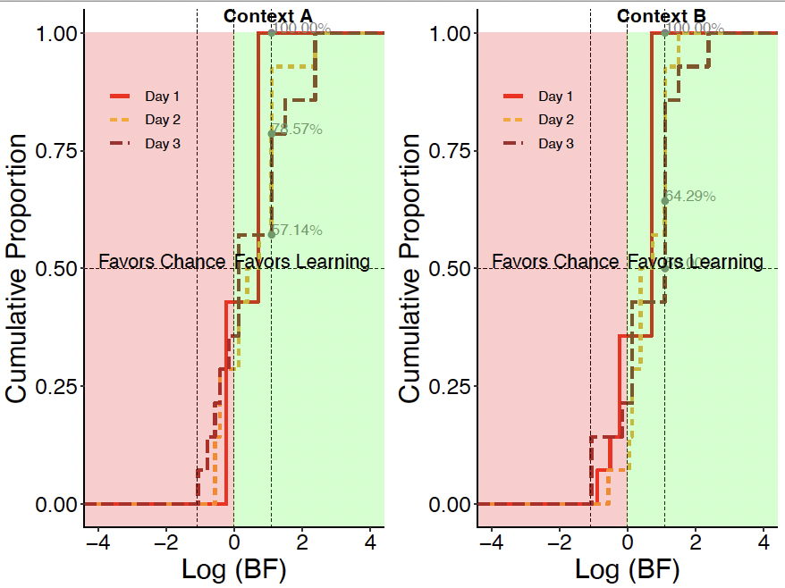

```{r setup, include=FALSE}
 library(knitr)
 knitr::knit_hooks$set(optipng = knitr::hook_optipng)
 knitr::opts_chunk$set(echo = TRUE,comment = "",error=FALSE, warning = FALSE, message = FALSE, fig.show='hold',results='hold', collapse = TRUE, optipng='-o7')
```

```{css, echo=FALSE}
.watch-out {
  background-color: #FFECEE;
  border: 1px solid gray;
}
```

```{css, echo=FALSE}
.main-container {
    max-height: 800px !important;
    overflow-y: scroll !important;
    overflow-x: auto !important;
}

pre {
  max-height: 800px !important;
  overflow-y: scroll !important;
  overflow-x: auto !important;
}
pre code {
  max-height: 800px !important;
  overflow-y: scroll !important;
  overflow-x: auto !important;
}
```

# Preliminars: Packages, functions, and data preload {.unnumbered}

```{r prelim, warning=FALSE, message=FALSE}

source(gzcon(url("https://github.com/ManuMi68/MuLaNa2/raw/main/SupportNeuroSpatial.R")))


```

```{r ResCtrl1, eval=F, echo=FALSE, comment=""}
    # Results
    kableTabl(ezPrecis(DTp),"Design Structure", "")
    cat("---------------------\n");
    cat("Data Structure:\n");
      str(DTp) # Data File
    cat("---------------------\n");
      print(DTp)
    cat("---------------------\n");
      kableTabl(DTRes,"Descriptive", "")
    cat("Omnibus AOV:\n")
      a0
    cat("---------------------\n");
    cat("Pos Hoc Simple Effects:\n")
      PosH.4w$PosHocMM
    #kableTabl(PosH.4w$PosHocMM,"Pos Hoc Simple Effects", "")
    cat("---------------------\n");
    kableTabl(PosH.4w$Means,"Descrptive & CI-95%", "")
    cat(NoteTable);
    cat("---------------------\n");
    # cat("Graphics have been preloaded to avoid page overload\n (see the corresponding section for details).:\n");
    cat("Exploratory Analysis:\n")
    cat(Grp) # Exploratory Analysis
    cat("\n")
```

# **Results Section 1.** Reorienting behavior in a two-context paradigm

## **Figure 1. Reorientation behavior in a two-context paradigm**

------------------------------------------------------------------------

> **Figure 1.** Reorientation behavior in a two-context paradigm. A) Experimental chambers showing reward location (yellow star) in Context A (left) and Context B (right). B) Session structure of two-context paradigm. C) Percentage of digs in each cup location on test trials on day 1 (left), day 2 (center), and day 3 (right). Standard error of the mean is shown in parentheses below the mean percentage values. D) Boxplots showing distribution of digs in geometrically correct vs. incorrect axes in each context. E) Boxplots showing distribution of digs in each cup location combining both contexts. In all boxplot graphs, the boxes indicate the upper and lower quartiles of the data and the whiskers (extending lines) the minimum and maximum outside the quartiles. The horizontal line indicates the median. Dots represent individual data points and asterisks (\*) indicate p ≤ .05, the value at which the significance level was set. F) Cumulative proportion of Bayes Factor (BF) on days 1 to 3 per context evaluating the alternative model (MAlt) that animals preferentially dug on a distinct rewarded axis in each context vs. the null model (Mnull) that animals dug by chance. The point at which the cumulative proportion intercepts the dotted line at 0 shows that even though there are some subtle differences in the rate of learning on day 2, these differences decrease on day 3 (Percentages on negative values: Day 2: Context A: 28.57%, Context B: 7.14%; Day 3: Context A: 35.71%, Context B: 21.43%). G) Cumulative proportion of individual Bayes Factors (BF) across days 1 to 3 combining contexts evaluating the alternative model (MAlt) that animals increased digging in C locations with experience vs. the null model (Mnull) that animals dug by chance. Conventional values showing the border marking credibility for Malt (log(BF) \> log(1/3)= 1.1) and Mnull (log(BF) \< log(1/3)= -1.1) are indicated by vertical dashed lines. The value of half (0.5) of the sample is marked by a horizontal dashed line. N = 14 animals. Source data are provided as a Source Data file.

------------------------------------------------------------------------

### Fig 1C) Percentage of digs in each cup location on test trials across days

{width="527"}

```{r F1C, collapse = FALSE}

  if(!exists('FxDir')) source(gzcon(url("https://github.com/ManuMi68/MuLaNa2/raw/main/SupportNeuroSpatial.R")))
  NmRoo = paste0(DirPath,"/", "Fig1")
  Mk.dir(NmRoo)
  DT.BF <-copy(DigBehavioralDataForBF)

  DT.Perc<-data.table(copy(DT.BF)) %>%
    dplyr::rename(., Context=Group) %>%
    mutate(Dig = dplyr::recode(Dig, C = "C",G = "G", F = "N", W="F")) %>%
    .[, data.table(table(Subj,Dig)),by=.(Context,Day)] %>%
    .[,Perc:=N/sum(N),by=list(Subj,Context,Day)]  %>%
    .[,.(Mean=percent(mean(Perc),0), SEM=percent(sd(Perc)/sqrt(length(Perc)),1) ), by=.(Context, Day, Dig)] %>%
    mutate_at(c("Dig"),factor) %>%
    as.data.table() %>%
    setkey(., Context, Day, Dig)
  
  cat("Percents of Figure 1C:\n")
  DT.Perc

```

### Fig 1D) Boxplots of digs in geometrically correct vs. incorrect axes in each context

{Design: (2 Axis x S) x (3 Day x S) x (2 Context x S)}

3-way repeated measures ANOVA. The `PosHocAut` function allows Post hoc analysis to be carried out

{width="400"}

```{r F1D, warning=FALSE, message=FALSE, out.width="800px", out.height="600px"}
  if(!exists('FxDir')) source(gzcon(url("https://github.com/ManuMi68/MuLaNa2/raw/main/SupportNeuroSpatial.R")))
  NmRoo = paste0(DirPath,"/", "Fig1")
  Mk.dir(NmRoo)
  
  #DT1 <- readRDS(gzcon(url("https://github.com/ManuMi68/MuLaNa2/raw/main/NeuroSpatialData/BehavTwoContext.RDS")))
  DTp<-copy(BehavTwoContext)
  
  
  # "Fig.1D) has been preloaded to avoid overloading problems
  # Box Plot
    ColPer=c("#D599D7", "#AA33B0","#700075")
    Grp.1D<- Grph.2023(
      DatP = DTp,
        Dvp="Proportion", VarX="Context",VarFill="Day",
        LblsP =c("Cluster Quality", "","Dig Percent Per Animal",""),
        ylmP =c(0,100),hLin = F,lvIp = 4,GrpSel = c(1:3),wMain=F,
      TyGrp="Box", # Bar, Box, Violin, SplitViolin
      Wthdot=T, Relleno=T, ResumAd=T,ColPer=ColPer
    ) 
   Grp.1D <- Grp.1D + facet_grid( ~ Axis)
   ggsave(paste0(NmRoo,"/Fig1D.pdf"), Grp.1D, width=10, height=10)
   
   
# Descriptive
  DTRes<-DTp[, rbindlist(lapply(.SD, stats_MM)), .SDcols = 'Proportion', by=.(Axis,Day,Context)]
  #DTRes<-DTp[,c(N = .N,as.list(summary(Proportion))), by=.(Axis,Day,Context)]
  write.csv2(DTRes,paste0(NmRoo, "/BehavTwoContext_Descriptive.csv"))
 
 
# AOV
  a0 <- aov_ez("Subject", "Proportion", DTp,
        within = c("Axis","Context","Day"))
  
  # Effect size & Mixed
  eef<-effectsize::eta_squared(a0, generalized=TRUE)
  Mod.1r<-lmer(Proportion~Day * Axis * Context + (1|Subject),data=DTp)
  
  # Pos Hoc of the more complex significant effect: Axis:Context
  # Defines orthogonal contrasts from a prioristic perspective
  custom <- list(`Unique` = c(1, -1))
  PosH.4w = PosHocAut(a0, Mod.1r, "Axis|Context", c("Context","emmean"), custom=custom)
  NoteTable<-NotePosHoc.Emm
  # Since the focal variable has only two levels, the Rom correction is not necessary  
  
  Grp<-"Run Grp.1D"
  # Grp.1D
  <<ResCtrl1>>
```

### Fig 1E) Boxplots of digs in each cup location combining both contexts

{Design: (4 Dig x S) x (3 Day x S)}

2-way repeated measures ANOVA. The `PosHocAut` function allows Post hoc analysis to be carried out

{width="400"}

```{r F1E, warning=FALSE, message=FALSE, out.width="800px", out.height="600px"}
  if(!exists('FxDir')) source(gzcon(url("https://github.com/ManuMi68/MuLaNa2/raw/main/SupportNeuroSpatial.R")))
  NmRoo = paste0(DirPath,"/", "Fig1")
  Mk.dir(NmRoo)
  #DT2 <- readRDS(gzcon(url("https://github.com/ManuMi68/MuLaNa2/raw/main/NeuroSpatialData/DigBehavioralData.RDS")))
  DTp<-copy(DigBehavioralData)
  
# Fig.1E) Box Plot
    ColPer=c("#D599D7", "#AA33B0","#700075")
    Grp.1E<- Grph.2023(
      DatP = DTp,
      Dvp="Perc", VarX="Dig", VarFill="Day",
      LblsP =c("Cluster Quality", "","Dig Percent Per Animal","Location of first dig"),
      ylmP =c(0,100),hLin = F,lvIp = 4,GrpSel = c(1:3),wMain=F,
      TyGrp="Box", # Bar, Box, Violin, SplitViolin
      Wthdot=T, Relleno=T, ResumAd=T,ColPer=ColPer
    )
    ggsave(paste0(NmRoo,"/Fig1E.pdf"), Grp.1E, width=10, height=10)
  
# Descriptive
  DTRes<-DTp[, rbindlist(lapply(.SD, stats_MM)), .SDcols = 'Perc', by=.(Dig,Day)]
  #DTRes<-DTp[,c(N = .N,as.list(summary(Perc))), by=.(Dig,Day)]
  write.csv2(DTRes,paste0(NmRoo, "/DigBehavioralData_Descriptive.csv"))
  
# AOV
  a0 <- aov_ez("Subject", "Perc", DTp,
        within = c("Dig","Day"))
  
  # Effect size & Mixed
  eef<-effectsize::eta_squared(a0, generalized=TRUE)
  Mod.1r<-lmer(Perc~Day * Dig + (1|Subject),data=DTp)
    
  
# Pos Hoc
  # Defines orthogonal contrasts from a prioristic perspective
  custom <- list(`CG vs NF` = c(1, 1,-1,-1),
                     `C vs G` = c(1,-1, 0, 0),
                    `N vs F` = c(0, 0, 1,-1)
                 )
  PosH.4w = PosHocAut(a0, Mod.1r, "Dig|Day", c("Day","emmean"), custom=custom)
  NoteTable<-NotePosHoc.Emm
  Grp<-"Run Grp.1E code"
  # Grp.1E
  <<ResCtrl1>> 
```

### Fig 1F) Cumulative proportion of Bayes Factor (BF) on days 1 to 3 per context

{width="400"}

The `MakeBF` function allows you to obtain all estimates related to Bayesian statistics. For this you can explore the following fields, for example in the variable *Res.50* (which are also stored in the text file *50Chan Global.txt*):

-   Global

-   ecdfMM

-   Detall

-   GlobalAPA

-   GrpGroup

-   GrpDay

-   GrpJn

```{r F1F, warning=FALSE, message=FALSE, collapse=FALSE, out.width="500px", out.height="400px"}
  if(!exists('FxDir')) source(gzcon(url("https://github.com/ManuMi68/MuLaNa2/raw/main/SupportNeuroSpatial.R")))
  NmRoo = paste0(DirPath,"/", "Fig1")
  Mk.dir(NmRoo)
  ValsBF2=seq(-2, 2, by=1.0)
  logEs10=F
  if (logEs10)  ValsBF=sort(c(seq(-2,2,by=.5),-log10(3),log10(3),-.01))
  if (!logEs10) ValsBF=sort(c(seq(-2,2,by=.5),-log(3),log(3),-.01))
  # unique(DT.BF$Subj) AK42   AK74   JJ9    HG1    K1     MG1    CMG159 CMG089 CMG129 CMG154 CMG162 CMG161 CMG169 CMG087
  Nsj=14; LgSess=12
  nFi=Nsj*LgSess*2+Nsj*4 # Check Files: 392
  #DT.BF <- readRDS(gzcon(url("https://github.com/ManuMi68/MuLaNa2/raw/main/NeuroSpatialData/DigBehavioralDataForBF.RDS")))
  DT.BF <-copy(DigBehavioralDataForBF)
  
  # Process the data to test:
   # the alternative model (MAlt) that animals preferentially dug on the rewarded axis
   # in each context (long wall right in Context A and long wall left in Context B) vs.
   # the null model (Mnull) that animals dug by chance (50%).
   # Note especially line:  .[,BF:=BayNormRam(z,N,li=.5,ls=.9,Nulo=.5),by=list(Group,Day,Subj)] 
  DT.50<-data.table(copy(DT.BF)) %>%
        .[,AxisMM :=Dig] %>% .[,HitsMM :=Dig] %>%
        mutate(AxisMM = dplyr::recode(AxisMM, C = "C/G",F = "N/W", G = "C/G", W="N/W")) %>%
        mutate(HitsMM = dplyr::recode(HitsMM, C = "1",  F = "0",   G = "1",   W="0")) %>%
        mutate(HitsMM = as.numeric(as.character(HitsMM))) %>%
        data.table() %>%
        .[, data.table(table(Subj,Day,AxisMM)),by=Group] %>%
        .[,Perc:=N/sum(N),by=list(Group,Subj,Day)] %>%
        .[,zz:=sum(N),by=list(Group,Subj,Day)] %>%
        .[AxisMM=="C/G"] %>%
        .[,Inter:=interaction(Group,Day)] %>%
        dplyr::rename(., z=N) %>%
        dplyr::rename(., N=zz) %>%
        .[,BF:=BayNormRam(z,N,li=.5,ls=.9,Nulo=.5),by=list(Group,Day,Subj)] %>%
        .[,InterBF:=InterpBF(BF),by=list(Group,Day,Subj)] %>%
        IfFilterLog(.,Fs = logEs10) %>%
        .[, ecdfr := lapply(.SD, function(z) stats::ecdf(z)(z)), .SDcols = "logBF", by = .(Group,Day) ] %>%
        mutate(Day=factor(Day)) %>%
        dplyr::rename(., Subject=Subj)  %>%
        as.data.table()
  
  # Overall results and Fig. 1F
  Res.50 = MakeBF(DT.50, paste0(NmRoo, "/50Chan"))
  cat("BF Overall results of Fig. 1F:\n")
  Res.50$Global
  cat("Run Res.50$GrpDay$All code for Fig. 1F :\n")
  # To View Fig.1F:
  # Res.50$GrpDay$All
```

### Table S1) Complement of Figure 1. Individual data points corresponding to Figure 1C showing percent of digs in each cup per context

```{r TS1}
    # To obtain the percentages data  
    DTPerc<- data.table(copy(DT.BF)) %>%
          .[, data.table(table(Subj,Day,Dig)),by=Group] %>%
          .[,Perc:=percent(N/sum(N)),by=list(Group,Subj,Day)] %>%
           mutate(Dig = dplyr::recode(Dig, C = "Correct",G = "Geo", F = "Near", W="Far")) %>%
          mutate(N=NULL)  %>%
          data.table()

   # To obtain the percentages data in wide format   
    DTFPivot<-DTPerc %>%
          pivot_wider(names_from = c(Dig, Group), values_from = Perc, names_vary = "slowest")
    kableTabl(DTFPivot,"percent of digs in each cup per context", "Table S1. Complement of Figure 1")
    write.csv2(DTFPivot,paste0(NmRoo,"/DigPercents.csv"))
```

### Table S2) Individual Data of Fig.1F)

------------------------------------------------------------------------

> **Table S2. Complement of Figure 1F.** Complement of Figure 1F. Individual and global Bayes Factors (BF) to test the alternative model (MAlt) that animals preferentially dug on the correct axis in each context (long wall right in context A and long wall left in context B, Fig.1) vs. the null model (Mnull) that animals dug by chance. Note that the global BF were \> than 1.1 across days and contexts, providing support for the MAlt.

------------------------------------------------------------------------

```{r TS2, warning=FALSE, message=FALSE, collapse=FALSE}

  DT.50[, .(Group,Day,Subject, logBF) ]
```

### Fig 1G) Cumulative proportion of individual Bayes Factors (BF) across days 1 to 3 combining contexts

{width="400"}

As in Figure 1F, also here we use a general function, `MakeBFNoCx` (simliar to MakeBF`)`. You can explore the variable *Res.25.NoCx* (which are also stored in the text file *25Chan_FolCx Global.txt*):

```{r F1G, warning=FALSE, message=FALSE, collapse=FALSE, out.width="500px", out.height="400px"}
  if(!exists('FxDir')) source(gzcon(url("https://github.com/ManuMi68/MuLaNa2/raw/main/SupportNeuroSpatial.R")))
  NmRoo = paste0(DirPath,"/", "Fig1")
  Mk.dir(NmRoo)
  ValsBF2=seq(-2, 2, by=1.0)
  logEs10=F
  if (logEs10)  ValsBF=sort(c(seq(-2,2,by=.5),-log10(3),log10(3),-.01))
  if (!logEs10) ValsBF=sort(c(seq(-2,2,by=.5),-log(3),log(3),-.01))
  # unique(DT.BF$Subj) AK42   AK74   JJ9    HG1    K1     MG1    CMG159 CMG089 CMG129 CMG154 CMG162 CMG161 CMG169 CMG087
  Nsj=14; LgSess=12
  nFi=Nsj*LgSess*2+Nsj*4 # Check Files: 392
  #DT.BF <- readRDS(gzcon(url("https://github.com/ManuMi68/MuLaNa2/raw/main/NeuroSpatialData/DigBehavioralDataForBF.RDS")))
  DT.BF <-copy(DigBehavioralDataForBF)
 
  # Process the data to test:
     # the alternative model (MAlt) that animals dug in the rewarded cup location vs.
     # the null model (Mnull) that animals dug by chance (25%).
     # Note especially line:  .[,BF:=BayNormRam(z,N,li=.25,ls=.9,Nulo=.25),by=list(Day,Subj)]
  DT.25.NoCx<-data.table(copy(DT.BF)) %>%
        .[,AxisMM :=Dig] %>% .[,HitsMM :=Dig] %>%
        mutate(AxisMM = dplyr::recode(AxisMM, C = "C/G",F = "N/W", G = "N/W", W="N/W")) %>%
        mutate(HitsMM = dplyr::recode(HitsMM, C = "1",  F = "0",   G = "0",   W="0")) %>%
        mutate(HitsMM = as.numeric(as.character(HitsMM))) %>%
        data.table() %>%
        .[, data.table(table(Subj,AxisMM)),by=Day] %>%
        .[,Perc:=N/sum(N),by=list(Day,Subj)] %>%
        .[,zz:=sum(N),by=list(Day, Subj)] %>%
        .[AxisMM=="C/G"] %>%
        .[,Inter:=Day] %>%
        dplyr::rename(., z=N) %>%
        dplyr::rename(., N=zz) %>%
        .[,BF:=BayNormRam(z,N,li=.25,ls=.9,Nulo=.25),by=list(Day,Subj)] %>%
        .[,InterBF:=InterpBF(BF),by=list(Day,Subj)] %>%
         IfFilterLog2(.,Fs = logEs10) %>%
        .[, ecdfr := lapply(.SD, function(z) stats::ecdf(z)(z)), .SDcols = "logBF", by = .(Day) ] %>%
        mutate(Day=factor(Day)) %>%
        dplyr::rename(., Subject=Subj)  %>%
        as.data.table()
  
  # Overall results and Fig. 1G
  Res.25.NoCx = MakeBFNoCx(DT.25.NoCx, paste0(NmRoo, "/25Chan_FolCx"))
  cat("BF Overall results of Fig. 1G:\n")
  Res.25.NoCx$Global
  cat("Run Res.25.NoCx$GrpDay code for Fig. 1G:\n")
  # To view Figure 1G:
  # Res.25.NoCx$GrpDay
```

### Table S3) Individual Data of Fig.1G).

------------------------------------------------------------------------

> **Table S3. Complement of Figure 1G.** Individual and global Bayes Factors (BF) to test the alternative model (MAlt) that animals dug in the correct cup location vs. the null model (Mnull) that animals dug by chance. \[log(BF)\> 1.1 provides credibility for MAlt,, log(BF) \< -1.1 provides credibility for Mnull\]. The results indicated that the alternative model only had credibility on days 2 and 3, indicating that with experience animals dug in the correct cup more than other.

------------------------------------------------------------------------

```{r TS3, warning=FALSE, message=FALSE, collapse=FALSE}

  DT.25.NoCx[, .(Day,Subject,logBF) ]

```

------------------------------------------------------------------------

# **Results Section 2.** Place field alignment to spatial geometry persists over days and predicts digging behavior

## **Figure 2. Place field alignment to spatial geometry persists over days.**

------------------------------------------------------------------------

> **Figure 2.** Place field alignment to spatial geometry persists over days. A) Example place cell maps from two simultaneously recorded cells on day 3 from electrophysiology (left) and calcium-imaging (right) recordings. B) Quantification of best match rotation (BMR) between trials for a cell. C) Boxplots showing distribution of best-match rotations across days using electrophysiological (N = 7 animals on day 1 and 6 animals on days 2 and 3, left) and calcium-imaging (N = 5 animals, right) recordings, computed as the proportion of pairwise trial comparisons for which each rotation yielded the best match, averaged per animal. Significant effect of rotations was found for electrophysiological, left (p \< .0040) and calcium-imaging, right (p \< .0001) recordings, using 3 x 4 repeated measures ANOVA with Post hoc Rom’s test. Boxplots are composed of a horizontal line (median), a box (upper and lower quartiles), whiskers (minimum and maximum values), and dots (individual data points). D) Schematic of heading prediction method using the center-out measure. E) Heading prediction accuracy. The orientation of the hippocampal map predicted heading on days 2 and 3 but not on day 1 (robust one-tailed t-test relative to chance; Day 1: p = .1680; Day 2: p \< .0300; Day 3: p \< .0280). Bar charts represent mean ± standard error of the mean (SEM), circles represent individual animal points (Day 1 N = 12, Day 2 and 3 N = 11 animals). Black dashed line represents chance level (50%). Asterisks (\*) indicate a significance value set at .05. Source data are provided as a Source Data file.

> **Figure S4.** Complement of Figure 2. Error prediction and proportion of dig sequences per trial as a function of place field angular rotation. A) Prediction of N and F error trails using the center out angle of these trials. The sine and cosine of each cells’ N and F trials’ center-out angle were used to train a support vector machine classifier, validated using a leave-one-out approach. Error trials could not be predicted above chance one sample, 1 tailed t-test: day 1: t(8)=1.07, p = .3175; day 2: t(7)=0.02, p = .9887; day 3: t(8)=0.53, p = .6075. B-D) Heatmap matrices showing proportion of dig sequences per trial as a function of place field angular rotation (0o, 90o, 180o, 270o) on day 1 (B), day 2 (C), and day 3 (D). Note that C/C and C/G are the most prevalent dig sequences, which is illustrated in vivid yellow/green colors. 90o and 270o rotations happen sporadically, even during C/C G/C or C/G sequences, which may reflect inherent noise in neural data. Colors indicate response counts, with yellow reflecting higher counts and dark blue lower ones.

------------------------------------------------------------------------

### Fig.2C-left) Distribution of bestmatch rotations across days using electrophysiological recordings

{Design (3 Day x S) x (4 Rotaton x S)}

2-way repeated measures ANOVA. The `PosHocAut` function allows Post hoc analysis to be carried out

{width="400"}

```{r F2C-L, warning=FALSE, message=FALSE, out.width="800px", out.height="600px"}
  if(!exists('FxDir')) source(gzcon(url("https://github.com/ManuMi68/MuLaNa2/raw/main/SupportNeuroSpatial.R")))
  NmRoo = paste0(DirPath,"/", "Fig2")
  Mk.dir(NmRoo)
   
  #DT3 <- readRDS(gzcon(url("https://github.com/ManuMi68/MuLaNa2/raw/main/NeuroSpatialData/Tetrodes.RDS")))
  DTp<-copy(Tetrodes)
  
  # "Fig.2CLeft) Box Plot
    ColPer=c("#D599D7", "#AA33B0","#700075")
    Grp.2CL<- Grph.2023(
      DatP = DTp,
        Dvp="Proportion", VarX="Rotation",VarFill="Day",
        LblsP =c("Cluster Quality", "","Percent Trial Pairs","Best Match Rotation"),
        ylmP =c(0,.6),hLin = F,lvIp = 4,GrpSel = c(1:3),wMain=F,
      TyGrp="Box", # Bar, Box, Violin, SplitViolin
      Wthdot=T, Relleno=T, ResumAd=T,ColPer=ColPer
    )
    ggsave(paste0(NmRoo,"/Fig2C_Left.pdf"), Grp.2CL, width=10, height=10)
  
# Descriptive
  DTRes<-DTp[, rbindlist(lapply(.SD, stats_MM)), .SDcols = 'Proportion', by=.(Rotation,Day)]
  #DTRes<-DTp[,c(N = .N,as.list(summary(Proportion))), by=.(Rotation,Day)]
  write.csv2(DTRes,paste0(NmRoo, "/Tetrodes_Descriptive.csv"))
 
# AOV
  a0 <- aov_ez("Subject", "Proportion", DTp,
        within = c("Rotation","Day"))
  
  # Effect size & Mixed
  eef<-effectsize::eta_squared(a0, generalized=TRUE)
  Mod.1r<-lmer(Proportion~Day * Rotation + (1|Subject),data=DTp)
      
# Pos Hoc
  # Defines orthogonal contrasts from a prioristic perspective
  custom <- list(`0.180vs90.270` = c(1,-1, 1,-1),
                       `0vs180` =  c(1, 0,-1, 0),
                      `90vs270` =  c(0, 1, 0,-1)
                   )
                 
  PosH.4w = PosHocAut(a0, Mod.1r, "Rotation", c("Rotation","emmean"), custom=custom)
  NoteTable<-NotePosHoc.Emm
  Grp<-"Run Grp.2CL code"
  # Grp.2CL
  <<ResCtrl1>> 
```

### Fig.2C-right) Distribution of bestmatch rotations across days using calcium-imaging recordings

{Design (3 Day x S) x (4 Rotaton x S)}

2-way repeated measures ANOVA. The `PosHocAut` function allows Post hoc analysis to be carried out

{width="400"}

```{r Fig2C-R, warning=FALSE, message=FALSE}
  if(!exists('FxDir')) source(gzcon(url("https://github.com/ManuMi68/MuLaNa2/raw/main/SupportNeuroSpatial.R")))
  NmRoo = paste0(DirPath,"/", "Fig2")
  Mk.dir(NmRoo)
  
  #DT4 <- readRDS(gzcon(url("https://github.com/ManuMi68/MuLaNa2/raw/main/NeuroSpatialData/CalciumNormal.RDS")))
  DTp<-copy(CalciumNormal)
  
  # Fig.2CRight) Box Plot
    ColPer=c("#D599D7", "#AA33B0","#700075")
    Grp.2CR<- Grph.2023(
      DatP = DTp,
        Dvp="Proportion", VarX="Rotation",VarFill="Day",
        LblsP =c("Cluster Quality", "","Percent Trial Pairs","Best Match Rotation"),
        ylmP =c(0,.6),hLin = F,lvIp = 4,GrpSel = c(1:3),wMain=F,
      TyGrp="Box", # Bar, Box, Violin, SplitViolin
      Wthdot=T, Relleno=T, ResumAd=T,ColPer=ColPer
    )
    ggsave(paste0(NmRoo,"/Fig2C_Right.pdf"), Grp.2CR, width=10, height=10)
  
# Descriptive
  DTRes<-DTp[, rbindlist(lapply(.SD, stats_MM)), .SDcols = 'Proportion', by=.(Rotation,Day)]
  #DTRes<-DTp[,c(N = .N,as.list(summary(Proportion))), by=.(Rotation,Day)]
  write.csv2(DTRes,paste0(NmRoo, "/CalciumNormal_Descriptive.csv"))
 
# AOV
  a0 <- aov_ez("Subject", "Proportion", DTp,
        within = c("Rotation","Day"))
  
  # Effect size & Mixed
  eef<-effectsize::eta_squared(a0, generalized=TRUE)
  Mod.1r<-lmer(Proportion~Day * Rotation + (1|Subject),data=DTp)
  
# Pos Hoc
  # Defines orthogonal contrasts from a prioristic perspective
  custom <- list(`0.180vs90.270` = c(1,-1, 1,-1),
                       `0vs180` =  c(1, 0,-1, 0),
                      `90vs270` =  c(0, 1, 0,-1)
                   )
                 
  PosH.4w = PosHocAut(a0, Mod.1r, "Rotation", c("Rotation","emmean"), custom=custom)
  NoteTable<-NotePosHoc.Emm
  Grp <- "Run Grp.2CR code"
  # Grp.2CR
  <<ResCtrl1>> 
```

### Fig.2E) Heading prediction accuracy using center-out measure

{Design: (3 Day x S)}

Robust one-sample test with respect to chance level, on each of the 3 days.

The **`OneSmRob`** function allows to extract the statistics needed for a robust one-sample test from the relevant Wilcox' functions. In addition, **effect size estimates** as well as relevant descriptive statistics are added to facilitate power estimates or meta-analysis studies.

{width="400"}

```{r F2E, warning=FALSE, message=FALSE, out.width="800px", out.height="600px"}
  if(!exists('FxDir')) source(gzcon(url("https://github.com/ManuMi68/MuLaNa2/raw/main/SupportNeuroSpatial.R")))
  NmRoo = paste0(DirPath,"/", "Fig2")
  Mk.dir(NmRoo)
  
  #DTp <- readRDS(gzcon(url("https://github.com/ManuMi68/MuLaNa2/raw/main/NeuroSpatialData/CenterOutCorrectHeadingPrediction.RDS")))
  DTp<-copy(CenterOutCorrectHeadingPrediction)
  
  DTp2 <- DTp %>% 
      mutate(Accuracy = Accuracy*100) %>%
      data.table()
  

# "Fig.2E) has been preloaded to avoid overloading problems
# Bar Plot with jitters points
    ColPer=c("#D599D7", "#AA33B0","#700075")
    Grp.2E<- Grph.2023(
    DatP = DTp2,
      Dvp="Accuracy", VarX="Day",VarFill="Day",
      LblsP =c("Cluster Quality", "","Percent Trials Predicted","Day"),
      ylmP =c(0,100),hLin = T,lvIp = 3,GrpSel = c(1:3),wMain=F,
    TyGrp="Bar", # Bar, Box, Violin, SplitViolin
    Wthdot=T, Relleno=T, ResumAd=F,ColPer=ColPer,hlVa0 = 50
  )
    ggsave(paste0(NmRoo,"/Fig2E.pdf"), Grp.2E, width=10, height=10)
    
# Descriptive
  DTRes<-DTp2[, rbindlist(lapply(.SD, stats_MM)), .SDcols = 'Accuracy', by=.(Day)]
  write.csv2(DTRes,paste0(NmRoo, "/CenterOutCorrectHeadingPrediction_Descriptive.csv"))  
  
  
# Robust One-sample tests by Day
  # "OneSmRob" function allows to extract robust one-sample test from the relevant Wilcox' functions (D.akp.effect.ci)
  ResOne<-lapply(levels(DTp$Day), function(ii) paste0("Day ",ii, ": ",OneSmRob(DTp[Day==ii]$Accuracy)))
  RobRes2<- data.table(data.table(do.call("rbind", ResOne))[[2]])
  
  # Print Results
  kableTabl(ezPrecis(DTp),"Design Structure", "")
    cat("---------------------\n");
    cat("Data Structure:\n");
      str(DTp) # Data File
    cat("---------------------\n");
      print(DTp)
    cat("---------------------\n");
      kableTabl(DTRes,"Descriptive", "")
    cat("Robust One-sample tests by Day:\n")
      RobRes2
    cat("---------------------\n");
    # cat("Graphics have been preloaded to avoid page overload\n (see the corresponding section for details).:\n");
    cat("Exploratory Analysis:\n")
    cat("Run Grp.2E Code to generate Figure 2E\n") # Exploratory Analysis
    cat("\n")
```

### Fig.S4A) Prediction of N and F error trails using the center out angle of these trials

{Design: (3 Day x S)}

Robust one-sample test with respect to chance level, on each of the 3 days.

The **`OneSmRob`** function allows to extract the statistics needed for a robust one-sample test from the relevant Wilcox' functions. In addition, **effect size estimates** as well as relevant descriptive statistics are added to facilitate power estimates or meta-analysis studies.

```{r F2Eb, warning=FALSE, message=FALSE, out.width="800px", out.height="600px"}
  if(!exists('FxDir')) source(gzcon(url("https://github.com/ManuMi68/MuLaNa2/raw/main/SupportNeuroSpatial.R")))
  NmRoo = paste0(DirPath,"/", "Fig2")
  Mk.dir(NmRoo)
  
  #DTp <- readRDS(gzcon(url("https://github.com/ManuMi68/MuLaNa2/raw/main/NeuroSpatialData/CenterOutWongHeadingPrediction.RDS")))
  DTp<-copy(CenterOutWongHeadingPrediction)
  
  DTp2 <- DTp %>% 
      mutate(Accuracy = Accuracy*100) %>%
      data.table()
      
# Descriptive
  DTRes<-DTp2[, rbindlist(lapply(.SD, stats_MM)), .SDcols = 'Accuracy', by=.(Day)]
  write.csv2(DTRes,paste0(NmRoo, "/CenterOutWongHeadingPrediction_Descriptive.csv"))
  
  
# Robust One-sample tests by Day
  # "OneSmRob" function allows to extract robust one-sample test from the relevant Wilcox' functions (D.akp.effect.ci)
  ResOne<-lapply(levels(DTp$Day), function(ii) paste0("Day ",ii, ": ",OneSmRob(DTp[Day==ii]$Accuracy)))
  RobRes2<- data.table(data.table(do.call("rbind", ResOne))[[2]])
  
  # Print Results
  kableTabl(ezPrecis(DTp),"Design Structure", "")
    cat("---------------------\n");
    cat("Data Structure:\n");
      str(DTp) # Data File
    cat("---------------------\n");
      print(DTp)
    cat("---------------------\n");
      kableTabl(DTRes,"Descriptive", "")
    cat("Robust One-sample tests by Day:\n")
      RobRes2
    cat("---------------------\n");
```

# **Results Section 3.** Different CA1 cells display distinct context sensitivity

## **Figure 3. Different CA1 cells display distinct context sensitivity.**

------------------------------------------------------------------------

> **Figure 3.** Different CA1 cells display distinct context sensitivity. A) Hypothetical neural representations of context recognition. B) Schematic of map alignment procedure. C) Distribution of context similarity scores across context for cells with at least one place field in both contexts (n = 2526 cells). Red dashed line represents threshold to separate cells as feature-sensitive (FS) or feature-insensitive (FI). D) Proportion of FI and FS cells recorded on day 1 (n = 925 cells), day 2 (n = 915 cells), and day 3 (n = 699 cells). E) Examples of average aligned maps of FI (left) and FS (right) cells from electrophysiology (top) and calcium-imaging (bottom) recordings, along with the corresponding context similarity measures. Source data are provided as a Source Data file.

> **Figure S5.** Validation of remapping threshold. A) Scatterplots showing average correlations within and across context for individual cells separated in deciles obtained from the similarity distribution shown in Figure 3C. B) Asymptotic regression model of the overall correlation decile function. The red dot indicates the half life of the function, which coincides with decile 1 (correlations across context between 0 and 0.3) and the root of the function (value that makes the function 0 on the y axis). Finally, in the asymptotic regression model, the relative growth rate is not constant. It attains its peak when Y = 0 and diminishes as Y increases. This suggests that Decile 1, corresponding to Y = 0, represents the point at which the rate of change is maximized. This indicates that that the first decile is the most informative to discriminate across context (Modeling method detailed in Figure S6 and Table S4). Cells included in this analysis had place fields in at least 2 trials in each context to obtain within and across correlation values (n=2515). Source data are provided as a Source Data file.

> **Figure S9. Complement of Figure 3.** Properties of FI and FS cells. A. Spatial information content in FS and FI cells. A robust 2-way ANOVA was conducted on spatial information content, with day of testing (day 1 to 3) and Cell type (FI and FS) as between’ factors. Results revealed a main effect of day \[Fw(2) = 15.57, p = .001, 𝛏 = 0.17\], as well as an interaction between day and stability \[Fw(2) = 6.56, p = .044, 𝛏 = 0.17\], but no effect of Cell Type \[F \< 1\]. Robust Rom’s multiple comparisons indicated that there were no differences between FI and FS on any testing day (p \>.05). However, FI cells displayed a difference between days 1 and 2 \[p \< .001; 𝛏 =0.26\] and days 1 and 3 \[p \< .001 𝛏 = 0.19\], with no differences between days 2 and 3 \[p \>.05; 𝛏 = 0.08\]. FS cells did not show differences across days (p \> .05). B. Spatial information content grouping data based on similarity correlation values across context divided in deciles (Figure S5). Spatial information content was calculated per day and averaged across days. A one-way ANOVA indicated no differences across deciles \[F(9, 2516)=  1.07, p= 0.38\]. The Boxplots boxes indicate the upper and lower quartiles of the data and the whiskers (extending lines) the minimum and maximum outside the quartiles. The horizontal line indicates the median. Total number of cells: N=2526. Asterisks (\*) represent a significance value set at .05. Red crosses in panel B indicate outliers. Source data are provided as a Source Data file. Spatial information from calcium traces was calculated using the method developed for calcium traces by Climer and Dombeck, 2021, based on Skaggs et al., 1993.

> **Figure S10. Complement of Figure 3.** Bar charts showing that FI and FS cells display similar geometric alignment within context. A-F) Although our analysis of map similarity across context indicated that FS cells displayed feature-sensitive remapping, we observed that when analyzed as a group, without distinguishing between FS and FI, the population of active cells aligned to geometry (Figure 3C-D). This result could happen if both FS and FI cell align to geometry within context despite having different phenotypes across context. To investigate this possibility, we evaluated the alignment of FS and FI within each context by conducting the best match rotation analysis depicted in Figure 3A, but this time broken down by chamber. This analysis was performed on the calcium imaging data to have sufficient data points for FS cells. A 4-way repeated measures ANOVA with Context (A or B) and Rotation (0°, 90°, 180°, 270°) as within cells’ factors, and cell type (FI or FS) and day (days 1-3) as between factors showed both FI and FS cells displayed geometric alignment within each context. There was a significant main effect of rotation \[F(2.89, 5827.38) = 78.27, p \< .001. Additionally, there was a significant interaction between Day, Context and Rotation \[F(5.83, 5884.64) = 2.86, p \< .001; the complete results of this ANOVA are shown in Table S5\]. In agreement with our hypothesis, post hoc Rom’s tests showed that the best match rotations at 0° and 180° occurred more often than other rotations in both Context A and Context B (p \< .05 on days 1 and 3). Even though geometric alignment persisted throughout training, on day 3 both FS and FI cells also showed higher proportion of best match rotations at 0° than 180º in both contexts (p \< .05), paralleling the increase in number of correct digs. Bar chart represent mean ± standard error of the mean (SEM). Asterisks (\*) represent a significance value set at .05. Source data are provided as a Source Data file.

> **Figure S11. Complement of Figure 3.** Same data shown in Figure S10 plotted as boxplots with overlaid violin plots to depict variability in the data. Violin plots display a rotated kernel density plot on each side, estimating the density function with kernels as weights. The width represents data density, with peaks indicating frequent values and valleys indicating less frequent ones. Inside the violins, box plots show the median (horizontal line), interquartile range (boxes), variability outside the upper and lower quartiles (whiskers), and a diamond symbol representing the weighted mean used for statistics. Asterisks (\*) represent a significance value set at .05. Source data are provided as a Source Data file.

------------------------------------------------------------------------

### Fig.3C) Distribution of context similarity scores across context for all cells

{width="600"}

```{r F3C, out.width="800px",out.height="600px"}
  if(!exists('FxDir')) source(gzcon(url("https://github.com/ManuMi68/MuLaNa2/raw/main/SupportNeuroSpatial.R")))
  NmRoo = paste0(DirPath,"/", "Fig3")
  Mk.dir(NmRoo)
  
  #DT5 <- readRDS(gzcon(url("https://github.com/ManuMi68/MuLaNa2/raw/main/NeuroSpatialData/CalcTetrodePairwiseCorrRaw.RDS")))
  DTp<-copy(CalcTetrodePairwiseCorrRaw)
  
  pdf(paste0(NmRoo,"/Fig3C.pdf"),width = 12,height = 6)
        hist(DTp$bestCorrelation,breaks = 60,freq = F,col = "dodgerblue",xlab="Context Similariry",main="")
        abline(v=.3,lty=2,col="red",lwd=3)
        rect(-.2,0,.3,2.1,col=rgb(1,0,0,alpha=0.3))
        rect(.3,0,1,2.1,col=rgb(0,0,1,alpha=0.3))
        text(.25,2,"FS")
        text(.35,2,"FI")
  dev.off()
  
  # Alternative method with ggplot
  #GrpCorr<-ggplot(DTp, aes(x=bestAlignedCorrelation, after_stat(density))) + 
  #  geom_histogram(bins=60,color="black", fill="dodgerblue") + 
  #  geom_vline(aes(xintercept=.3), color="red", linetype="dashed", size=3) +theme_bw_MM()
  
  cat("For Figure 3C, run the following code lines of hist\n")
    # hist(DTp$bestAlignedCorrelation,breaks = 60,freq = F,col = "dodgerblue",
    #      xlab="Context Similariry",main="")
    #       abline(v=.3,lty=2,col="red",lwd=3)
    #       rect(-.2,0,.3,2.1,col=rgb(1,0,0,alpha=0.3))
    #       rect(.3,0,1,2.1,col=rgb(0,0,1,alpha=0.3))
    #       text(.25,2,"FS")
    #       text(.35,2,"FI")
```

### Fig.3D) Proportion of FI and FS cells recorded across days

{width="200"}

```{r F3D, out.width="400px", out.height="600px", collapse=FALSE}
  if(!exists('FxDir')) source(gzcon(url("https://github.com/ManuMi68/MuLaNa2/raw/main/SupportNeuroSpatial.R")))
  NmRoo = paste0(DirPath,"/", "Fig3")
  Mk.dir(NmRoo)
  
  DTx <- copy(CalcTetrodePairwiseCorrRaw)
  # We read the file and compute the cutoff value
   # Cells with context similarity equal or below 0.3 were defined as Feature-Sensitive (FS)
   # and cells with context similarity above 0.3 were defined as Feature-Insensitive (FI).
  DTp2<- na.omit(DTx) %>%
    .[,CellType:= sapply(bestCorrelation,function(x) if(x<=.3) 'FS' else "FI")] %>%
      data.table()
  
  # n = 2539 total records
  # Of which, there are a total of 13 values with records exclusively in one context,
  # that count as "FS" type
  NaVal=cbind(DTx[is.na(bestCorrelation)],CellType="FS")
  DTp2 <- rbind(DTp2,NaVal ) %>%
   mutate_at(c('dayUsed', 'CellType'),factor) %>%
    data.table()
  DTp2 <- DTp2 %>%
  .[,data.table(table(CellType)), by=dayUsed] %>%
  .[,Perc:=percent(N/sum(N)), by=dayUsed] %>%
    dplyr::rename(., Day=dayUsed) %>%
    data.table()
  
  # Exploratory Analysis
  # Horizontal Bar Chart
  DTp3 <- DTp2 %>%
    mutate(Day=factor(Day, levels=c("3","2", "1"))) %>%
    mutate(Day = dplyr::recode(Day, "1" = "Day 1","2" = "Day 2", "3" = "Day 3")) %>%
    mutate(CellType=factor(CellType, levels=c("FI", "FS"))) %>%
  data.table()
  
  ColPer<-c("#1166B0", "#D04C24");
  brks <- c(0, 0.25, 0.5, 0.75, 1)
  Grp.3D <- ggplot(DTp3, aes(fill=CellType, y=N, x=Day)) + 
    geom_bar(position="fill", stat="identity",width = 0.6) + coord_flip() +
    scale_fill_manual(values=ColPer) +
    scale_y_continuous(breaks = brks, labels = scales::percent(brks)) +
    ylab("Percent") +
    theme(legend.position = "top") +
    labs(fill = "") +
    theme_classic2()
  ggsave(paste0(NmRoo,"/Fig3D.pdf"), Grp.3D, width=4, height=6)
  
  
  # Results
  cat("Total records: ")
  sum(DTp2$N)
  cat("\n Proportion of FI and FS cells by Day:\n")
  DTp2
  cat("------------------------\n")
  cat("Exploratory Analysis:\n")
  cat("Run Grp.3D code to generate Fig.3D\n")
  # Grp.3D
  cat("\n")
  
```

## Fig.S5. Validation of remapping threshold

------------------------------------------------------------------------

> **Figure S5. Complement of Figure 3.** Validation of remapping threshold. A) Scatterplots showing average correlations within and across context for individual cells separated in deciles obtained from the similarity distribution shown in Figure 3C. B) Asymptotic regression model of the overall correlation decile function. The red dot indicates the half life of the function, which coincides with decile 1 (correlations across context between 0 and 0.3) and the root of the function (value that makes the function 0 on the y axis). Finally, in the asymptotic regression model, the relative growth rate is not constant. It attains its peak when Y = 0 and diminishes as Y increases. This suggests that Decile 1, corresponding to Y = 0, represents the point at which the rate of change is maximized. This indicates that that the first decile is the most informative to discriminate across context (Modeling method detailed in Figure S6 and Table S4). Cells included in this analysis had place fields in at least 2 trials in each context to obtain within and across correlation values (n=2515). Source data are provided as a Source Data file.

------------------------------------------------------------------------

### Fig.S5A) Validation of remapping threshold. Scatterplots showing average correlations within and across context

{width="600"}

```{r FS5A, out.width="1000px",out.height="600px", collapse=FALSE}
  if(!exists('FxDir')) source(gzcon(url("https://github.com/ManuMi68/MuLaNa2/raw/main/SupportNeuroSpatial.R")))
  NmRoo = paste0(DirPath,"/", "Fig3")
  Mk.dir(NmRoo)
  
  #DT5 <- readRDS(gzcon(url("https://github.com/ManuMi68/MuLaNa2/raw/main/NeuroSpatialData/CalcTetrodePairwiseCorr.RDS")))
  DTp<-copy(CalcTetrodePairwiseCorr)
  
  # Correlation Bt-Wit
  Efs<-DTp[,cor(avgWithinCorrelation,avgAcrossCorrelation),by=.(Decile)]
  setkey(Efs,Decile)
  names(Efs)<-c("X", "Y")
  cat("Within and across context correlation:\n");
    Efs
  cat("---------------------\n");
  
  Decil.Labs <- c( "1"= "Decile 1 (.00 < bestCorr <= .30",
                  "2"= "Decile 2 (.30 < bestCorr <= .42",
                  "3"= "Decile 3 (.42 < bestCorr <= .51",
                  "4"= "Decile 4 (.51 < bestCorr <= .58",
                  "5"= "Decile 5 (.58 < bestCorr <= .64",
                  "6"= "Decile 6 (.64 < bestCorr <= .69",
                  "7"= "Decile 7 (.69 < bestCorr <= .75",
                  "8"= "Decile 8 (.75 < bestCorr <= .80",
                  "9"= "Decile 9 (.80 < bestCorr <= .86",
                  "10"= "Decile 10 (.86 < bestCorr <= 1.00"
                  )
  Decil_labeller <- function(variable,value){return(Decil.Labs[value])}
  
  forLab<-data.frame(Decile=Efs$X,avgWithinCorrelation=.1,avgAcrossCorrelation=.9,Label=paste("R = ",round(Efs$Y,2)))
  Grp.S5A<-ggplot2::ggplot(data=DTp, aes(x=avgWithinCorrelation, y=avgAcrossCorrelation, color=factor(Decile)))
  Grp.S5A<- Grp.S5A + scale_color_manual(values=decilecolors) + geom_point() + facet_wrap(~Decile, nrow=2, 
                                      labeller = labeller(Decile=Decil.Labs)) + theme_bw_MM() + 
    theme(legend.position="none") + geom_smooth(method = "lm", se = FALSE,col="gray40") +
     labs(x="Average Pair-wise Within Correlation", y="Average Pair-wise Across Correlation") +
    geom_text(data = forLab, mapping = aes(label = Label), col="black")
 
  ggsave(paste0(NmRoo,"/FigS5A.pdf"), Grp.S5A, width=12, height=6)
  
  cat("To previously create the division by Deciles from bestAlignedCorrelation:\n")
    DTp[,'bestAlignedCorrelation'] %>% mutate(Decile = ntile(bestAlignedCorrelation, 10)) 
  cat("\n")  
  cat("Run Grp.S5A code for Fig. S5A\n")
  # To view Figure S5A:
  # Grp.S5A
```

### Fig.S5B) Validation of remapping threshold. Asymptotic regression model of the overall correlation decile function

The Asymptotic Regression model (hereinafter AsymReg) is used to model a response y that approaches a horizontal asymptote as x tend to infinity (see Original article: [Stevens, W.L., 1951, Asymptotic Regression.*Biometrics*,*7*(3), 247--267. https://doi.org/10.2307/3001809](https://doi.org/10.2307/3001809)), also known as the Mitscherlich law in agriculture and as the von Bertalanffy law in fisheries research or Monomolecular Growth.\
We are going to focus on the model as defined in the `SSasymp` function of the R'nls library (see pages 511-512 on [Pinheiro, J.C. and Bates, D.M., 2000, *Mixed-effects models in S and Splus*. Springer](https://github.com/ManuMi68/MuLaNa2/blob/main/NeuroSpatialData/AppendixPinheiroBates2000.pdf): `Asymreg1<-formula(Y~Asym+(R0-Asym)*exp(-exp(lrc)*X))`.\
The model parameters are:

-   `Asym` θ~1~: The horizontal asymptote on the right side (very large values of `input`).

-   `R0` θ~2~: The response when `input` is zero.

-   `R0` θ~3~: The natural logarithm of the rate constant.

We have created the function, [`AdjMod.23.f`](https://github.com/ManuMi68/MuLaNa2/raw/main/NeuroSpatialData/AdjAsymReg.R), to systematize all computations related to the AsymReg Model. The following line of code will allow you to obtain the Figure, since the estimates related to the model are stored on *RsM1:*

`RsM1<- AdjMod.23.f(LasMedP=Efs, TyLbl=JnEq, xLb="Decile",yLb="Pearson's Correlation", xmaxp=10,yminp=-1)`

{width="400"}

```{r FS5B, warning=FALSE, message=FALSE, collapse=FALSE}
  if(!exists('FxDir')) source(gzcon(url("https://github.com/ManuMi68/MuLaNa2/raw/main/SupportNeuroSpatial.R")))
  NmRoo = paste0(DirPath,"/", "Fig3")
  Mk.dir(NmRoo)

  #DT5 <- readRDS(gzcon(url("https://github.com/ManuMi68/MuLaNa2/raw/main/NeuroSpatialData/CalcTetrodePairwiseCorr.RDS")))
  DTp<-copy(CalcTetrodePairwiseCorr)
  
  # Correlation Bt-Wit
  Efs<-DTp[,cor(avgWithinCorrelation,avgAcrossCorrelation),by=.(Decile)]
  setkey(Efs,Decile)
  names(Efs)<-c("X", "Y")
  
  # Base model
  fit <- NULL
  try(fit <- nls(Y ~ SSasymp(X, Asym, R0, lrc), data=Efs, control = list(maxiter = 500)))
  
  # Eq0 is the fundamental equation of the model from which all the rest is derived
  Eq0.a=quote(response)
  Eq0.b=quote(Asym+(R0-Asym)*exp(-exp(lrc)*input))
  Eq0=substitute(a ~ b , list(a = Eq0.a, b = Eq0.b))
  Eq0= as.expression(Eq0)
  EqTheta = ChangeSymbAR(EqQuo = Eq0,SymRes = c("theta[1]", "theta[2]", "theta[3]"))
  EqCDR = ChangeSymbAR(Eq0,letters[seq(1, 3)],c("Asym","R0","exp(lrc)"))
  EqTheta2 = ChangeSymbAR(EqQuo = Eq0,SymRes = c("Asymptote", "Origin", "LogRate"),LaX = "Decile",LaY="Correlation")
  EqTt.1=quote({"Asymptotic Regression:"})
  Eq.1=quote({f[theta](x) == theta[1] + (theta[2]-theta[1])*~e^{-e^{theta[3]}*~x}})
  EqLb.1=substitute(a ~ b , list(a = EqTt.1, b = Eq.1))
  EqTt.2=quote({"First derivative:"})
  Eq.2=quote({f*" '"[theta](x) == {e^{theta[3]}*~(theta[1]-f[theta](x))}})
  EqLb.2=substitute(a ~ b , list(a = EqTt.2, b = Eq.2))
  EqTt.3=quote({"Params:"})
  Eq.3=quote(list(theta[1] == "Asymptote", theta[2] == "Origin", theta[3] == "Log of Rate")~"["*{Rate==e^{theta[3]}}*"]")
  EqLb.3=substitute(a ~ b , list(a = EqTt.3, b = Eq.3))
  JnEq=list(EqLb.1,EqLb.2,EqLb.3)
 
  cat("Asymptotic regression model of the overall correlation decile function:\n")
  #RsM1<-AdjMod.23.f(LasMedP=Efs, TyLbl=JnEq, xLb="Decile",yLb="Pearson's Correlation", xmaxp=10,yminp=-1)
  pdf(paste0(NmRoo,"/FigS5B Suppl Graph AsymReg.pdf"),width = 6,height = 6)
        RsM1<- AdjMod.23.f(LasMedP=Efs, TyLbl=JnEq, xLb="Decile",yLb="Pearson's Correlation", xmaxp=10,yminp=-1)
  dev.off()
  
  cat("Table S4: Details of model fit Asymptotic regression:\n" )
  RsM1$forAPA2
  MkKblMod(RsM1,NmRoo,"",EqTheta2)
  cat("Half-life stimation from Asymptotic Regression (xMed=log(2)/(exp(lrcStim)):\n" )
  RsM1$Par
  cat("Root Value from Taylor Polynomial:\n" )
  RsM1$root
  cat("The AdjMod.23.f() line of code will allow you to obtain Figure S5B again.\n")
  # AdjMod.23.f(LasMedP=Efs, TyLbl=JnEq, xLb="Decile",yLb="Pearson's Correlation", xmaxp=10,yminp=-1)
  
```

#### Fig.S5B) The relative growth rate in the Asymptotic regression model

Due to its biological meaning, the most widespread parameterisation of AsymReg is:\
Y=a−(a−b)exp(−cX) where a is the maximum attainable Y, b is Y at x=0\
and c is proportional to the relative rate of Y increase while X increases.\
Indeed, we can see that the first derivative is\
\[D(expression(a - (a - b) \* exp (- c \* X)), "X")\]:\
(a - b) \* (exp(-c \* X) \* c); that is\
Y′=c(a−Y)

This conclusion is demonstrated as follows:\
Y = Asym + (R0 - Asym) \* exp(-exp(lrc) \* X)\
Y'= -((R0 - Asym) \* (exp(-exp(lrc) \* X) \* exp(lrc)))\
c = exp(lrc)\
- Y = Asym + `(R0 - Asym) * exp(-c * X)` = Asym + D\
- D = Y - Asym\
- Y' = -((R0 - Asym) \* (exp(-c \* X) \* c ))\
- Y' = (-1)\* (R0 - Asym) \* exp(-c \* X) \* c\
- Y'/-c = (R0 - Asym) \* exp(-c \* X)\
- Y'/-c = Y - Asym\
- Y' = -c \* (Y-Asym) = c \* (Asym - Y)\
- Proved: Y′=c(a−Y); taking into account that `a` refers to `Asym` (the Asymptote or plateau).

The first derivative of a function gives the expression for the line tangent to the curve of the function. This expression allows us to find the instantaneous rate of change at any point on the curve.

**We will now show that the relative growth rate in the asymptotic regression model (first derivative) is not constant, reaching its maximum value when Y = 0 and decreasing as Y increases.**\*

That is, the absolute ratio of increase of Y at a given X is not constant, but depends on the attained value of Y:\
{width="125"}

And, for the relative rate of increase of Y, we see that:

{width="125"}

It means that the relative rate of increase of Y is maximum at the beginning and approaches 0 when Y approaches the Asymptote `a`.

```{r FS5B.2, results='asis', fig.show='asis', collapse=FALSE, fig.keep = 'low', fig.cap= c("Values predicted by the AsymReg model...", "Adding the relative growth rate on Decile 1...", "Adding the relative growth rate for the rest of Deciles...")}

  cat("1)  In the first place we extract the parameters, and other values of interest, of the AsymReg model from the variable **fit**\n")
  XMax=tail(Efs$X,1)
  xPred <- seq(0, XMax, length = 1000);
  theta1=a=Asymptote= Asym=AsymStim=coefficients(fit)[[1]]
  theta2=b=Origin=    R0=R0Stim=coefficients(fit)[[2]]
  theta3=LogRate=     lrc=lrcStim=coefficients(fit)[[3]]
  xMed=log(2)/(exp(lrcStim))
  PredxMed=predict(fit, data.frame(X = xMed))
  Rate=c=             exp(lrcStim)
  
  cat(c(paste0("theta1 = ",theta1,"; "),
        paste0("theta2 = ",theta2,"; "),
        paste0("theta3 = ",theta3,"; "),
        paste0("Half-life = ",xMed,"; "),
        paste0("Rate = ",Rate,"\n")
        ));
  
  cat("2) Now, we represent the values predicted by the AsymReg model\n")
  PredMod=predict(fit, data.frame(X = xPred))
  plot(xPred, PredMod,lty=1,lwd=3,type="l",xlab="x: Decile", ylab="y: Pearson's Correlation")  
  
  
  cat("3) We get the relative growth rate in the AsymReg Model\n
      from the first derivative (`DrvAsymReg` function), estimate for the Decile 1 value.\n
      and plot them on a graph\n")
  newx <- 1
    pred0 <- data.frame(x=newx, y=AsymRegMM(newx,AsymStim,R0Stim,c))
    pred1 <- data.frame(x=newx, y=DrvAsymReg(newx,AsymStim,R0Stim,c))
    yint <- pred0$y - (pred1$y*newx)
    xint <- -yint/pred1$y
    lines(xPred, yint + pred1$y*xPred, lty=2,lwd=2, col="red") # tangent (1st deriv. of spline at newx)

    
  cat("4) We repeat these rate estimates for the rest of the Deciles (from 2 to 10)\n
      and incorporate these estimates in the graph\n")
  for (newx in 2:10)  {
        pred0 <- data.frame(x=newx, y=AsymRegMM(newx,AsymStim,R0Stim,c))
        pred1 <- data.frame(x=newx, y=DrvAsymReg(newx,AsymStim,R0Stim,c))
        yint <- pred0$y - (pred1$y*newx)
        xint <- -yint/pred1$y
        lines(xPred, yint + pred1$y*xPred, lty=2,lwd=1) # tangent (1st deriv. of spline at newx)
        }
```

It can be seen that the straight line with the point at which the rate of change is maximized (red color) is that which corresponds to the Decile 1, when Correlation (Y axis) = 0.

## Fig.S9) Properties of FI and FS cells

------------------------------------------------------------------------

> **Figure S9. Complement of Figure 3.** Properties of FI and FS cells. A. Spatial information content in FS and FI cells. A robust 2-way ANOVA was conducted on spatial information content, with day of testing (day 1 to 3) and Cell type (FI and FS) as between’ factors. Results revealed a main effect of day \[Fw(2) = 15.57, p = .001, 𝛏 = 0.17\], as well as an interaction between day and stability \[Fw(2) = 6.56, p = .044, 𝛏 = 0.17\], but no effect of Cell Type \[F \< 1\]. Robust Rom’s multiple comparisons indicated that there were no differences between FI and FS on any testing day (p \>.05). However, FI cells displayed a difference between days 1 and 2 \[p \< .001; 𝛏 =0.26\] and days 1 and 3 \[p \< .001 𝛏 = 0.19\], with no differences between days 2 and 3 \[p \>.05; 𝛏 = 0.08\]. FS cells did not show differences across days (p \> .05). B. Spatial information content grouping data based on similarity correlation values across context divided in deciles (Figure S5). Spatial information content was calculated per day and averaged across days. A one-way ANOVA indicated no differences across deciles \[F(9, 2516)=  1.07, p= 0.38\]. The Boxplots boxes indicate the upper and lower quartiles of the data and the whiskers (extending lines) the minimum and maximum outside the quartiles. The horizontal line indicates the median. Total number of cells: N=2526. Asterisks (\*) represent a significance value set at .05. Red crosses in panel B indicate outliers. Source data are provided as a Source Data file. Spatial information from calcium traces was calculated using the method developed for calcium traces by Climer and Dombeck, 2021, based on Skaggs et al., 1993. Spatial information was calculated using the following formula:
>
> {width="125"}
>
> Where f is the mean change in fluorescence, fi is the mean change in fluorescence in a bin, pX(xi) is the probability that the animal is in the ith spatial bin during a time sample. For each cell, we made 2 matrices of binned data, one for the probability of the animal position, p\[x,y\], and one for the binned calcium trace, f \[x,y\]. Both maps were smoothed. We then computed the equation shown above, which gave one spatial information value per cell.
>
> References:
>
> -   [Climer, J.R., Dombeck, D.A. Information theoretic approaches to deciphering the neural code with functional fluorescence imaging, eNeuro.0266-21.2021. https://doi.org/10.1523/ENEURO.0266-21.2021](https://doi.org/10.1523/eneuro.0266-21.2021)
>
> -   [Skaggs WE, McNaughton BL, Gothard KM (1993) An information theoretic approach to deciphering the hippocampal code 1030--1037. In: Advances in neural information processing systems 5, Hanson SJ, Cowan JD, Giles CL, eds). Burlington: Morgan-Kaufmann.](https://proceedings.neurips.cc/paper_files/paper/1992/file/5dd9db5e033da9c6fb5ba83c7a7ebea9-Paper.pdf)

------------------------------------------------------------------------

{width="400"}

{Design: 3 Day x 2 CellType}

Robust two-way ANOVA from Wilcox functions: *`t2way`* for Omnibus, and Pos Hoc Simple effect -Direction Day on each TypeCell- with *`yuenv2`*, and Rom vs Benjamini & Hochberg (BH) Pos Hoc corrections.

```{r FS9, warning=FALSE, message=FALSE, out.width="800px", out.height="600px"}
  if(!exists('FxDir')) source(gzcon(url("https://github.com/ManuMi68/MuLaNa2/raw/main/SupportNeuroSpatial.R")))
  NmRoo = paste0(DirPath,"/", "Fig3")
  Mk.dir(NmRoo)
  
  #DT6 <- readRDS(gzcon(url("https://github.com/ManuMi68/MuLaNa2/raw/main/NeuroSpatialData/SpatialInformationContent.RDS")))
  DTp<-copy(SpatialInformationContent)
  
  # Descriptive
  DTRes<-DTp[, rbindlist(lapply(.SD, stats_MM)), .SDcols = 'Perc', by=.(Day,CellType)]
  write.csv2(DTRes,paste0(NmRoo, "/SpatialInformationContent_Descriptive.csv"))
  
  # "Fig.S9) Box Plot
    ColPer=c("#838BC5","coral3")
    Grp.S9<- Grph.2023b(
      DatP = DTp,
      Dvp="Perc", VarX="Day", VarFill="CellType",
      LblsP =c("Cluster Quality", "","Spatial Information Content (bits/sec)",""),
      ylmP =c(0,100),hLin = F,lvIp = 4,GrpSel = c(1:3),wMain=F,
      TyGrp="Box", # Bar, Box, Violin, SplitViolin
      Wthdot=F, Relleno=T, ResumAd=T,ColPer=ColPer
    )
    ggsave(paste0(NmRoo,"/FigS9.pdf"), Grp.S9, width=10, height=10)
  
  # Data structure as lists for Wilcox functions
  IdSj="Subject";wv1="CellType";wv2="Day";LaVd="Perc"
  DTp2 <- copy(DTp) %>% 
    dplyr::rename(x1=all_of(wv1)) %>% 
    dplyr::rename(x2=all_of(wv2)) %>%
    dplyr::rename(y=all_of(LaVd)) %>%
    mutate(x1=factor(x1)) %>%
    mutate(x2=factor(x2)) %>%
    mutate(Inter:=factor(interaction(x1,x2))) %>%
    setkey(.,Inter)
  NumL=length(levels(DTp2$Inter)); vector=c(1:NumL)
  lv1=length(levels(DTp2$x1));lv2=length(levels(DTp2$x2))
  ArP=lapply(1:NumL, function (x) DTp2[.(levels(DTp2$Inter)[x]),"y",with=F][[1]])
  
  # t2way'Wilcox Robust ANOVA: 
  A=lv2;B=lv1;Prc=2 #A=3;B=2
  RsRb<-t2way(A,B,ArP)
  
  # Approximation to estimate Robust Effect Size  
  TamA=round(mean(ESmainMCP(A,B,ArP)$Factor.A[,3]),Prc)
	TamB=round(mean(ESmainMCP(A,B,ArP)$Factor.B[,3]),Prc)
	TamInt=round(mean(esImcp(A,B,ArP)$Effect.Sizes),Prc)
  TamJn <- c(TamA,TamB,TamInt)
  
  a0<-data.table(Names=c("Day","CellType","Day*CellType"),
                       data.table(Q=with(RsRb, round(c(Qa, Qb, Qab),Prc)),
                                  p=with(RsRb, round(c(A.p.value, B.p.value,AB.p.value),4)),
                                  EffSize=TamJn,
                                  Size= unlist(lapply(TamJn, InterpExplana))))
  #cat("Robust ANOVA:\n")
  #ExFinAOV
  
  # Pos Hoc Simple effect (with Wilcox'yuenv2, and Rom vs BH Pos Hoc)
  # Direction Day on each TypeCell
    cnt=0; yd<-list();LapAd<-NULL;LapAd2<-NULL
    PosH.4w<-list()
    for (i2 in 1:lv1) {
      LaP=NULL
      for (i in (1:(lv2-1))) {
      for (j in ((i+1):(lv2))) {
        cnt=cnt+1
        sample1<-DTp[Day==levels(DTp$Day)[i]&CellType==levels(DTp$CellType)[i2],Perc] 
        sample2<-DTp[Day==levels(DTp$Day)[j]&CellType==levels(DTp$CellType)[i2],Perc] 
        out=c(unlist(yuenv2(sample1,sample2)))
        yd[[cnt]]<-as.data.table(rbind(out))
        LaP=c(LaP,yd[[cnt]]$p.value)
        yd[[cnt]]<-data.table(cbind(IV1=levels(DTp$CellType)[i2],
                                    IV2.a=levels(DTp$Day)[i],IV2.b=levels(DTp$Day)[j],yd[[cnt]]))
      }
      }
      LapAd2<-c(LapAd2,p.adjust(LaP, "BH")) # Optim
      LapAd<-c(LapAd,adjustRom(LaP))
    }
  
    ext1<-ExtrSig(LapAd); names(ext1)<-c("p.Rom","Sig.Rom")
    ext2<-ExtrSig(LapAd2); names(ext2)<-c("p.BH","Sig.BH")
    ResPosRob2<-data.table(do.call("rbind", yd),ext1,ext2)
    ResPosRob2$p.value=frmMM( ResPosRob2$p.value,4)
    for (i in (c(4,5,9:15)))ResPosRob2[[i]]<-as.numeric(frmMM(ResPosRob2[[i]],2))
    ResPosRob2<-data.table(ResPosRob2, Magnitude= unlist(lapply(ResPosRob2$Effect.Size, InterpExplana)))
    setorder(ResPosRob2, -Sig.BH)
    ResAPA<-lapply(1:nrow(ResPosRob2), function(i) with (ResPosRob2[i,], paste0(IV1,": ",IV2.a," - ",IV2.b," = ",dif,": ","tw(",df,") = ",
                                   teststat, "; pROM = ", p.Rom, "; \U1D6CF =",
                                   Effect.Size, " (",Magnitude," effect)")))
    
    # Results
    NoteTable<-NotePosHoc.Rob
    PosH.4w$PosHocMM <- unlist(ResAPA)
    PosH.4w$Means <- ResPosRob2
    
    #cat("Robust Pos Hoc Simple Effect of Day on each CellType:\n")
    # More details on ResPosRob2
    #unlist(ResAPA)
    Grp<-"Run Grp.S9 code"
    # Grp.S9
    <<ResCtrl1>>  
```

## Fig.S10), S11) and Table S5)

{Design (2 Context x S) x (4 Rotation x S) x 2 CellType x 2 Day}

4-way repeated measures ANOVA. The `PosHocAut` function allows Post hoc analysis to be carried out

------------------------------------------------------------------------

> **Figure S10. Complement of Figure 3.** Bar charts showing that FI and FS cells display similar geometric alignment within context. A-F) Although our analysis of map similarity across context indicated that FS cells displayed feature-sensitive remapping, we observed that when analyzed as a group, without distinguishing between FS and FI, the population of active cells aligned to geometry (Figure 3C-D). This result could happen if both FS and FI cell align to geometry within context despite having different phenotypes across context. To investigate this possibility, we evaluated the alignment of FS and FI within each context by conducting the best match rotation analysis depicted in Figure 3A, but this time broken down by chamber. This analysis was performed on the calcium imaging data to have sufficient data points for FS cells. A 4-way repeated measures ANOVA with Context (A or B) and Rotation (0°, 90°, 180°, 270°) as within cells’ factors, and cell type (FI or FS) and day (days 1-3) as between factors showed both FI and FS cells displayed geometric alignment within each context. There was a significant main effect of rotation \[F(2.89, 5827.38) = 78.27, p \< .001. Additionally, there was a significant interaction between Day, Context and Rotation \[F(5.83, 5884.64) = 2.86, p \< .001; the complete results of this ANOVA are shown in Table S5\]. In agreement with our hypothesis, post hoc Rom’s tests showed that the best match rotations at 0° and 180° occurred more often than other rotations in both Context A and Context B (p \< .05 on days 1 and 3). Even though geometric alignment persisted throughout training, on day 3 both FS and FI cells also showed higher proportion of best match rotations at 0° than 180º in both contexts (p \< .05), paralleling the increase in number of correct digs. Bar chart represent mean ± standard error of the mean (SEM). Asterisks (\*) represent a significance value set at .05. Source data are provided as a Source Data file.

> **Figure S11. Complement of Figure 3.** Same data shown in Figure S10 plotted as boxplots with overlaid violin plots to depict variability in the data. Violin plots display a rotated kernel density plot on each side, estimating the density function with kernels as weights. The width represents data density, with peaks indicating frequent values and valleys indicating less frequent ones. Inside the violins, box plots show the median (horizontal line), interquartile range (boxes), variability outside the upper and lower quartiles (whiskers), and a diamond symbol representing the weighted mean used for statistics. Asterisks (\*) represent a significance value set at .05. Source data are provided as a Source Data file.

------------------------------------------------------------------------

{width="400"}

```{r FS10, warning=FALSE, message=FALSE, out.width="1000px", out.height="800px"}
  if(!exists('FxDir')) source(gzcon(url("https://github.com/ManuMi68/MuLaNa2/raw/main/SupportNeuroSpatial.R")))
  NmRoo = paste0(DirPath,"/", "Fig3")
  Mk.dir(NmRoo)
  
  #DT7 <- readRDS(gzcon(url("https://github.com/ManuMi68/MuLaNa2/raw/main/NeuroSpatialData/CalciumStabilityPerCell.RDS")))
  DTp<-copy(CalciumStabilityPerCell)
  
  # "Fig.S10) Bar Plot  
    ColPer=c("#65C8D0","#838BC5")
    Grp.S10<- Grph.2023(
      DatP = DTp,
      Dvp="Proportion", VarX="Rotation", VarFill="Context",
      LblsP =c("Cluster Quality", "","Percent",""),
      ylmP =c(0,50),hLin = F,lvIp = 24,GrpSel = c(1:2),wMain=F,
      TyGrp="Bar", # Bar, Box, Violin, SplitViolin
      Wthdot=F, Relleno=T, ResumAd=F,ColPer=ColPer
    )
    Grp.S10 <- Grp.S10 + facet_grid(Day ~ CellType)
    ggsave(paste0(NmRoo,"/FigS10.pdf"), Grp.S10 ,width = 12,height = 10)
    
  # Descriptive
  DTRes<-DTp[, rbindlist(lapply(.SD, stats_MM)), .SDcols = 'Proportion', by=.(Rotation,CellType,Context,Day)]
  #DTRes<-DTp[,c(N = .N,as.list(summary(Proportion))), by=.(Axis,Day,Context)]
  write.csv2(DTRes,paste0(NmRoo, "/CalciumStabilityPerCel_Descriptive.csv"))
  
  #AOV
  a0<-NA
  a0 <- aov_ez("CellName", "Proportion", DTp, between = c("CellType","Day"), 
       within = c("Context","Rotation"))
    
  
  # Effect size & Mixed
  eef<-effectsize::eta_squared(a0, generalized=TRUE)
  Mod.1r<-lmer(Proportion~ CellType * Day * Context * Rotation + (1|CellName),data=DTp)
  
  # Pos Hoc of the more complex significant effect: Day:Context:Rotation
  # Defines orthogonal contrasts from a prioristic perspective
    custom <- list(`0y180sup` = c(1,-1,1,-1),
                     `0vs180` = c(1,0,-1,0),
                    `90vs270` = c(0,1,0,-1)
                 )
    
    PosH.4w = PosHocAut(a0, Mod.1r, "Rotation|Day|Context", c("Context","Day","emmean"), custom)
    NoteTable<-NotePosHoc.Emm
    
    # Since it is analyzed only at the level of the Day:Context:Rotation interaction, 
     #it would be of interest to obtain the descriptive statistics for this simple single effects approach. 
    DTRes2<-DTp[, rbindlist(lapply(.SD, stats_MM)), .SDcols = 'Proportion', by=.(Rotation,Context,Day)]
    write.csv2(DTRes2,paste0(NmRoo, "/CalciumStabilityPerCel_Descriptive2.csv"))
    
    Grp<-"Run Grp.S10 code"
    # Grp.S10
    <<ResCtrl1>>
    
```

> **Figure S11.** Complement of Figure 3. Same data shown in Figure S8 plotted as boxplots with overlaid violin plots to depict variability in detail.

{width="400"}

```{r FS11, warning=FALSE, message=FALSE, out.width="1000px", out.height="800px", collapse=FALSE}
  if(!exists('FxDir')) source(gzcon(url("https://github.com/ManuMi68/MuLaNa2/raw/main/SupportNeuroSpatial.R")))
  NmRoo = paste0(DirPath,"/", "Fig3")
  Mk.dir(NmRoo)
  DTp<-copy(CalciumStabilityPerCell)
  Grp.S11<- Grph.2023(
    DatP = DTp,
    Dvp="Proportion", VarX="Rotation", VarFill="Context",
    LblsP =c("Cluster Quality", "","Percent",""),
    ylmP =NULL,hLin = F,lvIp = 24,GrpSel = c(1:2),wMain=F,
    TyGrp="SplitViolin", # Bar, Box, Violin, SplitViolin
    Wthdot=F, Relleno=T, ResumAd=T,ColPer=ColPer
  )
  Grp.S11 <- Grp.S11 + facet_grid(Day ~ CellType)
  ggsave(paste0(NmRoo,"/FigS11.pdf"), Grp.S11 ,width = 12,height = 10)
  cat("Run Grp.S11 code for Figure S11\n")
  # Grp.S11
```

------------------------------------------------------------------------

> **Table S5. Complement of Figure 3, S10, and S11.** . Statistical Table corresponding to Figures S10 and S11. A 4-way repeated measures ANOVA with Context (A or B) and Rotation (0º, 90º, 180º, 270º) as within-cells’ factors, and Cell Type (Feature-Sensitive or Feature-Insensitive) and Day (Day 1 to 3) as between factors was conducted to determine if the pattern of alignment in each context was similar in FS and FI cells. dfNum indicates degrees of freedom numerator. dfDen indicates degrees of freedom denominator. Epsilon indicates Greenhouse-Geisser multiplier for degrees of freedom, p-values and degrees of freedom in the table incorporate this correction. SSNum indicates sum of squares numerator. SSDen indicates sum of squares denominator. h2g indicates generalized eta-squared \* p ≤ .05, \*\* p ≤.01, \*\*\* p ≤.001.

------------------------------------------------------------------------

The 4-way ANOVA of the design of this section is the one we saw in `a0`, a little further back.\
This section serves only to convert this ANOVA to the APA format as shown in Table S5.\
You will find the result of the code of this section in the word file:\
**CalciumStabilityPerCel_ezANOVACorGG.doc**\
***Execute the following code if you want to generate the word file***

```{r TS5, warning=FALSE, message=FALSE, eval=FALSE}
    if(!exists('FxDir')) source(gzcon(url("https://github.com/ManuMi68/MuLaNa2/raw/main/SupportNeuroSpatial.R")))
    NmRoo = paste0(DirPath,"/", "Fig3")
    Mk.dir(NmRoo)
    DTp<-copy(CalciumStabilityPerCell)

    matchAll = function(x, table, nomatch=NA_integer_, incomparables=NULL) {
      which(!is.na(match(table, x, nomatch, incomparables)))
    }
    complete.cases.within = function(data, dv, wid) {
      incomplete = data %>% select(dv) %>% complete.cases() %>% !. #boolean vector containing incomplete rows
      toRemove = data %>% select(wid) %>% filter(incomplete) %>% .[,1] %>% unique() #all IDs containing incomplete rows
      positions = matchAll(toRemove, data[,wid])
      return(if (length(positions)==0) data else data[-positions,]) #drop all rows matching toRemove IDs
    }
    IntraEz = ezANOVA(data = complete.cases.within(data = data.frame(DTp),dv = 'Proportion',wid = 'CellName'), 
                  dv = Proportion,
                  wid = CellName,
                  within = .(Context,Rotation),
                  between= .(CellType,Day),
                  type=3,
                  detailed = TRUE)
    
    ezANOVAAPA <- apa.ezANOVA.table( IntraEz,
                                  filename=paste0(NmRoo,"/CalciumStabilityPerCel_ezANOVACorGG.doc"))
    ezANOVAAPA
   
```

# **Results Section 4.** FS cells display lower context similarity than FI cells and predict context across days

## **Figure 4. FS cells display lower context similarity than FI cells.**

------------------------------------------------------------------------

> **Figure 4.** FS cells display lower context similarity than FI cells and predict context across days. A) Schematic illustrating method for measuring population similarity across contexts. B) Distributions of normalized dot product of population data as cumulative proportions collected from FI (solid) or FS (dotted) cells across days. A two-way Ranked ANOVA and post hoc Rom’s tests revealed that FS cells have a lower dot product on days 2 and 3 than day 1, indicating more dissimilarity in the spatial maps at the population level across time (Day 1 vs 2: p = .2250; Day 1 vs 3: p = .6750; Day 2 vs 3: p \> .999\]). Asterisks represent p ≤ .05 (\*), p ≤ .01 (\*\*) or p ≤ .001 (\*\*\*). C) Schematic of population vector (PV) analysis for predicting context. D) Average context prediction accuracy using FI cells (left panel, day 1: N = 12 mice, day 2: N = 11 mice, and day 3: N = 11 mice) or FS cells (right panel, day 1: N = 9 mice, day 2: N = 7 mice, and day 3: N = 8 mice), averaged for each animal. Only FS cells reliably predict context across days. FI cells, left; Day 1: p = .6480; Day 2: p = .1460; Day 3: p = .1880\]. FS cells, right; Day 1: p \< .0001; Day 2: p \< .0001; Day 3: p \< .0001\]. Bar charts represent mean ± SEM, circles represent individual data points. Source data are provided as a Source Data file.

------------------------------------------------------------------------

### Fig.4B) Distributions of normalized dot product of population data from FI or FS cells across days

{Design 2 CellType x 3 Day} Ranked

Two-way Ranked

The rank analysis is based on the `rankFD` and `npar.t.test` functions (see Brunner et al., 2018), while the effect size estimates are based on the QS statistic. (Quantile-Shift, see Wilcox, 2022).

-   [Brunner, E., Bathke, A., and Konietschke, F. (2018). *Rank and Pseudo-Rank Procedures for Independent Observations in Factorial Designs: Using R and SAS*. Springer. https://doi.org/10.1007/978-3-030-02914-2.](https://doi.org/10.1007/978-3-030-02914-2)

-   [Wilcox, R. R. (2022). *Introduction to robust estimation and hypothesis testing* (5. ed.). Elsevier](https://shop.elsevier.com/books/introduction-to-robust-estimation-and-hypothesis-testing/wilcox/978-0-12-820098-8)

{width="600"}

```{r F4B, warning=FALSE, message=FALSE, out.width="800px", out.height="600px"}
  if(!exists('FxDir')) source(gzcon(url("https://github.com/ManuMi68/MuLaNa2/raw/main/SupportNeuroSpatial.R")))
  NmRoo = paste0(DirPath,"/", "Fig4")
  Mk.dir(NmRoo)
  
  #DT1 <- readRDS(gzcon(url("https://github.com/ManuMi68/MuLaNa2/raw/main/NeuroSpatialData/DistributionsPopulationData.RDS")))
  DTp<-copy(DistributionsPopulationData)
  
  # Fig.4B)  ECDF: Empirical Cumulative Distribution Function
     ColPer=c("#D599D7", "#AA33B0","#700075")
     Grp.4B <- ggplot(DTp, aes(Corr,color=Day,lty=CellType)) +
       stat_ecdf(geom = "step") + 
       scale_color_manual(values=ColPer) + 
       scale_linetype_manual(values=c(1,2)) +
       xlab("Normalized Dot Product") + ylab("Cumulative") +
       theme_bw(base_size = 14)
     ggsave(paste0(NmRoo,"/Fig4B.pdf"), Grp.4B, width=12, height=6)
  
  # Descriptive
  DTRes<-DTp[, rbindlist(lapply(.SD, stats_MM)), .SDcols = 'Corr', by=.(CellType,Day)]
  #DTRes<-DTp[,c(N = .N,as.list(summary(Proportion))), by=.(Axis,Day,Context)]
  write.csv2(DTRes,paste0(NmRoo, "/DistributionsPopulationData_Descriptive.csv"))
  
  # Ranked AOV
  a0 <- rankFD(Corr ~ CellType * Day, data = DTp)
  
  # Effect Size
  # The most appropriate estimation would be that provided by QS, but current developments are limited to 2^k designs,
  # for which reason we could not perform the estimation in this design, since the variable Day has more than 2 levels.
  
  
  # Pos Hoc of the more complex significant effect: CellType:Day
  # For Direction Day on each CellType
  # # Effect Size estimated from QS (Quantile Shift)
  Contr<-list()
  Contr[[1]]=c((levels(DTp$Day))[1],(levels(DTp$Day)[2]))
  Contr[[2]]=c((levels(DTp$Day))[1],(levels(DTp$Day)[3]))
  Contr[[3]]=c((levels(DTp$Day))[2],(levels(DTp$Day)[3]))
 
  ResRanPH<- lapply(1:2, function(y) lapply(1:3, function(x) {
    data.table(
      TypeCell=levels(DTp$CellType)[y],
      npar.t.test(Corr ~  Day, data = DTp[(Day ==Contr[[x]][1]|Day ==Contr[[x]][2])&CellType==levels(DTp$CellType)[y]])$Analysis,
      QS=round(ESfun( DTp[Day ==Contr[[x]][1]&CellType==levels(DTp$CellType)[y]]$Corr,
                      DTp[Day ==Contr[[x]][2]&CellType==levels(DTp$CellType)[y]]$Corr,
        method = "QS"),3),
      Size= InterpEfGen(ESfun(DTp[Day ==Contr[[x]][1]&CellType==levels(DTp$CellType)[y]]$Corr,
                              DTp[Day ==Contr[[x]][2]&CellType==levels(DTp$CellType)[y]]$Corr,
        method = "QS"),c(0.55,0.64,0.71)))
    }))
  
  ResRanPH<-data.table(do.call("rbind",unlist(ResRanPH,recursive = F)))
  
  # Apply Bonferroni correction
  splir<-split(ResRanPH[,p.Value],rep(c(1:2),each=3))
  ResRanPH$p.Value<-  unsplit(lapply(splir,p.adjust,"bonferroni"),rep(c(1:2),each=3))
  
  # Results
  PosH.4w<-list(
    PosHocMM=ResRanPH[,-c(4:5,8)],
    Means =ResRanPH)
  NoteTable<-NotePosHoc.Rnk
  
  a0<-a0$Wald.Type.Statistic
  Grp<-"Run Grp.4B code"
  # Grp.4B
   <<ResCtrl1>>
  
```

### Fig.4D) Average context prediction accuracy using FI or FS cells

{Design (2 CellType x S) x (3 Day x S) }

Robust one-sample test with respect to chance level, on each of the 3\*2 Days & CellType.

The **`OneSmRob`** function allows to extract the statistics needed for a robust one-sample test from the relevant Wilcox' functions. In addition, **effect size estimates** as well as relevant descriptive statistics are added to facilitate power estimates or meta-analysis studies.

{width="600"}

```{r F4D, warning=FALSE, message=FALSE, out.width="800px", out.height="600px"}
  if(!exists('FxDir')) source(gzcon(url("https://github.com/ManuMi68/MuLaNa2/raw/main/SupportNeuroSpatial.R")))
  NmRoo = paste0(DirPath,"/", "Fig4")
  Mk.dir(NmRoo)
  
  #DTp <- readRDS(gzcon(url("https://github.com/ManuMi68/MuLaNa2/raw/main/NeuroSpatialData/ByCellTypeContextPrediction.RDS")))
  DTp<-copy(ByCellTypeContextPrediction)
  
  DTp2 <- DTp %>% 
      mutate(CellType = dplyr::recode(CellType, "FI"="FI Cells","FS"="FS Cells")) %>%
      mutate(Accuracy=Accuracy*100)  %>%
      data.table()
  
# "Fig.4D) has been preloaded to avoid overloading problems
# Bar Plot with jitters points
    ColPer=c("#D599D7", "#AA33B0","#700075")
    Grp.4D<- Grph.2023b(
    DatP = DTp2,
      Dvp="Accuracy", VarX="Day",VarFill="Day",
      LblsP =c("Cluster Quality", "","Percent Context Predicted","Day"),
      ylmP =c(0,100),hLin = T,lvIp = 3,GrpSel = c(1:3),wMain=F,
    TyGrp="Bar", # Bar, Box, Violin, SplitViolin
    Wthdot=T, Relleno=T, ResumAd=F,ColPer=ColPer,hlVa0 = 50
  )
    Grp.4D <- Grp.4D + facet_grid( ~ CellType)
    ggsave(paste0(NmRoo,"/Fig4D.pdf"), Grp.4D, width=10, height=10)
    
# Descriptive
  DTRes<-DTp2[, rbindlist(lapply(.SD, stats_MM)), .SDcols = 'Accuracy', by=.(Day, CellType)]
  write.csv2(DTRes,paste0(NmRoo, "/ByCellTypeContextPrediction_Descriptive.csv"))
  

# Robust One-sample tests by Day
  # "OneSmRob" function allows to extract robust one-sample test from the relevant Wilcox' functions (D.akp.effect.ci)
  ResOne<-lapply(levels(DTp$CellType), function(jj) lapply(levels(DTp$Day), function(ii) 
     paste0("CellType ",jj," Day ", ii, ": ",OneSmRob(DTp[Day==ii&CellType==jj]$Accuracy))))
  RobRes2<- data.table(data.table(do.call("rbind",do.call("cbind",ResOne)))[[2]])
  
  
  # Print Results
    kableTabl(ezPrecis(DTp),"Design Structure", "")
    cat("---------------------\n");
    cat("Data Structure:\n");
      str(DTp) # Data File
    cat("---------------------\n");
      print(DTp)
    cat("---------------------\n");
      kableTabl(DTRes,"Descriptive", "")
    cat("Robust One-sample tests by Day:\n")
      RobRes2
    cat("---------------------\n");
    # cat("Graphics have been preloaded to avoid page overload\n (see the corresponding section for details).:\n");
    cat("Exploratory Analysis:\n")
    cat("Run Grp.4D Code to generate Figure 4D\n") # Exploratory Analysis
    cat("\n")
```

# **Results Section 5.** FI and FS cells display coherent patterns of alignment within and across context

## **Figure 5. FI and FS cells display coherent patterns of alignment within and across contexts.**

------------------------------------------------------------------------

> **Figure 5.** FI and FS cells display coherent patterns of alignment within and across contexts. A) Schematic of possible mechanisms for remapping across trials. Top: coherent remapping, in which all cells remap coherently between trials. Bottom: global remapping, in which cells remap incoherently. B) Schematic of coherency analysis using proportion of best match rotations (BMR) for each trial pair. Ranked proportions are shown in blue (1st), red (2nd), yellow (3rd), and 4th (purple). C) Histogram of cell percentages within each BMR. Chance line (black) at 25% indicates proportion of BMRs expected from chance. D) Boxplots showing proportion of cells within each BMR broken down by type of cell (FI and FS) and trial comparison (within or across) for day 1 (left), day 2 (center), and day 3 (right) \[trial pairs for FI within on day 1 N = 51, day 2 N = 69, day 3 = 124; FI across on day 1 N = 67, day 2 N = 89, day 3 N = 150; FS within on day 1 N = 51, day 2 N = 69, day 3 N = 124; FS across on day 1 N = 67, day 2 N = 89, day 3 N = 150\]. Boxplots are composed of a horizontal line (median), a box (upper and lower quartiles), and whiskers (minimum and maximum values). Black dashed line indicates chance level. E) Boxplots showing the same data as in D, except only the 1st and 2nd BMR are shown. The 1st and 2nd BMRs in FI cells are consistently above chance within and across contexts. In FS cells, the 1st BMR increases and the 2nd BMR decreases across days (4-way ANOVA; p \< .05, statistical details in Table S7A-B). F) Coherency matrices heatmap of joint probabilities for each cell type (FI and FS) trial comparison (within and across contexts) for day 1 (left), day 2 (center), and day 3 (right). Rows indicate 1st BMR and columns indicate 2nd BMR. Marginal probability of 1st BMR is shown at the right of each matrix. Wilcoxon one-sample, one-tailed tests revealed which marginal probabilities were significant (statistical details In Table S7C). Asterisks represent a significant value set at .05, and \# indicates a trend approaching this level. Source data are provided as a Source Data file.

------------------------------------------------------------------------

### Fig.5D) Histograms showing proportion of cells within each BMR

{width="400"}

```{r F5D, warning=FALSE, message=FALSE, out.width="800px", out.height="600px", collapse = FALSE}

  if(!exists('FxDir')) source(gzcon(url("https://github.com/ManuMi68/MuLaNa2/raw/main/SupportNeuroSpatial.R")))
  NmRoo = paste0(DirPath,"/", "Fig5")
  Mk.dir(NmRoo)
  
  #DT1 <- readRDS(gzcon(url("https://github.com/ManuMi68/MuLaNa2/raw/main/NeuroSpatialData/CalMinCorr.RDS")))
  DTp<-copy(CalMinCorr)
  
  
  TwoDT <- DTp %>%
    .[,pChi:=prop_test(N,Ntt,p=rep(.25,4),alternative = "greater")$p, by=.(Subject,Context,Day,CellType)] %>%
    .[,p.Sig:=0] %>%  .[pChi<=.10,p.Sig:=1] %>%
    mutate(BMROrder = dplyr::recode(BMROrder, "C_1" = "1st","C_2" = "2nd" ,"C_3" = "3rd", "C_4" = "4th")) %>%
    data.table() %>%
    setkey(.,Day, CellType, Context, BMROrder)
  
  
  # "Fig.5D) Bar Plot
  ColPer=c("blue","red","orange", "purple")
  Grp.5D<- Grph.2023(
    DatP = TwoDT,
    Dvp="Perc", VarX="Context", VarFill="BMROrder",
    LblsP =c("Cluster Quality", "","Proportion of Cells","Context"),
    ylmP =NULL,hLin = F,lvIp = 12,GrpSel = c(1:4),wMain=F,
    TyGrp="Bar", # Bar, Box, Violin, SplitViolin
    Wthdot=F, Relleno=T, ResumAd=F,ColPer=ColPer
  )
  Grp.5D <- Grp.5D + facet_grid(Day ~ CellType ) + geom_hline(yintercept=0.25, color = "red")
  ggsave(paste0(NmRoo,"/Fig5D.pdf"), Grp.5D, width=6, height=12)
  
  
  cat("The values of the graph in the Figure 5D are as follows:\n")
  TwoDT[,.(Mean=round(mean(Perc,na.rm=T),3)), by=.(CellType, Context, Day, BMROrder)]
  cat("\n")
  cat("Graphics have been preloaded to avoid page overload\n");
  cat("Run Grp.5D code if you wish to view it\n")
  # Grp.5D
  
```

### Fig.5E) The 1st and 2nd BMRs in FI cells are consistently above chance within and across context

{Design: 2 Context x 3 Day x (2 CellType x S) x (4 BMROrder x S)}

4-way repeated measures ANOVA

Examination of the interaction between cell type, day, and BMR, was performed using a trend (polynomial) analysis.

{width="400"}

```{r F5E, warning=FALSE, message=FALSE, out.width="800px", out.height="600px", collapse = FALSE}
  if(!exists('FxDir')) source(gzcon(url("https://github.com/ManuMi68/MuLaNa2/raw/main/SupportNeuroSpatial.R")))
  NmRoo = paste0(DirPath,"/", "Fig5")
  Mk.dir(NmRoo)
  
  #DTp <- readRDS(gzcon(url("https://github.com/ManuMi68/MuLaNa2/raw/main/NeuroSpatialData/CalMinCorr.RDS")))
  DTp<-copy(CalMinCorr)
  
  TwoDT <- DTp %>%
    .[,pChi:=prop_test(N,Ntt,p=rep(.25,4),alternative = "greater")$p, by=.(Subject,Context,Day,CellType)] %>%
    .[,p.Sig:=0] %>%  .[pChi<=.10,p.Sig:=1] %>%
    mutate(BMROrder = dplyr::recode(BMROrder, "C_1" = "1st","C_2" = "2nd" ,"C_3" = "3rd", "C_4" = "4th")) %>%
    data.table() %>%
    setkey(.,Day, CellType, Context, BMROrder)
  
  # We select only the first and second BMR levels
  TwoDT <- TwoDT %>% .[BMROrder=="1st"|BMROrder=="2nd"]
  
  # For the graphical representation we obtain the difference with respect to the chance level
  TwoDT.Ch<- TwoDT %>% mutate(Perc=Perc-0.25) %>% 
    data.table()
  
  # "Fig.5E) Bar Plot
  ColPer=c("blue","red","orange", "purple")
  Grp.5E<- Grph.2023(
      DatP = TwoDT.Ch %>% mutate(Day=as.numeric(Day)),
      Dvp="Perc", VarX="Day", VarFill="BMROrder",
      LblsP =c("Cluster Quality", "","Proportion of cells\n(difference whith cahnce)","Day"),
      ylmP =NULL,hLin = T,lvIp = 12,GrpSel = c(1:4),wMain=F,
      TyGrp="Bar", # Bar, Box, Violin, SplitViolin
      Wthdot=F, Relleno=T, ResumAd=F,ColPer=ColPer
    )
  Grp.5E <- Grp.5E + facet_grid(CellType ~ Context) + geom_smooth(method=lm, se=FALSE, col="black") 
  ggsave(paste0(NmRoo,"/Fig5E.pdf"), Grp.5E, width=6, height=12)
  
  
  # Descriptive
  DTRes<-TwoDT[, rbindlist(lapply(.SD, stats_MM)), .SDcols = 'Perc', by=.(BMROrder,CellType,Context,Day)]
  write.csv2(DTRes,paste0(NmRoo, "/CalMinCorr_Descriptive.csv"))
  
  # Print Results
  # Results
    kableTabl(ezPrecis(TwoDT),"Design Structure", "rot1 to rot4 refer to the 4 types of Rotation")
    cat("---------------------\n");
    cat("Data Structure:\n");
      str(TwoDT) # Data File
    cat("---------------------\n");
      print(TwoDT)
    cat("---------------------\n");
      kableTabl(DTRes,"Descriptive", "")
    cat("---------------------\n");
    # cat("Graphics have been preloaded to avoid page overload\n (see the corresponding section for details).:\n");
    cat("Exploratory Analysis:\n")
    cat("Run Grp.5E code") # Exploratory Analysis
    cat("\n")
```

### Table S6) Complement of Figure 5. Best Match rotation (BMR) analysis

------------------------------------------------------------------------

> **Table S6. Complement of Figure 5.** Best Match rotation (BMR) analysis: One-sample, one tailed robust t-test with respect to the chance level. First column indicates the experimental condition from the combination of day (D1, D2, and D3, respectively for days 1 to 3), cell type (FI vs. FS), context condition (within vs. across), and BMR (C_1=1st BMR, C_2=2nd BMR). The table indicates that the 1st and 2nd BMR are significantly above chance across days and context condition, except for FS where the 2nd BMR is below chance on day 3, either within or across context. BMR 3 and 4 were below chance across days and contextual conditions for both cell types (data not shown, p \> .05).

------------------------------------------------------------------------

```{r TS6, warning=FALSE, message=FALSE, out.width="800px", out.height="600px", collapse = FALSE}
  if(!exists('FxDir')) source(gzcon(url("https://github.com/ManuMi68/MuLaNa2/raw/main/SupportNeuroSpatial.R")))
  NmRoo = paste0(DirPath,"/", "Fig5")
  Mk.dir(NmRoo)
  
  #DTp <- readRDS(gzcon(url("https://github.com/ManuMi68/MuLaNa2/raw/main/NeuroSpatialData/CalMinCorr.RDS")))
  DTp<-copy(CalMinCorr)
  
  Prc=2
  IdSj="Subject";wv1="Day";wv2="CellType";wv3="Context";wv4="BMROrder";LaVd="Perc"
  
  DTp2<-NA
  DTp2 <- copy(DTp ) %>% 
    mutate(Day = dplyr::recode(Day, "1" = "D1","2" = "D2" ,"3" = "D3")) %>%
    dplyr::rename(IdSuj=all_of(IdSj)) %>% 
    dplyr::rename(x1=all_of(wv1)) %>% 
    dplyr::rename(x2=all_of(wv2)) %>%
    dplyr::rename(x3=all_of(wv3)) %>%
    dplyr::rename(x4=all_of(wv4)) %>%
    dplyr::rename(y=all_of(LaVd)) %>%
    mutate_at(c("IdSuj","x1","x2","x3", "x4"), factor) %>%
    mutate(Inter:=factor(interaction(x1,x2,x3,x4))) %>%
    setkey(.,Inter)
    
  NumL=length(levels(DTp2$Inter)); vector=c(1:NumL)
  
  fff=lapply(1:NumL, function (x) unlist(D.akp.effect.ci(
    DTp2[.(levels(DTp2$Inter)[x]),"y",with=F][[1]],null.value = .25)))
  
  fff3=lapply(1:NumL, function (x) unlist(trimciv2_vMM(
    DTp2[.(levels(DTp2$Inter)[x]),"y",with=F][[1]],null.value = .25, alternative = "greater")))
  
  # Organizes and interprets the information from the two Wilcox functions
   # (D.akp.effect.ci and trimciv2), and
   # corrects p-values for directional contrasts
  Sub1<- fff3 %>% do.call("rbind",.) %>% data.table(Condition=levels(DTp2$Inter),.)  %>%
    .[estimate>.25,p.value:=p.value*2] %>% .[estimate<=.25,p.value:=(1-p.value)*2]  %>%
    .[p.value>.05,Direction:="Chance"] %>%
    .[estimate>.25&p.value<=.05,Direction:="Above"] %>% 
    .[estimate<=.25&p.value<=.05,Direction:="Balow"]  %>% 
    data.table() %>%
    data.table(.,Size=sapply(.[,Effect.Size], InterpdCohen)) %>%
      .[,p.Sig:=""] %>% .[p.value<=.05,p.Sig:="*    "]  %>% 
      data.table() %>% mutate(p.value=frmMM(p.value,4))  %>%
      data.table(.,EfSize=do.call("rbind",fff)[,2:3])  %>%
     relocate(p.Sig , .after = EfSize.ci2)  %>% 
     relocate(p.value , .after = EfSize.ci2)  %>% 
     relocate(Direction , .after = p.Sig)  %>% 
     mutate(across(c(ci1:se,Effect.Size,EfSize.ci1, EfSize.ci2), ~ as.numeric(frmMM(.,2)))) %>%
     dplyr::rename(Mean=estimate) %>% 
      data.table()
  write.csv2(Sub1,paste0(NmRoo,"/Table S6.csv"))
 
  kableTabl(Sub1,"Table S6", "")
    cat("---------------------\n");
  # Sub1
  
```

### Table S7) Complement of Figure 5. Coherency analysis

------------------------------------------------------------------------

> **Table S7. Complement of Figure 5.** Analysis of coherent populations (Figures 5D and E). A) Details of 4-way ANOVA on proportion of BMR considering day \* cell type (FI vs. FS) \* context condition (within vs. across) \* BMR-Order (1st vs. 2nd BMR). dfNum indicates degrees of freedom numerator. dfDen indicates degrees of freedom denominator. SSNum indicates sum of squares numerator. SSDen indicates sum of squares denominator. η2g indicates generalized eta-squared. B) Trend analysis of Cell-type x Day x BMR-Order interaction. SE standard error, df degrees of freedom. Results of ANOVA revealed a main effect of the 4 factors, as well as of the interactions of order 1: Cell-type x Day, Stability x BMR-Order, and Day x BMR-Order; most importantly, a significant interaction between Cell-type x Day x BMR-Order (p\<.05). Detailed analysis of the significant order 2 interaction was performed using a trend analysis from day 1 to day 3, for each of the Cell-type and BMR-Order combinations. Detailed analysis of tendencies revealed that for FI cells, there is no significant change over days in either BMR 1st or 2nd (p \> .05 for linear and quadratic). However, in FS cells, a linear change over days is obtained, which is significant for BMR 1st and 2nd (p\<.05 for linear and p\>.05 for quadratic), but of opposite sign. \* p ≤ .05, \*\* p ≤. 01, \*\*\* p ≤ .001. BMR: best match rotation. C. Results of Wilcoxon test on marginal probabilities shown in Figure 5F. The First column shows the day of testing, type of contextual comparison (within vs. across), and cell type (FS or FI). The second column shows the best match rotation (BMR) and angular rotation. C1 refers to the 1st BMR and C2 to 2nd BMR. The second number of the comparison refers to angular rotation, 1=0o, 2, 90o, 3=180o, and 4=270o. For instance, C1.1_C2.2 compares the 1st BMR at 0o with the 2nd BMR at 90o. The third column of each condition has the Wilcoxon p level.

------------------------------------------------------------------------

```{r TS7, warning=FALSE, message=FALSE, out.width="800px", out.height="600px", collapse = FALSE}
  if(!exists('FxDir')) source(gzcon(url("https://github.com/ManuMi68/MuLaNa2/raw/main/SupportNeuroSpatial.R")))
  NmRoo = paste0(DirPath,"/", "Fig5")
  Mk.dir(NmRoo)
  
  #DTp <- readRDS(gzcon(url("https://github.com/ManuMi68/MuLaNa2/raw/main/NeuroSpatialData/CalMinCorr.RDS")))
  DTp<-copy(CalMinCorr)
  
  TwoDT <- DTp %>%
    .[,pChi:=prop_test(N,Ntt,p=rep(.25,4),alternative = "greater")$p, by=.(Subject,Context,Day,CellType)] %>%
    .[,p.Sig:=0] %>%  .[pChi<=.10,p.Sig:=1] %>%
    mutate(BMROrder = dplyr::recode(BMROrder, "C_1" = "1st","C_2" = "2nd" ,"C_3" = "3rd", "C_4" = "4th")) %>%
    data.table() %>%
    setkey(.,Day, CellType, Context, BMROrder)
  
  # We select only the first and second BMR levels
  TwoDT <- TwoDT %>% .[BMROrder=="1st"|BMROrder=="2nd"]
  
  
  #AOV
  IntraEz=NA
  # Due to the nesting of the factors, the optimal structure for defining the design for ANOVA:
   # BMROrder as intra variable and the rest (CellType, Context, and Day) as between
  IntraEz = ezANOVA(data = na.omit(TwoDT), 
                  dv = Perc,
                  wid = Subject,
                  within = .(BMROrder),
                  between= .(CellType, Context, Day),
                  type=3,
                  detailed = TRUE)
  ezANOVAAPA <- apa.ezANOVA.table( IntraEz,
                                  filename=paste0(NmRoo,"/ezANOVACorGG.doc"))
    
  # Polynomial analysis of the more complex significant effect:CellType:Day:BMROrder
  # For the analysis of simple effects for this interaction
   # we define the error within the combination of CellType & BMROrder
  aov.Intra <-aov(Perc ~ Day * BMROrder * Context * CellType + Error(Subject / (CellType*BMROrder)),data = TwoDT)
  em.simple.b1<-emmeans(aov.Intra,~Day|CellType|BMROrder)
  ResPostH.b2<- contrast(em.simple.b1, "poly")
  
  
  # Print Results
  # Results
    cat("Omnibus AOV:\n")
      ezANOVAAPA
    cat("---------------------\n");
    cat("Polynomial Simple Effects:\n")
      ResPostH.b2
    cat("---------------------\n")
    
```

### Fig.5F) Coherency matrices of joint probabilities

```{r F5F, warning=FALSE, message=FALSE, out.width="800px", out.height="600px", collapse = FALSE}
  if(!exists('FxDir')) source(gzcon(url("https://github.com/ManuMi68/MuLaNa2/raw/main/SupportNeuroSpatial.R")))
  NmRoo = paste0(DirPath,"/", "Fig5")
  Mk.dir(NmRoo)
  
  #DTp <- readRDS(gzcon(url("https://github.com/ManuMi68/MuLaNa2/raw/main/NeuroSpatialData/CalMinCorrDetail.RDS")))
  DTp<-copy(CalminCorrDetail)
  

  CombOmit=c('C1.1_C2.1', 'C1.2_C2.2', 'C1.3_C2.3', 'C1.4_C2.4')
  LosLev=levels(interaction(paste0("C1.",1:4),paste0("C2.",1:4),sep = "_"))
  LosLevLim= LosLev[!LosLev %in% CombOmit]
  DTlev=data.table(Condition=LosLev)
  
  
  # A) Combinations of Coherence & Rotation 
  ResChiF.a<-lapply (levels(DTp$CellType), function (i){
              lapply(levels(DTp$Day), function(j) {
                lapply(levels(DTp$Context), function(k) {
                   
                  DTComFusMeans <- CreateDT.Means3(DTp,i,j,k)
                  
                  Fusgl2<-data.table(cbind(Condition="Global", Mean=round(mean(DTComFusMeans[[1]]$Mean),2), pWilcox=NA, pw.Sig=""))
                  Rsf<-data.table(Effect=paste0("Day ",j,"_Class ",k,"_CellTy ",i),
                             rbind(Fusgl2,DTComFusMeans[[1]]))
                  Rsf[, c("Mean") := lapply(.SD, function(x) frmMM(as.numeric(x),2)),
                                .SDcols = c("Mean")]
                  Rsf[, c("pWilcox") := lapply(.SD, function(x) frmMM(as.numeric(x),4)),
                                .SDcols = c("pWilcox")]
                  Rsf
      })})})
  ResChiDT1 =  data.table(do.call("rbind",unlist(unlist(ResChiF.a,recursive = F),recursive=F)))
  write.csv2(ResChiDT1, paste0(NmRoo,"/Wilcox Analysis of Means.csv"))
  
  
  # B) Marginal Analysis of each Coherence with means
  ResChiF.b<-lapply (levels(DTp$CellType), function (i){
              lapply(levels(DTp$Day), function(j) {
                lapply(levels(DTp$Context), function(k) {
                   
                  DTComFusMeans <- CreateDT.Means3(DTp,i,j,k)
                  
                   Fusgl2a<-cbind(Mean=round(mean(DTComFusMeans[[2]]$Mean),2), pWilcox=NA, pw.Sig="")
                   Fusgl2b<-cbind(Mean=round(mean(DTComFusMeans[[3]]$Mean),2), pWilcox=NA, pw.Sig="")
                   
                   Fusgl2=rbind(cbind(Condition="C1",bmr="global",Fusgl2a),
                                cbind(DTComFusMeans[[2]]),
                                cbind(Condition="C2",bmr="global",Fusgl2b),
                                cbind(DTComFusMeans[[3]]))
                   Rsfm<-data.table(Effect=paste0("Day ",j,"_Class ",k,"_Stab ",i),Fusgl2)
                   Rsfm[, c("Mean") := lapply(.SD, function(x) frmMM(as.numeric(x),2)),
                                            .SDcols = c("Mean")]
                   Rsfm[, c("pWilcox") := lapply(.SD, function(x) frmMM(as.numeric(x),4)),
                                            .SDcols = c("pWilcox")]
                   Rsfm
      })})})
  ResChiDTMarg =  data.table(do.call("rbind",unlist(unlist(ResChiF.b,recursive = F),recursive=F)))
  write.csv2(ResChiDTMarg, paste0(NmRoo,"/Wilcox Analysis of Marginal Means.csv"))
  
  
 # Print results
 kableTabl(ResChiDT1,"A) Wilcoxon Analysis of Means (joint probabilities)", "")
 cat("---------------------\n")
 cat("---------------------\n")
 
 kableTabl(ResChiDTMarg,"B) Wilcoxon Analysis of Marginal Mean (BMR Order)", "")
```

The results entered in the consistency matrices are as follows.

```{r F5Fb, results='asis', collapse = FALSE}
  if(!exists('FxDir')) source(gzcon(url("https://github.com/ManuMi68/MuLaNa2/raw/main/SupportNeuroSpatial.R")))
  NmRoo = paste0(DirPath,"/", "Fig5")
  Mk.dir(NmRoo)
  
  #DTp <- readRDS(gzcon(url("https://github.com/ManuMi68/MuLaNa2/raw/main/NeuroSpatialData/CalMinCorrDetail.RDS")))
  DTp<-copy(CalminCorrDetail)
  

  CombOmit=c('C1.1_C2.1', 'C1.2_C2.2', 'C1.3_C2.3', 'C1.4_C2.4')
  LosLev=levels(interaction(paste0("C1.",1:4),paste0("C2.",1:4),sep = "_"))
  LosLevLim= LosLev[!LosLev %in% CombOmit]
  DTlev=data.table(Condition=LosLev)
  
  
  # C) To visualize the averages used in the coherence matrices of Fig.5F
  ResChiAutomMean <- lapply (levels(DTp$CellType), function (i){
                    lapply(levels(DTp$Day), function(j) {
                      lapply(levels(DTp$Context), function(k) {
                        MatrLev2 = MkMtrSig()
                      
                        DTComFus.m <- CreateDT.Means3(DTp,i,j,k)
                        MatrLev1=frmMM(full_join(DTlev,DTComFus.m[[1]][,.(Condition,Mean)])$Mean,2)
                        MatrLev2[1:4,1:4] <-matrix(LimpMtr2(MatrLev1),nrow = 4)
                        # Marginals
                        MatrLev2[1:4,5]= frmMM(as.numeric(LimpMtr2(DTComFus.m[[2]][,Mean])),2)
                        MatrLev2[5,1:4]= frmMM(as.numeric(LimpMtr2(DTComFus.m[[3]][,Mean])),2)
                      kable_out <- kableTabl2(MatrLev2,LebelFor =paste0("Day ",j,"_Class ",k,"_CellTy ",i),NoteFor = "" )
  })})})
  save_kable(c(unlist(ResChiAutomMean)) ,paste0(NmRoo,"/Means-Wilcoxon.html"))
  
  # D) To visualize the statistical significances used in the coherency matrices of Fig.5F
  ResChiAutomSign <- lapply (levels(DTp$CellType), function (i){
                    lapply(levels(DTp$Day), function(j) {
                      lapply(levels(DTp$Context), function(k) {
                        MatrLev2 = MkMtrSig()
                      
                        DTComFus.m <- CreateDT.Means3(DTp,i,j,k)
                        MatrLev1=full_join(DTlev,DTComFus.m[[1]][,.(Condition,pw.Sig)])$pw.Sig
                        MatrLev2[1:4,1:4] <-matrix(LimpMtr(MatrLev1),nrow = 4)
                        # Marginals
                        MatrLev2[1:4,5]= LimpMtr(DTComFus.m[[2]][,pw.Sig])
                        MatrLev2[5,1:4]= LimpMtr(DTComFus.m[[3]][,pw.Sig])
                      
                      kable_out <- kableTabl2(MatrLev2,LebelFor =paste0("Day ",j,"_Class ",k,"_CellTy ",i),NoteFor = "" )
  })})})
  save_kable(c(unlist(ResChiAutomSign)) ,paste0(NmRoo,"/Means-Wilcoxon Significant.html"))
  

cat("C) Averages for the Coherency matrices of Fig.5F:\n")
 ResChiAutomMean
  cat("---------------------\n")
  
 cat("D) Statistical significances for the Coherency matrices of Fig.5F:\n") 
 ResChiAutomSign
   cat("---------------------\n")
```

# **Results Section 6.** FI cells can predict heading across time

## **Figure 6. FI cells can predict heading across time.**

------------------------------------------------------------------------

> **Figure 6.** FI cells can predict heading across time. A) Spatial footprints of cells identified from a representative animal on day 1 (magenta, left), day 3 (green, center), and cells identified on both days 1 and 3 (white, right) illustrating method to track cells across time. B) Pie charts showing stability of cell identity across time. Top panel shows FI and bottom panel FS percentages of registered cells that displayed stable identity (same pattern of stability across days) or unstable identity (distinct identity across days). Note that the majority of FI cells remain FI across days, whereas only a small percentage of FS cells retain their identity. C) Heading prediction accuracy using registered cells’ center out angles across days. Left panel trained a classifier with neural data from day 1 to predict heading on day 2 (N = 5 animals), the center panel trained with data on day 2 to predict heading on day 3 (N = 5 animals), and the right panel trained with data on day 1 to predict heading on day 3 (N = 5 animals). Bar chart show prediction for each animal and overall prediction (gray) ± standard error of the mean (SEM) and circles indicate individual animals. Asterisks represent p ≤ .05 (\*), p ≤ .01 (\*\*) or p ≤.001 (\*\*\*), \# indicates a trend approaching the significance level we set at .05 (p = .0502). Source data are provided as a Source Data file.

> **Figure S13. Complement of Figure 6.** A) Registration quality per decile. To determine if the registration quality influenced the remapping properties across context, we used the registration score index (range = 0–1) developed by Sheintuch et al. (2017), which is provided by the CellReg algorithm. This value evaluates the registration certainty of all cell-pairs within the population of registered cells by computing the footprint spatial correlations for each cell across days. Spatial registration quality was evaluated for any cell present during at least 2 days of testing by dividing the average correlation across context distribution in deciles. There were no significant differences in footprint quality across deciles \[F(9, 1317) = 0.88, p = .54\]. This indicates  that changes in stability across time are not due to differences in spatial registration quality.  B) Change in context similarity across days per decile. The absolute difference in correlations for all registered cells was calculated for each day pair by dividing the cells into the same deciles described in panel A. One way ANOVA results indicate that cells in decile 1 displayed more significant differences in similarity scores across context than cells from other deciles  (Day 1 to Day 2: F(9,279) = 8.78, p \< .0001; Day 1 to Day 3: F(9, 262) = 3.94, p \< .0001; Day 2 to Day 3: F(9,226) = 3.93, p \< .0001, Pos Hoc multiple comparisons shown in the graph).  Registered cells present across deciles: N=236. In all Boxplots, the boxes indicate the upper and lower quartiles of the data and the whiskers (extending lines) the minimum and maximum outside the quartiles. The horizontal line indicates the median, and + indicates the presence of outliers. Number of registered cells: day 1 and 2: N=289, day 1 and 3: N=236; day 2 and 3: N=272. Asterisks represent p ≤ .05 (\*), p ≤ .01 (\*\*) or p ≤ .001 (\*\*\*), \# indicates a trend approaching the significance level set at .05. Source data are provided as a Source Data file.

------------------------------------------------------------------------

### Fig.6C) Heading prediction accuracy using registered cells' center out angles across days

{Design: (3 Day x S)}

Robust one-sample test with respect to chance level, on each of the 3 days.

The **`OneSmRob`** function allows to extract the statistics needed for a robust one-sample test from the relevant Wilcox' functions. In addition, **effect size estimates** as well as relevant descriptive statistics are added to facilitate power estimates or meta-analysis studies.

{width="600"}

```{r F6C, warning=FALSE, message=FALSE, out.width="800px", out.height="600px"}
  if(!exists('FxDir')) source(gzcon(url("https://github.com/ManuMi68/MuLaNa2/raw/main/SupportNeuroSpatial.R")))
  NmRoo = paste0(DirPath,"/", "Fig6")
  Mk.dir(NmRoo)
  
  #DTp <- readRDS(gzcon(url("https://github.com/ManuMi68/MuLaNa2/raw/main/NeuroSpatialData/FromRegisCellHeadingPrediction.RDS")))
  DTp<-copy(FromRegisCellHeadingPrediction)
  
  DTp2 <- DTp %>% 
      mutate(Day = dplyr::recode(Day, "Day 1.Day 2"="Train Day 1 \n Predict Day 2",
                                      "Day 1.Day 3"="Train Day 1 \n Predict Day 3",
                                      "Day 2.Day 3"="Train Day 2 \n Predict Day 3" )) %>%
      mutate(Accuracy=Accuracy*100)  %>%
      data.table()
  
# "Fig.6C) has been preloaded to avoid overloading problems
# Bar Plot with jitters points
    ColPer=c("#D599D7", "#AA33B0","#700075")
    Grp.6C<- Grph.2023b(
    DatP = DTp2,
      Dvp="Accuracy", VarX="Day",VarFill="Day",
      LblsP =c("Cluster Quality", "","Prediction Accuracy","Day"),
      ylmP =c(0,100),hLin = T,lvIp = 3,GrpSel = c(1:3),wMain=F,
    TyGrp="Bar", # Bar, Box, Violin, SplitViolin
    Wthdot=T, Relleno=T, ResumAd=F,ColPer=ColPer,hlVa0 = 50
  )
    ggsave(paste0(NmRoo,"/Fig6C.pdf"), Grp.6C, width=10, height=10)
    
# Descriptive
  DTRes<-DTp2[, rbindlist(lapply(.SD, stats_MM)), .SDcols = 'Accuracy', by=.(Day)]
  write.csv2(DTRes,paste0(NmRoo, "/FromRegisCellHeadingPrediction_Descriptive.csv"))
  

# Robust One-sample tests by Day
  # "OneSmRob" function allows to extract robust one-sample test from the relevant Wilcox' functions (D.akp.effect.ci)
  ResOne<-lapply(levels(DTp$Day), function(ii) paste0("Day ",ii, ": ",OneSmRob(DTp[Day==ii]$Accuracy)))
  RobRes2<- data.table(data.table(do.call("rbind", ResOne))[[2]])
  
  # Print Results
    kableTabl(ezPrecis(DTp),"Design Structure", "")
    cat("---------------------\n");
    cat("Data Structure:\n");
      str(DTp) # Data File
    cat("---------------------\n");
      print(DTp)
    cat("---------------------\n");
      kableTabl(DTRes,"Descriptive", "")
    cat("Robust One-sample tests by Day:\n")
      RobRes2
    cat("---------------------\n");
    # cat("Graphics have been preloaded to avoid page overload\n (see the corresponding section for details).:\n");
    cat("Exploratory Analysis:\n")
    cat("Run Grp.6C Code to generate Figure 6C\n") # Exploratory Analysis
    cat("\n")
```

### Fig.S13) Registration quality per decile & Change in context similarity across days per decile

#### Fig.S13A) Registration quality per decile

{width="400"}

```{r FS13A, warning=FALSE, message=FALSE, out.width="800px", out.height="600px", collapse = FALSE}
  if(!exists('FxDir')) source(gzcon(url("https://github.com/ManuMi68/MuLaNa2/raw/main/SupportNeuroSpatial.R")))
  NmRoo = paste0(DirPath,"/", "Fig6")
  Mk.dir(NmRoo)
  
  #DTp <- readRDS(gzcon(url("https://github.com/ManuMi68/MuLaNa2/raw/main/NeuroSpatialData/CalciumCellRegsScores.RDS")))
  DTp<-copy(CalciumCellRegsScores)
  
  # "Fig.13A) has been preloaded to avoid overloading problems
  # Box Plot
  Grp.S13A<-ggplot2::ggplot(data=DTp, aes(x=Decile, y=Score, fill=factor(Decile))) +
    geom_boxplot(staplewidth = .5) + scale_fill_manual(values=decilecolors) + theme_bw_MM() + theme(legend.position = "none") +
    ylab("Cell Registration Score")
  ggsave(paste0(NmRoo,"/FigS13A.pdf"), Grp.S13A ,width = 12,height = 6)
  
  # Descriptive
  DTRes<-DTp[, rbindlist(lapply(.SD, stats_MM)), .SDcols = 'Score', by=.(Decile)]
  write.csv2(DTRes,paste0(NmRoo, "/CalciumCellRegsScores_Descriptive.csv"))  

  # AOV Omnibus & Pos Hoc
  AOVMain<-aov(Score~Decile,DTp)
  
  # Since there are no significant differences in the AOV, then Pos Hoc is not applicable.
  
  # Print Results
  a0<-summary(AOVMain)
  PosH.4w<-list()
  PosH.4w$PosHocMM <-NULL
  PosH.4w$Means <- NULL
  NoteTable=""
  Grp<-"Run Grp.S13A"
  # Grp.S13A
  <<ResCtrl1>>
    
  
```

#### Fig.S13B) Change in context similarity across days per decile

{Design: 10 Decile x 3 Day}

Two-way robust ANOVA.

The **`RobSisOne`** function allows to extract the statistics needed for a robust ANOVA from the relevant Wilcox' functions. Firstly the **omnibus** AOV and secondly the **Pos Hoc** simple effects analysis. In addition, **effect size estimates** as well as relevant descriptive statistics are added in both approaches to facilitate power estimates or meta-analysis studies.

{width="400"}

```{r FS13B, warning=FALSE, message=FALSE, out.width="800px", out.height="600px", collapse = FALSE}
  if(!exists('FxDir')) source(gzcon(url("https://github.com/ManuMi68/MuLaNa2/raw/main/SupportNeuroSpatial.R")))
  NmRoo = paste0(DirPath,"/", "Fig6")
  Mk.dir(NmRoo)
  
  #DTp <- readRDS(gzcon(url("https://github.com/ManuMi68/MuLaNa2/raw/main/NeuroSpatialData/CellRegsCountBetweenDays.RDS")))
  DTp<-copy(CellRegsCountBetweenDays)
  
  # "Fig.S13B) has been preloaded to avoid overloading problems
  # Box Plot
  Grp.S13B<-ggplot2::ggplot(data=DTp, aes(x=Decile, y=Correlation, fill=factor(Decile))) +
    geom_boxplot(staplewidth = .5) + scale_fill_manual(values=decilecolors) + theme_bw_MM() + theme(legend.position = "none") +
    facet_wrap(~Day) + ylab("Absolute Correlation Difference")
  ggsave(paste0(NmRoo,"/FigS13B.pdf"), Grp.S13B ,width = 12,height = 6)
  
  # Descriptive
  DTRes<-DTp[, rbindlist(lapply(.SD, stats_MM)), .SDcols = 'Correlation', by=.(Day,Decile)]
  write.csv2(DTRes,paste0(NmRoo, "/CellRegsCountBetweenDays_Descriptive.csv"))  

  # AOV Omnibus & Pos Hoc
  # The "RobSisOne" function allows to extract the statistics needed for a robust ANOVA from the relevant Wilcox' functions
  RobRes1<-RobSisOne(DTFisp = DTp , IdSj = "Subject",wv1="Day",wv2="Decile",LaVd="Correlation")
  write.csv2(RobRes1$SimplEfb.1,paste0(NmRoo,"/CellRegsCountBetweenDays_PosHoc.csv"))
  
  
  # Print Results
  # Results
    kableTabl(ezPrecis(DTp),"Design Structure", "")
    cat("---------------------\n");
    cat("Data Structure:\n");
      str(DTp) # Data File
    cat("---------------------\n");
      print(DTp)
    cat("---------------------\n");
      kableTabl(DTRes,"Descriptive", "")
    cat("---------------------\n");
    
    cat("1) Robust One-way of the Deciles for each of the pairs of days:\n")
    cat("(see legend text of Figure S13B)):\n")
      RobRes1$Omn
    cat("---------------------\n");
    cat("---------------------\n");
    cat("2) Robust Pos Hoc of the Deciles for each of the pairs of days:\n")
    cat("(see asterisks at the top of the Figure S13B):\n")
      kableTabl(RobRes1$SimplEfb.1,"Pos Hoc", "")
      cat("\n");
      cat(NotePosHoc.Rob);
    cat("---------------------\n");
    
    cat("\n")
    cat("\n")
    # cat("Graphics have been preloaded to avoid page overload\n (see the corresponding section for details).:\n");
    cat("Exploratory Analysis:\n")
    cat("Run Grp.S13B")
    # Grp.S13B
    cat("\n")
    
```

# **Results Section 7.** Firing rate predicts context and reorientation behavior by integrating featural and geometric information

## **Figure 7. Firing rate predicts context and reorientation behavior by integrating featural and geometric information.**

------------------------------------------------------------------------

> **Figure 7.** Firing rate predicts context and reorientation behavior by integrating featural and geometric information. A) Schematic of method used to calculate rate matrices heatmap based on the absolute rate difference between trials. Quadrants with black contour depict rate differences within context (upper quadrant Context A and bottom quadrant Context B). Quadrants without black contour depict rate differences across contexts. Rate matrices are computed for each cell and averaged per animal B) Bar chart showing average rate difference within and across contexts trial comparisons on days 1 (N = 84 cells), day 2 (N = 82 cells), and day 3 (N = 69 cells). Dots indicate individual cell data. Robust two-way repeated measures ANOVA with post hoc Rom’s test indicated that comparisons within and across context were not different on day 1 (p = .4075) but were significantly different on days 2 (p \< .0039) and 3 (p \< .0022). C) Same as (B), represented as heatmap matrices of average rate difference across animals recorded on day 1 (left), 2 (center), and 3 (right). D) Schematic of prediction method. E) Top: Trials used to predict context. Bottom: SVM prediction accuracy on day 1 (N = 7 animals; p = .078), day 2 (N = 6 animals; p \< .031), and day 3 (N = 6 animals; p \< .016). F) Top: Trials used to predict heading. Bottom: Prediction accuracy of SVM on day 1 (N = 7 animals; p = .148), day 2 (N = 6 animals; p \< .016), and day 3 (N = 6 animals; p \< .031). P values reflect one-sided sign rank test relative to chance. Bar charts show prediction for each animal ± standard error of the mean (SEM) and circles indicate individual animals. C= correct, G= geometric error. Asterisks (\*) represent p \< .05, the level of significance. Source data are provided as a Source Data file.

> **Figure S15. Complement of Figure 7.** Mean (A) and peak (B) firing rate changes within and across context provide similar differences using different occupancy thresholds, with the mean firing rate being slightly more consistent across conditions of occupancy. The results were equivalent across the variations of minimum occupancy (50%, 60%, and 70%) and measurement of rate differences (peak and mean firing rate). To compare the occupancy parameters, an analysis of effect sizes was performed. The Within-Across effect sizes were equivalent across occupancy and measurement conditions (day 1: p=0.97, N=80; day 2: p=0.16, N=80; day 3: p=0.99, N=69). Table S8A shows effect size for each condition. All the graphs are Boxplots, in which the boxes indicate the upper and lower quartiles of the data and the whiskers (extending lines) the minimum and maximum outside the quartiles. The horizontal line indicates the median and the diamond the weighted mean used for statistics.  Asterisks (\*) represent a significance value set at .05. \# indicates a trend approaching this significance level. Specific p levels and effect size are shown in Table S8. Source data are provided as a Source Data file.

> **Figure S16. Complement of figure 7.**. Complement of figure 7. A-B. Differences in mean firing rate within and across context in FI (A) and FS (B) cells.  Robust repeated measures ANOVAS showed that FI displayed showed no differences on day 1 (p\>.05), but significant differences on days 2 and 3 (p\<.05). FS cells did not show significant differences on any day (p\>.05). The absence of significant results in FS cells might stem from the limited yield of electrophysiology data. However, the trend in these cells is the same observed in FI cells (see Table S8B for p levels and effect size details). To strengthen these conclusions, an analysis of effect size was performed showing no rate differences between FS and FI cells (Table S8A). C. Heading prediction per cell type using rate. FI cells: Day 1: ξ = 1.31, p= . 0520; Day 2: ξ = 2.52, p\< .0001; Day 3: ξ = 1.91, p\<.0001. FS cells: Day 1: ξ = 0.94, p\< .0001; Day 2: ξ = 5.19, p\< .0001; Day 3: ξ = 1.44, p\< .0001. D. Context prediction per cell type using rate. FI cells: Day 1: ξ = 0.89, p= .0640; Day 2: ξ = 0.93, p\<.0001; Day 3: ξ = 1.52, p\<.0001. FS cells: Day 1: ξ = 1.29, p\<.0001; Day 2: ξ = 0.69, p\<.0001; Day 3: ξ = 0.43, p= .0800. In both C and D, results are obtained using robust one-sample t-tests with respect to chance, with probability based on the xi (𝜉) statistic. In addition, a robust t-test for dependent samples showed that there were no significant differences between FI and FS across days either for context or heading predictions (p \>.05). These data suggest that rate changes integrate information about geometry and features. In all Boxplots the boxes indicate the upper and lower quartiles of the data and the whiskers (extending lines) the minimum and maximum outside the quartiles. The horizontal line indicates the median. Day 1: FI: 76 cells, FS: 8 cells; Day 2: FI: 68 cells, FS: 14 cells; Day 3: FI: 58 cells, FS: 11 cells. Asterisks represent p ≤ .05 (\*), p ≤ .01 (\*\*) or p ≤.001 (\*\*\*). \# indicates a trend approaching the significance level we set at .05. Source data are provided as a Source Data file.

------------------------------------------------------------------------

### Fig.7B) Histograms showing average rate difference within and across context trial comparisons on days 1 to 3

{Design: (2 Context x S) x 3 Day}

Robust two-way ANOVA for repeated measures

The **`RobSis24`** function allows to extract the statistics needed for a robust ANOVA from the relevant Wilcox' functions for a repeated measures design with a factor between and an within factor. Firstly the **omnibus** AOV and secondly the **Pos Hoc** simple effects analysis. In addition, **effect size estimates** as well as relevant descriptive statistics are added in both approaches to facilitate power estimates or meta-analysis studies.

{width="400"}

```{r F7B, warning=FALSE, message=FALSE, out.width="800px", out.height="600px"}
  if(!exists('FxDir')) source(gzcon(url("https://github.com/ManuMi68/MuLaNa2/raw/main/SupportNeuroSpatial.R")))
  NmRoo = paste0(DirPath,"/", "Fig7")
  Mk.dir(NmRoo)
  
  #DTp <- readRDS(gzcon(url("https://github.com/ManuMi68/MuLaNa2/raw/main/NeuroSpatialData/RateRemap.RDS")))
  DTp<-copy(RateRemap)
  
  DTp2 <- DTp %>% 
      mutate(Context = dplyr::recode(Context, "within"="Within Context","across"="Across Context")) %>%
      data.table()
      
  
# "Fig.7B) has been preloaded to avoid overloading problems
# Bar Plot with jitters points
    ColPer<-c("#FAAF3B", "#8CC540")
    Grp.7B<- Grph.2023(
    DatP = DTp2,
      Dvp="Rate", VarX="Day",VarFill="Context",
      LblsP =c("Cluster Quality", "","Rate Difference (Hz)","Day"),
      ylmP =c(0,1),hLin = F,lvIp = 3,GrpSel = c(1:2),wMain=F,
    TyGrp="Bar", # Bar, Box, Violin, SplitViolin
    Wthdot=F, Relleno=T, ResumAd=F,ColPer=ColPer
  )
    Grp.7B <- Grp.7B + geom_jitter(position=position_jitter(0.2), color="black", size=1.0, alpha=0.9, pch=21)
    ggsave(paste0(NmRoo,"/Fig7B.pdf"), Grp.7B, width=10, height=10)
    
# Descriptive
  DTRes<-DTp[, rbindlist(lapply(.SD, stats_MM)), .SDcols = 'Rate', by=.(Day,Context)]
  write.csv2(DTRes,paste0(NmRoo, "/RateRemap_Descriptive.csv"))  
  
  
  
# AOV Omnibus & Pos Hoc
  # The "RobSis24" function allows to extract the statistics needed for a robust ANOVA from the relevant Wilcox' functions
  RobRes1<-RobSis24(DTFisp = DTp , IdSj = "Subject",wv1="Context",wv2="Day",LaVd="Rate")
  
  # Print Results
  a0<-RobRes1$Omn
  PosH.4w<-list()
  PosH.4w$PosHocMM <-RobRes1$SimplEfa.2
  PosH.4w$Means <- RobRes1$SimplEfa.1
  NoteTable<-NotePosHoc.Rob
  Grp<-"Run Grp.7B"
  # Grp.7B
  <<ResCtrl1>>
```

### Fig.7E) Context prediction

{Design: (3 Day x S)}

Robust one-sample test with respect to chance level, on each of the 3 days.

The **`OneSmRob`** function allows to extract the statistics needed for a robust one-sample test from the relevant Wilcox' functions. In addition, **effect size estimates** as well as relevant descriptive statistics are added to facilitate power estimates or meta-analysis studies.

{width="400"}

```{r F7E, warning=FALSE, message=FALSE, out.width="800px", out.height="600px"}
  if(!exists('FxDir')) source(gzcon(url("https://github.com/ManuMi68/MuLaNa2/raw/main/SupportNeuroSpatial.R")))
  NmRoo = paste0(DirPath,"/", "Fig7")
  Mk.dir(NmRoo)
  
  #DTp <- readRDS(gzcon(url("https://github.com/ManuMi68/MuLaNa2/raw/main/NeuroSpatialData/ContextPrediction.RDS")))
  DTp<-copy(ContextPrediction)
  
  DTp2 <- DTp %>% 
      mutate(Day = dplyr::recode(Day, "1"="Day 1","2"="Day 2", "3"="Day 3")) %>%
      data.table()
      

  # "Fig.7E) has been preloaded to avoid overloading problems
  # Bar Plot with jitters points
    ColPer=c("#D599D7", "#AA33B0","#700075")
    Grp.7E<- Grph.2023b(
    DatP = DTp2,
      Dvp="Percent", VarX="Day",VarFill="Day",
      LblsP =c("Cluster Quality", "","Percent Trials Predicted","Day"),
      ylmP =c(0,1),hLin = T,lvIp = 3,GrpSel = c(1:3),wMain=F,
    TyGrp="Bar", # Bar, Box, Violin, SplitViolin
    Wthdot=T, Relleno=T, ResumAd=F,ColPer=ColPer,hlVa0 = .5
  )
    ggsave(paste0(NmRoo,"/Fig7E.pdf"), Grp.7E, width=10, height=10)
    
# Descriptive
  DTRes<-DTp[, rbindlist(lapply(.SD, stats_MM)), .SDcols = 'Percent', by=.(Day)]
  write.csv2(DTRes,paste0(NmRoo, "/ContextPrediction_Descriptive.csv"))  
  
  
# Robust One-sample tests by Day
  # "OneSmRob" function allows to extract robust one-sample test from the relevant Wilcox' functions (D.akp.effect.ci)
  ResOne<-lapply(levels(DTp$Day), function(ii) paste0("Day ",ii, ": ",OneSmRob(DTp[Day==ii]$Percent)))
  RobRes2<- data.table(data.table(do.call("rbind", ResOne))[[2]])
  
  
  # Print Results
    kableTabl(ezPrecis(DTp),"Design Structure", "")
    cat("---------------------\n");
    cat("Data Structure:\n");
      str(DTp) # Data File
    cat("---------------------\n");
      print(DTp)
    cat("---------------------\n");
      kableTabl(DTRes,"Descriptive", "")
    cat("Robust One-sample tests by Day:\n")
      RobRes2
    cat("---------------------\n");
    # cat("Graphics have been preloaded to avoid page overload\n (see the corresponding section for details).:\n");
    cat("Exploratory Analysis:\n")
    cat("Run Grp.7E Code to generate Figure 7E\n") # Exploratory Analysis
    cat("\n")
```

### Fig.7F) Heading prediction

{Design: (3 Day x S)}

Robust one-sample test with respect to chance level, on each of the 3 days.

The **`OneSmRob`** function allows to extract the statistics needed for a robust one-sample test from the relevant Wilcox' functions. In addition, **effect size estimates** as well as relevant descriptive statistics are added to facilitate power estimates or meta-analysis studies.

{width="400"}

```{r F7F, warning=FALSE, message=FALSE, out.width="800px", out.height="600px"}
  if(!exists('FxDir')) source(gzcon(url("https://github.com/ManuMi68/MuLaNa2/raw/main/SupportNeuroSpatial.R")))
  NmRoo = paste0(DirPath,"/", "Fig7")
  Mk.dir(NmRoo)
  
  #DTp <- readRDS(gzcon(url("https://github.com/ManuMi68/MuLaNa2/raw/main/NeuroSpatialData/HeadingPrediction.RDS")))
  DTp<-copy(HeadingPrediction)
  
  DTp2 <- DTp %>% 
      mutate(Day = dplyr::recode(Day, "1"="Day 1","2"="Day 2", "3"="Day 3")) %>%
      data.table()
      

# "Fig.7F) has been preloaded to avoid overloading problems
# Bar Plot with jitters points
    ColPer=c("#D599D7", "#AA33B0","#700075")
    Grp.7F<- Grph.2023b(
    DatP = DTp2,
      Dvp="Percent", VarX="Day",VarFill="Day",
      LblsP =c("Cluster Quality", "","Percent Trials Predicted","Day"),
      ylmP =c(0,1),hLin = T,lvIp = 3,GrpSel = c(1:3),wMain=F,
    TyGrp="Bar", # Bar, Box, Violin, SplitViolin
    Wthdot=T, Relleno=T, ResumAd=F,ColPer=ColPer,hlVa0 = .5
  )
    ggsave(paste0(NmRoo,"/Fig7F.pdf"), Grp.7F, width=10, height=10)
    
# Descriptive
  DTRes<-DTp[, rbindlist(lapply(.SD, stats_MM)), .SDcols = 'Percent', by=.(Day)]
  write.csv2(DTRes,paste0(NmRoo, "/HeadingPrediction_Descriptive.csv"))  
  

# Robust One-sample tests by Day
  # "OneSmRob" function allows to extract robust one-sample test from the relevant Wilcox' functions (D.akp.effect.ci)
  ResOne<-lapply(levels(DTp$Day), function(ii) paste0("Day ",ii, ": ",OneSmRob(DTp[Day==ii]$Percent)))
  RobRes2<- data.table(data.table(do.call("rbind", ResOne))[[2]])
  
  # Print Results
  kableTabl(ezPrecis(DTp),"Design Structure", "")
    cat("---------------------\n");
    cat("Data Structure:\n");
      str(DTp) # Data File
    cat("---------------------\n");
      print(DTp)
    cat("---------------------\n");
      kableTabl(DTRes,"Descriptive", "")
    cat("Robust One-sample tests by Day:\n")
      RobRes2
    cat("---------------------\n");
    # cat("Graphics have been preloaded to avoid page overload\n (see the corresponding section for details).:\n");
    cat("Exploratory Analysis:\n")
    cat("Run Grp.7F Code to generate Figure 7F\n") # Exploratory Analysis
    cat("\n")
```

### Fig.S15) Mean and peak firing rate

------------------------------------------------------------------------

> **Figure S15. Complement of Figure 7.** Mean (A) and peak (B) firing rate changes within and across context provide similar differences using different occupancy thresholds, with the mean firing rate being slightly more consistent across conditions of occupancy. The results were equivalent across the variations of minimum occupancy (50%, 60%, and 70%) and measurement of rate differences (peak and mean firing rate). To compare the occupancy parameters, an analysis of effect sizes was performed. The Within-Across effect sizes were equivalent across occupancy and measurement conditions (day 1: p=0.97, N=80; day 2: p=0.16, N=80; day 3: p=0.99, N=69). Table S8A shows effect size for each condition. All the graphs are Boxplots, in which the boxes indicate the upper and lower quartiles of the data and the whiskers (extending lines) the minimum and maximum outside the quartiles. The horizontal line indicates the median and the diamond the weighted mean used for statistics.  Asterisks (\*) represent a significance value set at .05. \# indicates a trend approaching this significance level. Specific p levels and effect size are shown in Table S8. Source data are provided as a Source Data file.

------------------------------------------------------------------------

{Design (2 Context x S) x 3 Day}

Robust two-way ANOVAs for repeated measures

Use the function **`RobSis24`**, as in Fig.7B

{width="400"}

```{r FS15,  warning=FALSE, message=FALSE, out.width="800px", out.height="600px", collapse=FALSE}
  if(!exists('FxDir')) source(gzcon(url("https://github.com/ManuMi68/MuLaNa2/raw/main/SupportNeuroSpatial.R")))
  NmRoo = paste0(DirPath,"/", "Fig7")
  Mk.dir(NmRoo)
  
  #Example:
  # DTp.a1 <- readRDS(gzcon(url("https://github.com/ManuMi68/MuLaNa2/raw/main/NeuroSpatialData/RateRemapMean_0_5.RDS")))
  # ... DTp.a6 <- readRDS(gzcon(url("https://github.com/ManuMi68/MuLaNa2/raw/main/NeuroSpatialData/RateRemapPeak_0_7.RDS")))
  DTp.a1<-copy(RateRemapMean_0_5)
  DTp.a2<-copy(RateRemapMean_0_6)
  DTp.a3<-copy(RateRemapMean_0_7)
  DTp.b1<-copy(RateRemapPeak_0_5)
  DTp.b2<-copy(RateRemapPeak_0_6)
  DTp.b3<-copy(RateRemapPeak_0_7)
  
  DTp2.a1 <- DTp.a1 %>% 
      mutate(Context = dplyr::recode(Context, "Within"="Within Context","Across"="Across Context")) %>%
      data.table()
  DTp2.a2 <- DTp.a2 %>% 
      mutate(Context = dplyr::recode(Context, "Within"="Within Context","Across"="Across Context")) %>%
      data.table()
  DTp2.a3 <- DTp.a3 %>% 
      mutate(Context = dplyr::recode(Context, "Within"="Within Context","Across"="Across Context")) %>%
      data.table()
  DTp2.b1 <- DTp.b1 %>% 
      mutate(Context = dplyr::recode(Context, "Within"="Within Context","Across"="Across Context")) %>%
      data.table()
  DTp2.b2 <- DTp.b2 %>% 
      mutate(Context = dplyr::recode(Context, "Within"="Within Context","Across"="Across Context")) %>%
      data.table()
  DTp2.b3 <- DTp.b3 %>% 
      mutate(Context = dplyr::recode(Context, "Within"="Within Context","Across"="Across Context")) %>%
      data.table()
  
#A) Exploratory analysis

    ColPer<-c("#FAAF3B", "#8CC540")
# Box Plot MFR 0.5    
    Grp.S15.a1<- Grph.2023(
    DatP = DTp2.a1,
      Dvp="Rate", VarX="Day",VarFill="Context",
      LblsP =c("Cluster Quality", "50%","Rate Difference (Hz)","Day"),
      ylmP =c(0,.4),hLin = F,lvIp = 3,GrpSel = c(1:2),wMain=F,
    TyGrp="Box", # Bar, Box, Violin, SplitViolin
    Wthdot=F, Relleno=T, ResumAd=T,ColPer=ColPer
  )
   
  # Box Plot MFR 0.6
    Grp.S15.a2<- Grph.2023(
    DatP = DTp2.a2,
      Dvp="Rate", VarX="Day",VarFill="Context",
      LblsP =c("Cluster Quality", "60%","Rate Difference (Hz)","Day"),
      ylmP =c(0,.4),hLin = F,lvIp = 3,GrpSel = c(1:2),wMain=F,
    TyGrp="Box", # Bar, Box, Violin, SplitViolin
    Wthdot=F, Relleno=T, ResumAd=T,ColPer=ColPer
  )   
  
  # Box Plot MFR 0.7
    Grp.S15.a3<- Grph.2023(
    DatP = DTp2.a3,
      Dvp="Rate", VarX="Day",VarFill="Context",
      LblsP =c("Cluster Quality", "70%","Rate Difference (Hz)","Day"),
      ylmP =c(0,.4),hLin = F,lvIp = 3,GrpSel = c(1:2),wMain=F,
    TyGrp="Box", # Bar, Box, Violin, SplitViolin
    Wthdot=F, Relleno=T, ResumAd=T,ColPer=ColPer
  )     
  
  # Box Plot PFR 0.5    
    Grp.S15.b1<- Grph.2023(
    DatP = DTp2.b1,
      Dvp="Rate", VarX="Day",VarFill="Context",
      LblsP =c("Cluster Quality", "50%","Rate Difference (Hz)","Day"),
      ylmP =c(0,60),hLin = F,lvIp = 3,GrpSel = c(1:2),wMain=F,
    TyGrp="Box", # Bar, Box, Violin, SplitViolin
    Wthdot=F, Relleno=T, ResumAd=T,ColPer=ColPer
  )
   
  # Box Plot PFR 0.6
    Grp.S15.b2<- Grph.2023(
    DatP = DTp2.b2,
      Dvp="Rate", VarX="Day",VarFill="Context",
      LblsP =c("Cluster Quality", "60%","Rate Difference (Hz)","Day"),
      ylmP =c(0,60),hLin = F,lvIp = 3,GrpSel = c(1:2),wMain=F,
    TyGrp="Box", # Bar, Box, Violin, SplitViolin
    Wthdot=F, Relleno=T, ResumAd=T,ColPer=ColPer
  )   
  
  # Box Plot PFR 0.7
    Grp.S15.b3<- Grph.2023(
    DatP = DTp2.b3,
      Dvp="Rate", VarX="Day",VarFill="Context",
      LblsP =c("Cluster Quality", "70%","Rate Difference (Hz)","Day"),
      ylmP =c(0,60),hLin = F,lvIp = 3,GrpSel = c(1:2),wMain=F,
    TyGrp="Box", # Bar, Box, Violin, SplitViolin
    Wthdot=F, Relleno=T, ResumAd=T,ColPer=ColPer
  )    

  Grp.S15 <- plot_grid(Grp.S15.a1, Grp.S15.a2, Grp.S15.a3, Grp.S15.b1, Grp.S15.b2, Grp.S15.b3,labels = c("","          mean firing rate","","","          peak firing rate"))
  ggsave(paste0(NmRoo,"/FigS15.pdf"), Grp.S15 ,width = 22,height = 14)  
  
  
  
#B) Comparative analysis through effect size
  OrdPar<-list(DTp.a1,DTp.a2,DTp.a3,DTp.b1, DTp.b2, DTp.b3)
  RobResf <- lapply(OrdPar, function(ii) RobSis24(DTFisp = ii , IdSj = "Subject",wv1="Context",wv2="Day",LaVd="Rate"))
  for ( i in 1:6) setkey (RobResf[[i]]$SimplEfa.1, IV1)
  
  for ( i in 1:6) setkey (RobResf[[i]]$Dif, x2)
  EfDay1<- lapply(lapply(lapply(RobResf, "[[", "Dif"),"[",'Day 1'),"[[",'Difference')
  EfDay2<- lapply(lapply(lapply(RobResf, "[[", "Dif"),"[",'Day 2'),"[[",'Difference')
  EfDay3<- lapply(lapply(lapply(RobResf, "[[", "Dif"),"[",'Day 3'),"[[",'Difference')
  
  ContrEfSizD1<-rmES.pro(EfDay1,PV = T)
  ContrEfSizD2<-rmES.pro(EfDay2,PV = T)
  ContrEfSizD3<-rmES.pro(EfDay3,PV = T)
  
  
  
  # Print results
  cat("\n")
  cat("\n")
  cat("Graphics have been preloaded to avoid page overload\n")
  cat("Run Grp.S15 code\n")
  # Grp.S15
  
  cat("To compare the 6 occupancy parameters,\n an analysis of effect sizes was performed.\n A test of statistical significance between all the effect sizes for each of the days\n showed that Within-Across effect sizes were equivalent across occupancy and measurement conditions (p>.05):\n")
  paste0("Probabilities: ","Day 1: ", ContrEfSizD1$p.value, "; Day 2: ", ContrEfSizD2$p.value, "; Day 3: ", ContrEfSizD3$p.value)    
  
```

### Fig.S16) Differences in firing rate within and across context in FI and FS cells, Heading prediction & Context Prediction

------------------------------------------------------------------------

> **Figure S16. Complement of figure 7.**. Complement of figure 7. A-B. Differences in mean firing rate within and across context in FI (A) and FS (B) cells.  Robust repeated measures ANOVAS showed that FI displayed showed no differences on day 1 (p\>.05), but significant differences on days 2 and 3 (p\<.05). FS cells did not show significant differences on any day (p\>.05). The absence of significant results in FS cells might stem from the limited yield of electrophysiology data. However, the trend in these cells is the same observed in FI cells (see Table S8B for p levels and effect size details). To strengthen these conclusions, an analysis of effect size was performed showing no rate differences between FS and FI cells (Table S8A). C. Heading prediction per cell type using rate. FI cells: Day 1: ξ = 1.31, p= . 0520; Day 2: ξ = 2.52, p\< .0001; Day 3: ξ = 1.91, p\<.0001. FS cells: Day 1: ξ = 0.94, p\< .0001; Day 2: ξ = 5.19, p\< .0001; Day 3: ξ = 1.44, p\< .0001. D. Context prediction per cell type using rate. FI cells: Day 1: ξ = 0.89, p= .0640; Day 2: ξ = 0.93, p\<.0001; Day 3: ξ = 1.52, p\<.0001. FS cells: Day 1: ξ = 1.29, p\<.0001; Day 2: ξ = 0.69, p\<.0001; Day 3: ξ = 0.43, p= .0800. In both C and D, results are obtained using robust one-sample t-tests with respect to chance, with probability based on the xi (𝜉) statistic. In addition, a robust t-test for dependent samples showed that there were no significant differences between FI and FS across days either for context or heading predictions (p \>.05). These data suggest that rate changes integrate information about geometry and features. In all Boxplots the boxes indicate the upper and lower quartiles of the data and the whiskers (extending lines) the minimum and maximum outside the quartiles. The horizontal line indicates the median. Day 1: FI: 76 cells, FS: 8 cells; Day 2: FI: 68 cells, FS: 14 cells; Day 3: FI: 58 cells, FS: 11 cells. Asterisks represent p ≤ .05 (\*), p ≤ .01 (\*\*) or p ≤.001 (\*\*\*). \# indicates a trend approaching the significance level we set at .05. Source data are provided as a Source Data file.

------------------------------------------------------------------------

#### Fig.S16AB) Differences in firing rate within and across context in FI and FS cells

{Design (2 Context x S) x 3 Day x 2 CellType}

Robust two-way ANOVAs for repeated measures, in each of the 2 cell types

Use the function **`RobSis24`**, as in Fig.7B

{width="400"}

```{r FS16AB,  warning=FALSE, message=FALSE, out.width="800px", out.height="600px", collapse=FALSE}
  if(!exists('FxDir')) source(gzcon(url("https://github.com/ManuMi68/MuLaNa2/raw/main/SupportNeuroSpatial.R")))
  NmRoo = paste0(DirPath,"/", "Fig7")
  Mk.dir(NmRoo)
  
  # DTp <- readRDS(gzcon(url("https://github.com/ManuMi68/MuLaNa2/raw/main/NeuroSpatialData/RateRemapCellType.RDS")))
  DTp<-copy(RateRemapCellType)

  DTp2 <- DTp %>% 
      mutate(Context = factor(Context, levels = c("Within", "Across"))) %>%
      mutate(Context = dplyr::recode(Context, "Within"="Within Context","Across"="Across Context")) %>%
      mutate(CellType = dplyr::recode(CellType, "FI"="FI Cells","FS"="FS Cells")) %>%
      data.table()

    
  # A) Exploratory analysis

    ColPer<-c("#FAAF3B", "#8CC540")
# Box Plot
    Grp.S16AB<- Grph.2023(
    DatP = DTp2,
      Dvp="Rate", VarX="Day",VarFill="Context",
      LblsP =c("Cluster Quality", "","Absolute Rate Difference (Hz)","Day"),
      ylmP =c(0,.6),hLin = F,lvIp = 3,GrpSel = c(1:2),wMain=F,
    TyGrp="Box", # Bar, Box, Violin, SplitViolin
    Wthdot=F, Relleno=T, ResumAd=T,ColPer=ColPer
  )
  Grp.S16AB <- Grp.S16AB + facet_grid( ~ CellType)
  ggsave(paste0(NmRoo,"/FigS16AB.pdf"), Grp.S16AB, width=14, height=10)
  
  
# Descriptive
  DTRes<-DTp[, rbindlist(lapply(.SD, stats_MM)), .SDcols = 'Rate', by=.(Day,Context,CellType)]
  write.csv2(DTRes,paste0(NmRoo, "/RateRemapCellType_Descriptive.csv"))  
  
  
# B) AOV & Pos Hoc, with Effect Sizes
  # for each cell type separately, in order to facilitate comparison with the results of the preceding analyses
  # The "RobSis24" function allows to extract the statistics needed for a robust ANOVA from the relevant Wilcox' functions
  OrdPar<-list(DTp[CellType=="FI"], DTp[CellType=="FS"])
  RobResf <- lapply(OrdPar, function(ii) RobSis24(DTFisp = ii , IdSj = "Subject",wv1="Context",wv2="Day",LaVd="Rate"))
  
  
  
  # Results
    kableTabl(ezPrecis(DTp),"Design Structure", "")
    cat("---------------------\n");
    cat("Data Structure:\n");
      str(DTp) # Data File
    cat("---------------------\n");
      print(DTp)
    cat("---------------------\n");
      kableTabl(DTRes,"Descriptive", "")
    cat("---------------------\n");
    
    cat(" For FI Cells\n")
    cat("Omnibus Robust AOV:\n")
      RobResf[[1]]$Omn
    cat("---------------------\n");
    cat("Robust Pos Hoc Simple Effects:\n")
      RobResf[[1]]$SimplEfa.2
    cat("---------------------\n");
    kableTabl(RobResf[[1]]$SimplEfa.1,"Descrptive & CI-95% for FI Cells", "")
    cat("\n");
      cat(NotePosHoc.Rob);
    cat("---------------------\n");
    
    cat(" For FS Cells\n")
    cat("Omnibus Robust AOV:\n")
      RobResf[[2]]$Omn
    cat("---------------------\n");
    cat("Robust Pos Hoc Simple Effects:\n")
      RobResf[[2]]$SimplEfa.2
    cat("---------------------\n");
    kableTabl(RobResf[[2]]$SimplEfa.1,"Descrptive & CI-95% for FS Cells", "")
    cat("\n");
      cat(NotePosHoc.Rob);
    cat("---------------------\n");
    
    cat("\n")
    cat("\n")
    # cat("Graphics have been preloaded to avoid page overload\n (see the corresponding section for details).:\n");
    cat("Exploratory Analysis:\n")
    cat("Run Grp.S16AB")
    #Grp.S16AB
    cat("\n")
  
```

#### Fig.S16CD) Heading prediction and Context prediction per cell type using rate

{Design (2 CellType x S) x (3 Day x S)}

One-sample test of chance level, on each of the 3\*2 Days & CellType in two dependent variables (Context Prediction, Heading Prediction)

{width="400"}

```{r FS16CD,  warning=FALSE, message=FALSE, out.width="800px", out.height="600px", collapse=FALSE}
  if(!exists('FxDir')) source(gzcon(url("https://github.com/ManuMi68/MuLaNa2/raw/main/SupportNeuroSpatial.R")))
  NmRoo = paste0(DirPath,"/", "Fig7")
  Mk.dir(NmRoo)
  
  # DTp <- readRDS(gzcon(url("https://github.com/ManuMi68/MuLaNa2/raw/main/NeuroSpatialData/HeadingAndContextPrediction.RDS")))
  DTp<-copy(HeadingAndContextPrediction)

  DTp2 <- DTp %>% 
      mutate(Accuracy=Accuracy*100) %>% 
      data.table()

# A) Exploratory analysis

# Box Plot
    ColPer=c("#838BC5","coral3")
    Grp.S16CD<- Grph.2023b(
      DatP = DTp2,
      Dvp="Accuracy", VarX="Day", VarFill="CellType",
      LblsP =c("Cluster Quality", "","Prediction Accuracy (%)",""),
      ylmP =c(0,100),hLin = T,lvIp = 4,GrpSel = c(1:3),wMain=F,
      TyGrp="Box", # Bar, Box, Violin, SplitViolin
      Wthdot=T, Relleno=T, ResumAd=F,ColPer=ColPer,hlVa0 = 50
    )
    Grp.S16CD <- Grp.S16CD  + facet_wrap(~PredictionType) 
    ggsave(paste0(NmRoo,"/FigS16CD.pdf"), Grp.S16CD, width=14, height=10)
  
  
# Descriptive
  DTRes<-DTp2[, rbindlist(lapply(.SD, stats_MM)), .SDcols = 'Accuracy', by=.(Day,PredictionType,CellType)]
  write.csv2(DTRes,paste0(NmRoo, "/HeadingAndContextPrediction_Descriptive.csv"))  
  

# Headind Prediction
  DTpHead <- DTp[PredictionType=="Heading Prediction"]
  
  # AOV Omnibus & Pos Hoc
  IdSj="Subject";wv1="Day";wv2="CellType";LaVd="Accuracy"
  DTp3 <- copy(DTpHead) %>% 
    dplyr::rename(IdSuj=all_of(IdSj)) %>% 
      dplyr::rename(x1=all_of(wv1)) %>% 
      dplyr::rename(x2=all_of(wv2)) %>%
      dplyr::rename(y=all_of(LaVd)) %>%
      mutate(x1=factor(x1)) %>%
      mutate(x2=factor(x2)) %>%
      mutate(IdSuj=factor(IdSuj)) %>%
      mutate(Inter:=factor(interaction(x1,x2))) %>%
      data.table() %>%
      setkey(.,Inter)
  
  NumL=length(levels(DTp3$Inter)); vector=c(1:NumL)
  lv1=length(levels(DTp3$x1));lv2=length(levels(DTp3$x2))
  # Data structure for Wilcox functions
  ArP=lapply(1:NumL, function (x) DTp3[.(levels(DTp3$Inter)[x]),"y",with=F][[1]])
  
  # Robust AOV from direction CellType on each Day
  ArPl<-ResArpl<-list()
  splx1<-split(DTp3,DTp3$x1)
  for (i in 1:length(splx1)) {
    setkey(splx1[[i]],x2)
    ArPl[[i]]<-lapply(1:lv2, function (x) splx1[[i]][.(levels(DTp3$x2)[x]),"y",with=F][[1]])
    ResArpl[[i]]<-rmmcp(ArPl[[i]],hoch = F)
    }
  rCb<-NULL;
  for (i in 1:length(splx1)) {
    rCb<-rbind(rCb,with(ResArpl[[i]], cbind(Day=i,test)))
  }
  colnames(rCb)[2:3] <-levels(DTp3$x2)
  rCb<- data.table(rCb) %>% .[,p.Sig:=""] %>% .[p.value<p.crit,p.Sig:="*    "]  %>% as.data.table() %>% mutate(p.value=frmMM(p.value,4))
  rCb <- rCb[,-c(6:7)]
  rCb[[4]]<-as.numeric(frmMM(rCb[[4]],2))
  REfsHead<-rCb
  
  # Robust One-sample tests by Day
  # The "OneSmRob" function allows to extract robust one-sample test from the relevant Wilcox' functions (D.akp.effect.ci)
  ResOne<-lapply(levels(DTpHead$CellType), function(jj) lapply(levels(DTpHead$Day), function(ii) 
     paste0("CellType ",jj," Day ", ii, ": ",OneSmRob(DTpHead[Day==ii&CellType==jj]$Accuracy))))
  ResOneHead<- as.data.table(data.table(do.call("rbind",do.call("cbind",ResOne)))[[2]])
  ResOneHeadOnlyp<-as.data.table(data.table(do.call("rbind",do.call("cbind",ResOne)))[[3]])  

# Context Prediction
  DTpContext <- DTp[PredictionType=="Context Prediction"]
  
  # AOV Omnibus & Pos Hoc
  IdSj="Subject";wv1="Day";wv2="CellType";LaVd="Accuracy"
  DTp3 <- copy(DTpContext) %>% 
    dplyr::rename(IdSuj=all_of(IdSj)) %>% 
      dplyr::rename(x1=all_of(wv1)) %>% 
      dplyr::rename(x2=all_of(wv2)) %>%
      dplyr::rename(y=all_of(LaVd)) %>%
      mutate(x1=factor(x1)) %>%
      mutate(x2=factor(x2)) %>%
      mutate(IdSuj=factor(IdSuj)) %>%
      mutate(Inter:=factor(interaction(x1,x2))) %>%
      data.table() %>%
      setkey(.,Inter)
  
  NumL=length(levels(DTp3$Inter)); vector=c(1:NumL)
  lv1=length(levels(DTp3$x1));lv2=length(levels(DTp3$x2))
  # Data structure for Wilcox functions
  ArP=lapply(1:NumL, function (x) DTp3[.(levels(DTp3$Inter)[x]),"y",with=F][[1]])
  
  # Robust AOV from direction CellType on each Day
  ArPl<-ResArpl<-list()
  splx1<-split(DTp3,DTp3$x1)
  for (i in 1:length(splx1)) {
    setkey(splx1[[i]],x2)
    ArPl[[i]]<-lapply(1:lv2, function (x) splx1[[i]][.(levels(DTp3$x2)[x]),"y",with=F][[1]])
    ResArpl[[i]]<-rmmcp(ArPl[[i]],hoch = F)
    }
  rCb<-NULL;
  for (i in 1:length(splx1)) {
    rCb<-rbind(rCb,with(ResArpl[[i]], cbind(Day=i,test)))
  }
  colnames(rCb)[2:3] <-levels(DTp3$x2)
  rCb<- data.table(rCb) %>% .[,p.Sig:=""] %>% .[p.value<p.crit,p.Sig:="*    "]  %>% as.data.table() %>% mutate(p.value=frmMM(p.value,4))
  rCb <- rCb[,-c(6:7)]
  rCb[[4]]<-as.numeric(frmMM(rCb[[4]],2))
  REfsContext<-rCb
  
  # Robust One-sample tests by Day
  # The "OneSmRob" function allows to extract robust one-sample test from the relevant Wilcox' functions (D.akp.effect.ci)
  ResOne2<-lapply(levels(DTpContext$CellType), function(jj) lapply(levels(DTpContext$Day), function(ii) 
    paste0("CellType ",jj," Day ", ii, ": ",OneSmRob(DTpContext[Day==ii&CellType==jj]$Accuracy))))
  ResOneContext<- as.data.table(data.table(do.call("rbind",do.call("cbind",ResOne2)))[[2]])
  ResOneContextOnlyp<-as.data.table(data.table(do.call("rbind",do.call("cbind",ResOne2)))[[3]])
  
  
  
  # Results
    kableTabl(ezPrecis(DTp),"Design Structure", "")
    cat("---------------------\n");
    cat("Data Structure:\n");
      str(DTp) # Data File
    cat("---------------------\n");
      print(DTp)
    cat("---------------------\n");
      kableTabl(DTRes,"Descriptive", "")
    cat("---------------------\n");
    
    cat("1) Probabilities of Robust One-sample statistical tests in which the null hypothesis of chance (0.5) is tested:\n")
    cat(" For Heading Prediction\n")
    cat("(see asterisks at the top of the Figure S16C):\n")
      ResOneHeadOnlyp
    cat("---------------------\n");
    cat(" For Context Prediction\n")
    cat("(see asterisks at the top of the Figure S16D):\n")
      ResOneContextOnlyp
    
    cat("---------------------\n");  
    cat("(or legend text for Heading Prediction):\n")
    cat("For FI Cells: \n")
      ResOneHead[1:3]
    cat("\n For FS Cells: \n")
      ResOneHead[4:6]
    cat("---------------------\n");    
    cat("(or legend text for Context Prediction):\n")  
      cat("For FI Cells: \n")
      ResOneContext[1:3]
    cat("\n For FS Cells: \n")
      ResOneContext[4:6]
    
    cat("---------------------\n");
    cat("---------------------\n");
    cat("\n")
    cat("\n")
    cat("2) Probabilities of Robust two-sample differences between CellTypes on each Day:\n")
    cat(" For Heading Prediction\n")
    cat("(see marks in the second line from the top of the Figure S16C):\n")
      REfsHead
    cat("---------------------\n");
    cat(" For Context Prediction\n")
    cat("(see marks in the second line from the top of the Figure S16D):\n")
      REfsContext
    cat("---------------------\n");
    cat("---------------------\n");
    cat("Conclusion: Critically, there were no significant differences between FI and FS\n across days either for context or heading predictions (p >.05) \n")
    
    
    cat("\n")
    cat("\n")
    # cat("Graphics have been preloaded to avoid page overload\n (see the corresponding section for details).:\n");
    cat("Exploratory Analysis:\n")
    cat("Run 'Grp.S16CD'")
    #Grp.S16CD
    cat("\n")
  
```

### Table S8) Comparison of effect size for rate remapping within and across context throughout the days

------------------------------------------------------------------------

> **Table S8. Complement of Figures 7, S10, S11, and S12.** Comparison of effect size for rate remapping within and across context throughout the days. A) Comparison of effect size using occupancy thresholds 50%, 60%, 70% for mean (left) and peak (right) firing rate differences. B) Comparison of effect size of mean rate remapping for FS and FI cells. FS=feature-sensitive; FI=feature-insensitive

------------------------------------------------------------------------

Use the function **`RobSis24`**, as in Fig.7B

```{r TS8,  warning=FALSE, message=FALSE, out.width="800px", out.height="600px"}
  if(!exists('FxDir')) source(gzcon(url("https://github.com/ManuMi68/MuLaNa2/raw/main/SupportNeuroSpatial.R")))
  NmRoo = paste0(DirPath,"/", "Fig7")
  Mk.dir(NmRoo)
  
  

# Table S8A) Comparison of effect size using occupancy thresholds 50%, 60%, 70% for mean and peak firing rate differences  
  #Example:
  # DTp.a1 <- readRDS(gzcon(url("https://github.com/ManuMi68/MuLaNa2/raw/main/NeuroSpatialData/RateRemapMean_0_5.RDS")))
  # ... DTp.a6 <- readRDS(gzcon(url("https://github.com/ManuMi68/MuLaNa2/raw/main/NeuroSpatialData/RateRemapPeak_0_7.RDS")))
  DTp.a1<-copy(RateRemapMean_0_5)
  DTp.a2<-copy(RateRemapMean_0_6)
  DTp.a3<-copy(RateRemapMean_0_7)
  DTp.b1<-copy(RateRemapPeak_0_5)
  DTp.b2<-copy(RateRemapPeak_0_6)
  DTp.b3<-copy(RateRemapPeak_0_7)
  
  OrdParB<-list(DTp.a1,DTp.a2,DTp.a3,DTp.b1, DTp.b2, DTp.b3)
  RobResfB <- lapply(OrdParB, function(ii) RobSis24(DTFisp = ii , IdSj = "Subject",wv1="Context",wv2="Day",LaVd="Rate"))
  for ( i in 1:6) setkey (RobResfB[[i]]$SimplEfa.1, IV1)
  
  ExtrEfB<-    data.table(do.call("rbind", lapply(lapply(RobResfB, "[[", "SimplEfa.1"),"[[",'Effect.Size')))
  ExtrPRomB<-  data.table(do.call("rbind", lapply(lapply(RobResfB, "[[", "SimplEfa.1"),"[[",'p.Rom')))
  names(ExtrEfB) <-names(ExtrPRomB) <-c("Day.1", "Day.2", "Day.3")
  
  Table.S8A<-data.table(cbind("Threshold" = rep(c("50%","60%","70%"),each=3),
                  "Day" = rep(c(1:3),3),
                  "MFR.p(within-across)"= c(t(ExtrPRomB[1:3])),
                  "MFR.Effect size (𝛏)" = c(t(ExtrEfB[1:3])),
                  "PFR.p(within-across)"= c(t(ExtrPRomB[4:6])),
                  "PFR.Effect size (𝛏)" = c(t(ExtrEfB[4:6]))
               ))
  
  # Graphical alternative to the Table S8A
  AllSizeIntraB <-cbind(DepVar = rep(c("MFR","PFR"),each=3), Threshold= rep(c("50%","60%","70%"),2),ExtrEfB) %>% 
    mutate_at(c('DepVar', 'Threshold'),factor) %>% 
    mutate_at(c('Day.1', 'Day.2', 'Day.3'),as.numeric) %>%
    pivot_longer(cols = `Day.1`:`Day.3`, 
               names_to = "Day", values_to = 'Effect.Size')
  grpTable.S8A <-ggplot(AllSizeIntraB, aes(x=Day, y =Effect.Size, group=1)) + 
    geom_point(data=AllSizeIntraB, aes(x = Day, y = Effect.Size), size=3) + 
    geom_line(linewidth=1) + theme_classic() + facet_grid(DepVar~Threshold) + ylab("Effect Size")
  
  
  # Table S8B) Comparison of effect size of mean rate remapping for FS and FI cells
  DTp<-copy(RateRemapCellType)
  
  OrdParA<-list(DTp[CellType=="FI"], DTp[CellType=="FS"])
  RobResfA <- lapply(OrdParA, function(ii) RobSis24(DTFisp = ii , IdSj = "Subject",wv1="Context",wv2="Day",LaVd="Rate"))
  for ( i in 1:2) setkey (RobResfA[[i]]$SimplEfa.1, IV1)
  
  ExtrEfA<-    data.table(do.call("rbind", lapply(lapply(RobResfA, "[[", "SimplEfa.1"),"[[",'Effect.Size')))
  ExtrPRomA<-  data.table(do.call("rbind", lapply(lapply(RobResfA, "[[", "SimplEfa.1"),"[[",'p.Rom')))
  names(ExtrEfA) <-names(ExtrPRomA) <-c("Day.1", "Day.2", "Day.3")
  
  Table.S8B<-data.table(cbind("Cell Type" = rep(c("FI","FS"),each=3),
                  "Day" = rep(c(1:3),2),
                  "MFR.p(within-across)"= frmMM(c(t(ExtrPRomA)),4),
                  "MFR.Effect size (𝛏)" = frmMM(c(t(ExtrEfA)),2)
               ))
  
  # Print Results
  kableTabl(Table.S8A,"Table S8A. Comparison of effect size using occupancy thresholds 50%, 60%, 70% for mean and peak firing rate differences", "")
  kableTabl(Table.S8B,"Table S8B. Comparison of effect size of mean rate remapping for FS and FI cells", "")
  
```
